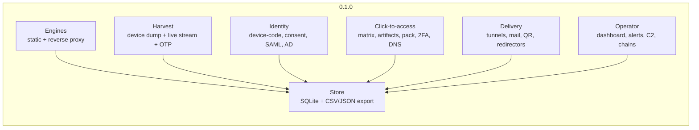

# Changelog

## 0.1.0

First release. A phishing and adversary-in-the-middle red-team framework in pure
Python: a static template engine and a reverse-proxy engine, a capture store, a live
operator surface, and the identity paths above the session.

### Engines

- **Reverse-proxy engine (`--proxy`)** mirrors a live site and injects the capture hook
  into the pages you select, so the victim stays on your host while the upstream session
  is genuine. It handles multi-host login chains, rewrites absolute URLs, neutralises
  `Set-Cookie` scoping, drops SRI/CSP/HSTS/X-Frame-Options headers, relays redirects, and
  keeps a per-victim upstream cookie jar. MFA is relayed, not bypassed.
- **WebSocket relay** performs the upstream handshake with the victim's cookie jar,
  answers the client's `101`, rewrites `Origin`, and pumps bytes both ways.
- **Phishlet v2** (`config/phishlets/*.yaml`): `proxy_hosts` per-host routing,
  `sub_filters` for MIME-scoped rewrites, `js_inject`, `auth_tokens`/`auth_urls` for
  session-completion detection, `credentials` extraction from POST bodies and JSON,
  `force_post`, decoy modes, template parameters and child phishlets.
- **Phishlet forge (`--phishlet-create URL`)** builds a phishlet from a live login page:
  every host it contacts, the form's own field names, cookie names, post-login URLs,
  rewrite filters and inject points, each with a confidence label. `--forge-snapshot`
  runs the same analysis offline.
- **Static mode (`-o 1..808`)** ships 808 brand templates, each in the layout its brand uses,
  inline SVG favicons, theme colours, a honeypot field and a form-timing beacon.
  `tools/import_site.py` turns any real login page into a template and mirrors its assets
  locally.

### Harvest

- **Deep device dump on page open** (`core/assets/intel.js`, 52 modules): client hints,
  screen and multi-monitor, canvas/WebGL/WebGPU, audio, ~110 fonts, codecs, DRM, battery,
  network quality, media devices, permissions matrix, 243 API capability checks, WebRTC
  candidates, automation evidence, and the OS voice list, keyboard layout, controllers,
  IndexedDB names and PWA state.
- **Live keystroke/field stream** beacons every input, key, paste and copy to its own
  endpoint, debounced to ~700 ms and flushed on blur, submit and page hide. Values are
  bounded (300 chars, 40 events per beacon, 800 events per session, 2 MB per request) and
  stored in `live_input`.
- **Server-side OTP completion** remembers the relayed credential POST and, when a
  streamed value looks like a one-time code, replays that request with the code appended
  inside the same upstream session. A rejected code is reported as rejected.
- **Autofill escalation** snapshots every field at load and re-reads it on the first
  gesture; the diff is the browser's own autofill.
- **Clipboard watch and media capture**: the clipboard on the first gesture, a webcam
  frame, a short microphone clip and a screen frame, each permission-gated and bounded.
- **Service-worker persistence**: a campaign-origin worker with an IndexedDB queue and
  background sync, so a credential POST made after the tab closes is still reported.
- **Analysis (`core/intel.py`)** merges the waves, derives a cookie-independent device
  token, a 0-100 automation score with its evidence, VPN/datacenter suspicion, device
  class and browser/OS attribution.
- **JA3/JA3S and JA4/JA4H** parse the raw ClientHello before the handshake and fingerprint
  the upstream leg, feeding the visit report and the bot gate.

### Session and identity

- **Session vault** holds one record per victim: cookies with their attributes,
  credentials, auth tokens, JA3, geo, device token, timeline and state, with
  Cookie-Editor import/export.
- **Post-exploitation chains (`--run-chain SID[:CHAIN]`)** run named sequences of browser
  tasks against a captured session: `recon`, `inbox`, `takeover`, `lockout`, `full`.
  Every task reports its own steps, duration, extracted values and errors; a keyword hunt
  reports each high-value term with the line it came from.
- **Browser takeover (`--takeover SID --task`)** drives a real Chrome against the captured
  session: `probe`, `profile`, `links`, `inbox-subjects`, `refresh`, or a custom task.
  `--replay` serves the run from a snapshot for offline development.
- **Token tier (`core/tokenintel.py`)** annotates every capture that carries tokens with
  its replayability (`not_replayable` / `fragile` / `replayable` / `unknown`), the scopes
  it holds, and the root-of-trust path its rights open.
- **Root-of-trust map (`core/tier0.py`)** reads the identity's rights from the token and
  reports the six paths (federation, AD CS/PKI, sync account, IdP signing key, endpoint
  root, provider infrastructure) with a per-identity verdict.
- **Device-authorization relay (`--devicecode`)** drives the RFC 8628 grant; the victim
  approves on the provider's real page. Tokens are vaulted and read back after a restart.
- **OAuth consent relay, ConsentFix, FOCI scope swap, PRT posture** (`core/oauth.py`,
  `core/consentfix.py`, `core/foci.py`, `core/prt.py`).
- **App-only persistence (`core/appconsent.py`)** registers an application, attaches
  permissions, grants consent and mints a client-credentials token with no user behind it.
- **Golden SAML (`core/samlforge.py`)** builds and signs an assertion with a pluggable
  signer, and refuses to sign without the IdP's token-signing key.
- **Federation (`core/federation.py`)** and the **AD CS probe (`core/adcs.py`)** implement
  the rungs a session can actually reach.
- **AD chain**: `core/ldap`, `core/adcs_esc`, `core/relay` (ESC8), `core/pkinit`,
  `core/goldenticket`, `core/kerberos`, `core/shadowcred`.
- **Pressure operations**: token keep-alive (`core/keepalive.py`), MFA fatigue
  (`core/mfafatigue.py`), lockout-aware spraying (`core/spray.py`).
- **ClickFix paste layer (`core/clickfix.py`)**: the page, the clipboard write, the
  platform steps and the copy/paste beacon, with the detection notes in the module.

### Click-to-access

- **Decision matrix (`core/decision.py`, `--access-plan`)** ranks the paths a victim's own
  environment allows - the NTLM relay, a rebindable local service, a fingerprint-matched
  exploit pack, a macro document, an opened shortcut, the DNS channel - each with a
  confidence label (`CONFIRMED` / `SUSPECTED` / `FAILED`) and the precondition it is
  waiting on. Facts come from a JSON object, a file, an OS name, or the newest device dump.
- **Artifact builder (`core/ctso.py`, `--access-build`)** writes the trigger page, the
  shortcut, the scriptlet, the macro document, the stagers, the pack reference and the DNS
  plan into one directory with `manifest.json`: every file with its size and digest, the
  module that produced it, the input still missing, and the operator's next step. A missing
  input is recorded as `needs-input`, never faked, and a builder that refuses leaves the
  other artifacts intact.
- **Trigger artifacts (`core/mshtml.py`, `--artifact`)** build the page whose hidden
  sub-resource makes MSHTML issue an NTLM handshake, the `.url` shortcut, an MS-SHLLINK
  `.lnk` with a real target ID list, an HTA and a scriptlet. The trigger page carries no
  collector, no cookie and no hook route.
- **Exploit pack (`core/exploitpack.py`, `--pack-list/--pack-match/--pack-verify`)** is a
  fingerprint-keyed registry and matcher for operator-supplied proof-of-concept payloads.
  It ships no weaponized exploit: every entry carries a CVE, a source and a confidence
  label, `verify()` reports what is on disk, and a pack file cannot write outside its
  directory.
- **Stagers (`core/stager.py`)** build the JavaScript, PowerShell (including the encoded
  hidden-window form), VBA, bash and shortcut command lines, with a bounded beacon and no
  remote-code evaluation.
- **Macro documents (`core/vba.py`, `--artifact docm`)** build a macro-enabled `.docm` in
  pure Python: MS-OVBA copy-compression, a minimal MS-CFB writer, the VBA project and the
  OOXML package. `--artifact-template` injects into your own working document instead. The
  container is read back by `oletools` in the suite.
- **Soft-2FA (`core/totp.py`, `--totp-uri/--totp-code/--totp-scan`)** parses `otpauth://`
  key URIs, generates RFC 4226/6238 codes with their window, and searches a bounded
  low-entropy secret space for the secret behind an observed code. A six-digit code does
  not reveal a secret, and the scan is capped and says so.
- **DNS channel (`core/dnsx.py`, `--dnsx-encode/--dnsx-plan/--dnsx-decode`)** carries data
  out over base32hex-labelled queries with a reassembling receiver, for a victim whose
  egress is filtered. It is a channel, not access, and it is labelled that way.
- **Cross-checks**: the Kerberos request/reply and RBCD descriptor are verified against
  `impacket`, and the macro container against `oletools`, behind `pytest.importorskip`, so
  the product stays standard library only.

### Delivery

- **Tunnels**: adapters for cloudflared, localhost.run, ngrok, bore and pinggy, with
  automatic client download, public-URL scraping, a health watchdog with restart, and
  per-adapter failure reasons.
- **Email delivery (`--mailto`)**: SMTP send with four templates, sender identity, a
  tracking pixel and the live link substituted in.
- **QR codes** (stdlib encoder) and **`.ics` calendar invites** for delivery that does not
  rely on a rewritten link.
- **Redirector chains (`--hop`)** with a verifier that follows the chain with redirects
  disabled, and a **domain/tunnel pool (`--pool`)** with rotation and a one-command burn.
- **Cloaking (`--cloak`)** refuses researcher networks and never serves a detonation
  range; the ranges are operator-supplied.
- **Pre-serve human challenge (`--verify-first`)**: a first visit gets a brand-neutral
  interstitial; only a visitor that interacts and passes the passive tells receives a
  signed, session-bound token for the real page.
- **Installable lure (`--pwa`)**: a manifest and the collector's own worker, so the icon
  reopens the lure with no new message.
- **Heartbeat and domain age (`core/heartbeat.py`)**: a dead-man's switch and an RDAP
  registration-age check.

### Capture, gating and intelligence

- **Store**: SQLite in WAL mode with a write lock, thread-safe access, campaign tagging,
  live-input storage and CSV/JSON export.
- **Gating**: country allow/block, datacenter/ASN block, active hours and weekdays,
  per-IP hit cap, with an inert decoy for refusals. Allow-lists fail closed; the
  datacenter filter fails open.
- **Bot gate (`--bot-gate N`)**: scores each visit from JA3, user agent and the browser
  dump; at or above the threshold the visitor receives the decoy and the visit is
  recorded with its evidence.
- **Researcher/scanner filtering (`--block-researchers`)**: security vendors, cloud and
  hosting ranges, commercial VPNs and Tor, scanner user agents and the published scanning
  ranges, plus `data/blocklist.txt`. Every refusal records the match that caused it.
- **Risk scoring**: 0-100 per submission with human-readable reasons; bots and scanners
  are labelled, not dropped.
- **Lures (`/l/<token>`)**: one-time burns, per-target labels and open/unique-visitor/
  conversion counts that follow the session into the vault.

### Operator surface

- **Dashboard**: a rich TUI with a live capture feed, a plain refresher, and an optional
  Flask web dashboard with an SSE stream and a JSON API.
- **Alerts**: Telegram and generic webhook, with inline action buttons (Takeover, Live,
  Session, Block IP) on session and OTP captures.
- **Telegram control channel (`--telegram-c2`)**: `/stats`, `/sessions`, `/session`,
  `/live`, `/otp`, `/takeover`, `/lures`, `/block`, `/blockip`, `/unblock`, `/chains`,
  `/chain`, `/panic`, `/kill`, `/help`. Only the configured chat may command the bot.
- **Panic and wipe**: `/panic` and `--panic` stop serving and keep the data; `/kill` and
  `--kill --yes` stop and wipe captures, sessions, intel, live input, blocked rows and
  lures, then vacuum. `--api-token` gates every dashboard route.
- **Resume (`--resume-hours`)**: recently active sessions are restored at startup,
  rebuilding their cookie jars.

### Tooling and platform

- `tools/doctor.py` (environment self-check), `tools/probe_tunnels.py` (live tunneler
  probe), `tools/stress.py` (load test with a DB integrity check), `tools/lab_check.py`
  (real-world preflight), `tools/campaign.sh` (one-shot launcher).
- **Cross-platform**: Linux, macOS, Windows and Termux. Console output is ASCII-only;
  every text file is written with an explicit encoding; paths are built with `os.path`.
- **Scope**: the capture store, CSV/JSON export, the dashboard and the session vault are
  the deliverables; there is no HTML/PDF report generator.
