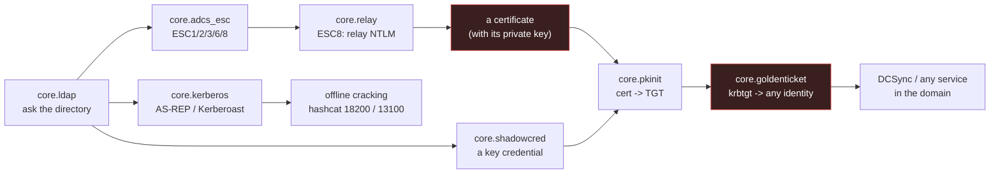

# The AD chain: from a directory query to a forged ticket

The identity side of this framework ends at a session. This is the other side: what a session can
turn into when the target is Active Directory, and why the last rung is the same rung as Golden
SAML.



## What each step needs, and what stops it

| Step | Module | Needs | Stops it |
|---|---|---|---|
| Directory query | `core.ldap` | a bind (or an anonymous one, which most DCs refuse) | LDAP signing/channel binding, or no read rights |
| ESC analysis | `core.adcs_esc` | read access to the templates | templates hardened (no enrollee-supplied subject, manager approval, EKUs restricted) |
| ESC8 relay | `core.relay` | a CA offering NTLM, no EPA, and a trigger | Extended Protection, HTTPS + channel binding, WebClient disabled |
| PKINIT | `core.pkinit` | the certificate WITH its private key | a CA not in NTAuth, strong certificate binding, clock skew |
| Golden Ticket | `core.goldenticket` | the krbtgt key | krbtgt rotated **twice**, PAC validation, correlation of tickets against AS-REQs |
| Roasting | `core.kerberos` | preauth off (AS-REP) or any domain user (TGS) | preauth enabled everywhere, AES-only domains, long random service passwords |
| Shadow credentials | `core.shadowcred` | write access to `msDS-KeyCredentialLink` | the attribute audited (event 5136), no write ACE |

## The two hashes that matter, and why

**The krbtgt key** encrypts every TGT in the domain. Holding it means holding the domain: a
forged ticket for any user, any group, validated by the DC with the same key it signed with. A
password reset does not touch it, and the remediation is a **double** rotation - which is why it
is an emergency, not a maintenance task.

**A service account's key** (Kerberoasting) is protected by that account's password, and a
service ticket is requested by any ordinary domain user. Nothing fails, nothing locks, and the
request looks like a service being used - which is why it is the quiet one.

## What this framework verifies, and what it cannot

Verified here, with tests: the LDAP BER stack against a **real directory server**, the ESC
findings from real attribute shapes, the relay end to end (a fake CA hands the certificate to the
client through the relay), the RC4-HMAC cipher against the published keystream vector and a
round-trip, and every refusal firing with a reason.

Cannot be verified here, and said so in the modules: that a real KDC accepts a forged ticket,
that a real DC accepts a shadow credential, and that a real CA issues for a chosen subject. Those
need a domain, and no test in this repository can fabricate one honestly.

## Running it

```bash
# 1. who is worth asking
./bytephisher.py --ldap dc.contoso.test --ldap-user 'CONTOSO\alice' --ldap-pass '...' \
                 --ldap-query kerberoast

# 2. the CA's posture, and the ESC conditions the directory reveals
./bytephisher.py --adcs-probe http://ca.contoso.test
./bytephisher.py --ldap dc.contoso.test --ldap-query templates --adcs-esc /tmp/t.json
./bytephisher.py --adcs-esc /tmp/t.json

# 3. ESC8: the certificate comes back to whoever authenticated
./bytephisher.py --relay-start http://ca.contoso.test --relay-listen 80

# 4. the certificate becomes a TGT, and the TGT becomes any identity
./bytephisher.py --pkinit-plan --pkinit-realm CONTOSO.TEST
./bytephisher.py --golden-forge --realm CONTOSO.TEST --krbtgt-hash <nt-hash> \
                 --golden-sid S-1-5-21-... --golden-groups S-1-5-21-...-512 --out ./loot
export KRB5CCNAME=FILE:./loot/golden.ccache
```
