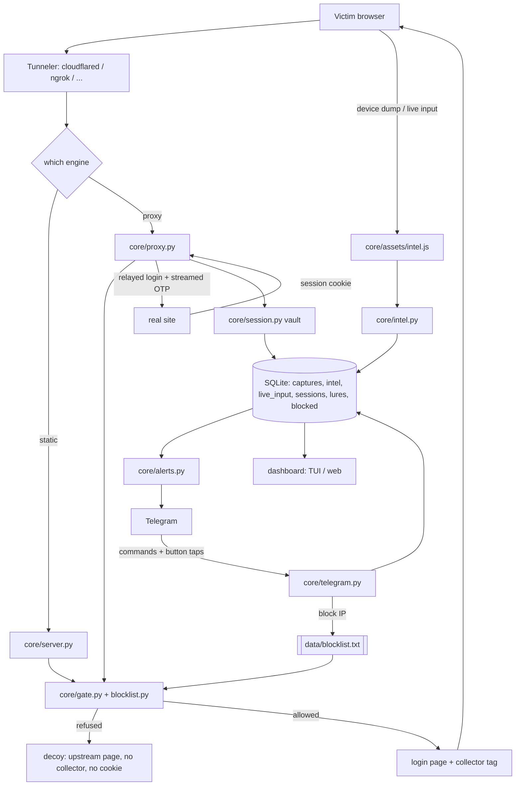

# Architecture

Pure Python 3.10+, no PHP, no Apache, no external service. One CLI entry point wires the
modules together; every module is importable and testable on its own.

## Module map

```

bytephisher.py                 CLI: flags, banner, live loop, session summary
|
|--- core/                      69 modules
|   |--- server.py              static-template HTTP server (threaded, TLS, JA3 capture)
|   |--- proxy.py               reverse-proxy engine (real site, hook injected)
|   |--- phishlet.py            phishlet v2: hosts, sub-filters, tokens, credentials
|   |--- forge.py               build a phishlet from a live login page
|   |--- transport.py           outbound leg: curl_cffi impersonation, IPv4-first
|   |--- tls_fp.py              JA3/JA3S + JA4/JA4H from the raw ClientHello
|   |--- classify.py            shared rules: credential pairs, device class, datacenter
|   |--- intel.py               device intelligence: merge waves, device token, scoring
|   |--- capture.py             SQLite capture store (per-thread connections, WAL)
|   |--- templates.py           template rendering (login / OTP / thank-you)
|   |--- gate.py                campaign gating: geo, ASN, hours, hit cap, decoy
|   |--- blocklist.py           vendors, scanners, anonymising networks, ranges, own file
|   |--- risk.py                static-campaign risk score 0-100 + reasons
|   |--- challenge.py           pre-serve human challenge (signed, session-bound token)
|   |--- symbols.py             per-campaign cookie and data-* names
|   |--- lures.py               tracked entry points /l/<token>, one-time burn
|   |--- session.py             captured-session vault + browser takeover runner
|   |--- ops.py                 live-session operations: validation, keep-alive
|   |--- chains.py              post-exploitation chains over the vault
|   |--- tokenintel.py          replayability + scopes, computed where the token lands
|   |--- tier0.py               root-of-trust posture map
|   |--- devicecode.py          RFC 8628 device-authorization relay
|   |--- oauth.py / consentfix.py / foci.py / prt.py   OAuth identity paths
|   |--- appconsent.py          app-only persistence
|   |--- samlforge.py           Golden SAML assertion forge
|   |--- federation.py          federation as the three calls
|   |--- adcs.py / adcs_esc.py  CA probe + ESC analysis
|   |--- ldap.py / relay.py / pkinit.py / goldenticket.py / kerberos.py / shadowcred.py
|   |--- keepalive.py / mfafatigue.py / spray.py        pressure operations
|   |--- clickfix.py            the paste layer
|   |--- inbox.py               IMAP reply inbox + classification
|   |--- qr.py / ics.py / sender.py / pretexts.py / targets.py    delivery
|   |--- redirectors.py / pool.py / heartbeat.py        infrastructure
|   |--- pwa.py                 installable lure
|   |--- alerts.py / telegram.py                        notifications + control channel
|   |--- campaign.py            cohorts, A/B, funnel metrics
|   |--- rebind.py              DNS rebinding responder
|   |--- exploits.py            local-service exploit library
|   |--- dbsc.py / passkey.py   device-bound + passkey awareness
|   |--- decision.py            the click-to-access decision matrix
|   |--- ctso.py                writes a verdict's artifacts + manifest.json
|   |--- mshtml.py              NTLM trigger artifacts: page, .url, .lnk, .hta, .sct
|   |--- exploitpack.py         fingerprint-keyed pack registry and matcher
|   |--- stager.py              JS / PowerShell / VBA / bash stagers
|   |--- vba.py                 macro-enabled .docm builder (MS-OVBA + MS-CFB)
|   |--- totp.py                soft-2FA secrets, codes, bounded secret scan
|   |--- dnsx.py                DNS exfiltration channel (base32hex labels)
|   `--- net.py                 outbound transport, IPv4-first
|
|--- tunnels/__init__.py        5 adapters + process registry + watchdog helpers
|--- dashboard/__init__.py      live TUI, plain refresher, Flask dashboard + SSE
|--- mailer/__init__.py         SMTP templates, HTML rendering, tracking pixel
|
|--- tools/                     operator utilities (not imported at runtime)
|   |--- gen_templates.py       generates the template library + manifest
|   |--- import_site.py         turns a real login page into a template
|   |--- probe_tunnels.py       live reality check for every tunneler
|   |--- stress.py              load test for your own instance
|   |--- doctor.py              environment self-check
|   |--- lab_check.py           real-world preflight
|   `--- campaign.sh            one-shot campaign launcher
|
|--- core/assets/intel.js       browser-side collector (52 modules)
|--- config/config.yaml         runtime defaults (port, db, tunnels, smtp, alerts)
|--- config/phishlets/*.yaml    reverse-proxy target definitions
|--- templates/NN_slug/         generated pages: index.html, otp.html, fields.json
`--- tests/                     88 suites, tiered by a module-level pytestmark (docs/TESTING.md)

```

## The whole pipeline



## Data flow - static-template campaign

```

victim -> tunneler (cloudflared/...) -> core/server.py
                                   |--- client IP: CF-Connecting-IP -> True-Client-IP
                                   |              -> X-Real-IP -> X-Forwarded-For -> socket
                                   |--- gate.check()  -> refused? log_blocked(), stop
                                   |--- templates.render_site()  -> login or OTP page
                                   |     + the collector tag (core/assets/intel.js)
                                   |--- POST /__bh/intel  -> core/intel.py merge + analyse
                                   |                     -> CaptureDB.log_intel()
                                   `--- POST body parsed (urlencoded/multipart/JSON)
                                        -> credential detection
                                        -> risk.score()
                                        -> CaptureDB.record()  -> SQLite (WAL)
                                        -> alerts.notify()     -> Telegram / webhook
                                        -> dashboard live_loop() picks it up by row id

```

`CaptureDB` is the single source of truth: the TUI, the web dashboard and the exports
all read the same rows, so a number cannot disagree between two views.

## Data flow - reverse proxy

```

victim -> tunneler -> core/proxy.py serve_proxy()
                    |--- session resolved from payload sid / __bhs cookie / ?s=
                    |--- ProxyEngine.fetch() -> real upstream (requests, IPv4-first)
                    |--- rewrite_headers()   -> CSP/HSTS/XFO dropped, SRI stripped,
                    |                         Set-Cookie scoped to us, Location rewritten
                    |--- rewrite_html()      -> absolute URLs -> proxy-relative
                    |--- hook injected into pages matching inject_paths
                    |--- POST /__bh/capture  -> credential + fingerprint + cookies
                    |                         -> risk model -> CaptureDB.record()
                    |--- POST /__bh/live     -> live stream (see docs/HARVEST.md)
                    |                         -> a streamed OTP completes the login
                    |                           upstream and flips the session to
                    |                           captured with the real cookie jar
                    `--- decoy mode          -> upstream markup only: no collector,
                                              no __bhs cookie

```

The per-victim `ProxySession` holds that visitor's upstream cookie jar, so the proxy
completes a real login (including a follow-up MFA step) without two victims ever sharing
a session. See [PROXY.md](PROXY.md).

## Configuration that changes the shape of a campaign

| Flag | Effect | Detail |
|---|---|---|
| `--hook-path PATH` | moves every collector route and the injected tag | [OPERATIONS.md](OPERATIONS.md) |
| `--block-researchers` | refuses vendors, scanners, anonymising networks | [OPERATIONS.md](OPERATIONS.md) |
| `--blocklist-file PATH` | adds the operator's own entries | [OPERATIONS.md](OPERATIONS.md) |
| `--telegram-c2` | turns the bot into a command channel | [OPERATIONS.md](OPERATIONS.md) |
| `--bot-gate SCORE` | serves the decoy above a fingerprint score | [PROXY.md](PROXY.md) |
| `--intel-perms` | fires the permission-gated probes | [HARVEST.md](HARVEST.md) |

## Design rules the code holds to

1. **Accurate numbers.** Bots and scanners are scored and labelled, never silently
   dropped; reports separate "credential pairs" from "credible (low risk)" counts.
   Gated-out visitors are counted separately from served ones.
2. **Fail-open where the alternative is a dark campaign.** An unreachable geo provider
   disables country rules instead of blocking everyone; explicit allow-lists fail closed
   by design.
3. **Nothing phones home.** The only outbound calls are the ones an operator invokes or
   configures: the geo lookup, alerts (Telegram or a webhook), SMTP when `--mailto` is
   used, the RDAP registration-age check, the DNS-over-HTTPS resolver behind the
   sender-identity check, the tunneler client, and the upstream in proxy mode. There is no
   relay, no telemetry and no third-party storage.
4. **Every failure is visible.** Tunnelers that die mid-campaign are named in the live
   loop; missing binaries, missing config keys and unconfigured alerts report "not
   configured" rather than pretending to work.
5. **A refusal explains itself.** A blocked visitor is recorded with the reason that
   matched (`known scanning range (censys, 162.142.125.0/24)`), so a false positive is
   diagnosable.
6. **A claim about behaviour is verified by running it.** The collector's per-session
   renaming is checked by executing the rendered script under Node; the OTP relay is
   checked against a fake MFA upstream that really receives the code.
