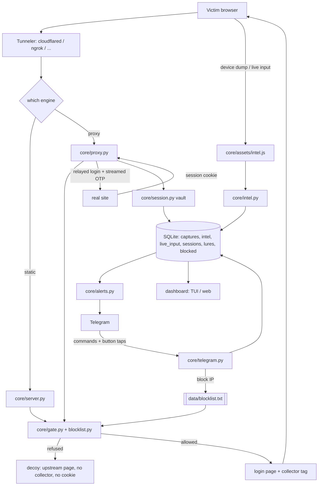

# BytePhisher architecture

Pure Python 3.10+, no PHP, no Apache, no external service required. One CLI
entry point wires the modules together; every module is importable and testable
on its own.

```
bytephisher.py                 CLI: flags, banner, live loop, session summary
│
├── core/
│   ├── server.py              static-template HTTP server (threaded, TLS)
│   │     make_handler() · serve()
│   ├── proxy.py               reverse-proxy engine (real site, hook injected)
│   │     Phishlet · ProxySession · ProxyEngine · serve_proxy()
│   ├── classify.py            shared rules: credential pairs, device class,
│   │     datacenter markers (server + proxy + risk + gate)
│   ├── intel.py               deep device intelligence (merge waves, device
│   │     token, headless + VPN scoring, CLI dump renderer, live-stream
│   │     parsing, OTP detection, per-session symbol randomisation)
│   ├── capture.py             SQLite capture store (per-thread connections)
│   │     CaptureDB.record/all/stats/since/log_blocked/reuse_stats/campaigns/export_*
│   ├── templates.py           template rendering (login / OTP / thank-you)
│   ├── gate.py                campaign gating: geo, ASN, hours, hit cap, decoy,
│   │     researcher filtering
│   │     Gate.check/note_hit/describe · parse_days/parse_hours
│   ├── blocklist.py           security vendors, cloud scanners, anonymising
│   │     networks, scanner user agents, scanning ranges, operator file
│   ├── risk.py                static-campaign risk score 0–100 + reasons
│   ├── alerts.py              Telegram + webhook notifier (daemon thread,
│   │     inline action buttons on session/OTP captures)
│   ├── telegram.py            Telegram control channel: command registry,
│   │     long-poll loop, inline-keyboard callbacks, reply rendering
│   ├── net.py                 outbound transport, IPv4-first (ipv4_only, urlopen…)
│
├── tunnels/__init__.py        6 adapters + process registry + watchdog helpers
│     Tunneler · Cloudflared · Ngrok · LocalHostRun · Serveo · Bore · Hoplink
│     run_one() · run_all() · dead_names() · running_names() · stop_all()
│
├── dashboard/__init__.py      live TUI, plain refresher, Flask dashboard + SSE
│     make_frame() · live_loop() · render_tui() · render_plain() · web_dashboard()
│
├── mailer/__init__.py         SMTP templates, HTML rendering, tracking pixel
│     render() · to_html() · send_smtp() · blast() · tracking_pixel()
│
├── tools/                     operator utilities (not imported at runtime)
│   ├── gen_templates.py       generates the template library + manifest
│   ├── import_site.py         turns a real login page into a template
│   ├── probe_tunnels.py       live reality check for every tunneler
│   ├── stress.py              load test for your own instance
│   ├── doctor.py              environment self-check
│   └── campaign.sh            one-shot campaign launcher
│
├── core/assets/intel.js            browser-side collector (48 modules: device dump,
│                              live keystroke stream, autofill escalation,
│                              clipboard watch, media capture)
├── config/config.yaml         runtime defaults (port, db, tunnels, smtp, alerts)
├── config/phishlets/*.yaml    reverse-proxy target definitions
├── templates/NN_slug/         generated pages: index.html, otp.html, fields.json
├── tests/js_harness.js        runs the collector under Node with a stubbed DOM
└── tests/                     25 suites (see tests/README.md)
```

## The whole pipeline



## Data flow — static-template campaign

```
victim → tunneler (cloudflared/…) → core/server.py
                                   ├── client IP: CF-Connecting-IP → True-Client-IP
                                   │              → X-Real-IP → X-Forwarded-For → socket
                                   ├── gate.check()  → refused? log_blocked(), stop
                                   ├── templates.render_site()  → login or OTP page
                                   │     + the collector tag (core/assets/intel.js)
                                   ├── POST /__bh/intel  → core/intel.py merge + analyse
                                   │                     → CaptureDB.log_intel()
                                   └── POST body parsed (urlencoded/multipart/JSON)
                                        → credential detection
                                        → risk.score()
                                        → CaptureDB.record()  → SQLite (WAL)
                                        → alerts.notify()     → Telegram / webhook
                                        → dashboard live_loop() picks it up by row id
```

`CaptureDB` is the single source of truth: the TUI, the web dashboard, the
HTML/PDF reports and the exports all read the same rows, so a number can never
disagree between two views.

## Data flow — reverse proxy

```
victim → tunneler → core/proxy.py serve_proxy()
                    ├── session resolved from payload sid / __bhs cookie / ?s=
                    ├── ProxyEngine.fetch() → real upstream (requests, IPv4-first)
                    ├── rewrite_headers()   → CSP/HSTS/XFO dropped, SRI stripped,
                    │                         Set-Cookie scoped to us, Location rewritten
                    ├── rewrite_html()      → absolute URLs → proxy-relative
                    ├── hook injected into pages matching inject_paths
                    ├── POST /__bh/capture  → credential + fingerprint + cookies
                    │                         → risk model → CaptureDB.record()
                    ├── POST /__bh/live     → live stream (see docs/HARVEST.md)
                    │                         → a streamed OTP completes the login
                    │                           upstream and flips the session to
                    │                           captured with the real cookie jar
                    └── decoy mode          → upstream markup only: no collector,
                                              no __bhs cookie (a scanner must not
                                              receive the design)
```

The per-victim `ProxySession` holds that visitor's upstream cookie jar, so the
proxy can complete a real login (including a follow-up MFA step) without two
victims ever sharing a session. See `docs/PROXY.md`.

## Configuration that changes the shape of a campaign

| Flag | Effect | Detail |
|---|---|---|
| `--hook-path PATH` | moves every collector route and the injected tag | [EVASION.md](OPERATIONS.md) |
| `--block-researchers` | refuses vendors, scanners, anonymising networks | [CONTROL.md](OPERATIONS.md) |
| `--blocklist-file PATH` | adds the operator's own entries | [CONTROL.md](OPERATIONS.md) |
| `--telegram-c2` | turns the bot into a command channel | [CONTROL.md](OPERATIONS.md) |
| `--bot-gate SCORE` | serves the decoy above a fingerprint score | [PROXY.md](PROXY.md) |
| `--intel-perms` | fires the permission-gated probes | [INTEL.md](HARVEST.md) |

## Design rules the code holds to

1. **Accurate numbers.** Bots and scanners are scored and labelled, never
   silently dropped; reports separate "credential pairs" from "credible (low
   risk)" counts. Gated-out visitors are counted separately from served ones.
2. **Fail-open where the alternative is a dark campaign.** An unreachable geo
   provider disables country rules instead of blocking everyone; the reverse is
   true for explicit allow-lists (they fail closed, by design).
3. **Nothing phones home.** The only outbound calls are the ones you configure:
   geo lookup, alerts, update check, and the upstream in proxy mode. No relay,
   no telemetry, no third-party storage.
4. **Every failure is visible.** Tunnelers that die mid-campaign are named in
   the live loop; missing binaries, missing config keys and unconfigured alerts
   report "not configured" rather than pretending to work.
5. **A refusal explains itself.** A blocked visitor is recorded with the reason
   that matched, so a false positive is diagnosable (`known scanning range
   (censys, 162.142.125.0/24)`) instead of mysterious.
6. **A claim about behaviour is verified by running it.** The collector's
   per-session renaming is checked by executing the rendered script under Node,
   not by reading it; the OTP relay is checked against a fake MFA upstream that
   really receives the code.
