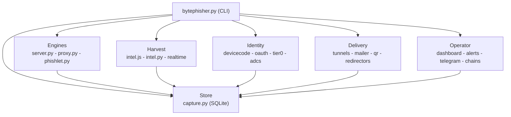

# Coverage map

Every capability, where it lives, and the test that covers it. Counts below are
recomputed against this tree; the command that produced each one is named next to it.
Per-suite numbers in parentheses are `pytest --collect-only -q` results for that file.


| Metric | Value |
|---|---|
| Core modules (`core/*.py`) | 70 |
| Test files (`tests/test_*.py`) | 87 |
| Template directories (`templates/NN_*`) | 808 |
| Collected tests | 2116 |

```
ls core/*.py | wc -l                                            -> 70
ls tests/test_*.py | wc -l                                      -> 87
find templates -maxdepth 1 -type d -name '[0-9]*' | wc -l       -> 808
./.venv/bin/python -m pytest tests --collect-only -q | tail -1  -> 2116 tests collected
```

Corrections applied against the previous matrix:

- `test_ics.py` does not exist. `core/ics.py` is covered by `test_mailer_delivery.py`,
  which imports `from core import ics, qr` and parses the output.
- `test_relay.py` does not exist. `core/relay.py` is covered by `test_ad_hardening.py`
  and `test_brutal_ops.py` (the latter relays a real NTLM exchange to a fake CA).
- `test_spray.py` does not exist. `core/spray.py` is covered by `test_brutal_ops.py`
  and `test_identity_hardening.py`.
- Stale per-suite counts corrected: `test_http.py` 31 -> 36, `test_realtime.py` 25 -> 33,
  `test_chains.py` 25 -> 50, `test_telegram.py` 48 -> 50, `test_devicecode.py` 28 -> 34,
  `test_rebind.py` 29 -> 31, `test_blocklist.py` 52 -> 62. Test suites 34 -> 87.
  exploit library 17 -> 19 services, Telegram channel 12 -> 16 commands.
- The deep-dump row carried a "(48 modules)" figure. `core/assets/intel.js` states 46
  modules in its own header, while the file contains 11 `safe`, 42 `later` and 6 inline
  registrations, so a count taken from the calls disagrees with the count taken from the
  header. Every document now quotes the file's own figure, 46.



## Engine and capture

| Capability | Where | Test |
|---|---|---|
| Pure-Python HTTP server, no PHP | `core/server.py` | `test_http.py` (36), live tunnel round trips |
| TLS option | `serve(tls=..., cert_path=...)`, `--tls --cert` | `test_http.py::TestBehaviourModes::test_tls_mode` |
| Request logging (headers-derived IP/UA, `source_url`) | `core/server.py` | `test_http.py::TestPost` |
| SQLite capture store (WAL, write lock, migrations) | `core/capture.py` | `test_units.py::TestCaptureDB`, 40-parallel-submission test |
| Datacenter / hosting flag | `core/risk.py`, `core/gate.py` | `test_features.py::TestRiskEngine`, `test_gate.py` |
| VPN flag | `core/blocklist.py`, `core/intel.py` (`vpn_suspected_score`), `core/risk.py` | `test_blocklist.py::TestOrganisations`, `test_intel.py` |
| Field-level capture + hidden honeypot | `hp_email` in every template | `test_http.py::TestPost::test_honeypot_value_recorded` |
| Keystroke-level timing | collector `/__bh/live` (per-event ms), `_ts` form-open duration, behaviour module | `test_realtime.py::TestLiveParsing` |
| Jinja2 template engine | `core/templates.py` | `test_units.py::TestTemplates` |
| 808 templates, per-template OTP page | `templates/NN_slug/` (`index.html` + `otp.html`) | `test_units.py` renders every site |
| Custom template builder | `tools/import_site.py` | `test_units.py::TestCustomImport` |
| Reverse-proxy engine | `core/proxy.py`, `--proxy`, phishlet YAML, per-victim cookie jar, hook injection | `test_proxy.py` (27) + a live round trip |
| WebSocket relay | `core/proxy.py` `_websocket` | `test_websocket.py` |
| Meta-tag CSP removal (header and `<meta http-equiv>`) | `core/proxy.py` `rewrite_html` | `test_websocket.py` |
| Response-header hygiene | `core/server.py`, `core/proxy.py`, `--server-header` | `test_fingerprint_headers.py` |
| Upstream TLS impersonation | `core/transport.py`, `--impersonate` | `test_transport.py` |
| Shared classification (credential pair, device class) | `core/classify.py` | `test_security.py` (43) |
| TLS client fingerprint (JA3/JA4 from the wire) | `core/tls_fp.py` | `test_ja4.py` (29), `test_transport.py` |
| Phishlet v2 engine | `core/phishlet.py` | `test_phishlet.py` (38) |
| Phishlet forge | `core/forge.py` | `test_forge.py` (20) |

## Harvest

| Capability | Where | Test |
|---|---|---|
| Deep device dump on page open | `core/assets/intel.js`, `core/intel.py` | `test_intel.py` (29), `test_intel_harvest.py` |
| Deeper device detail (voices, layout, gamepads, heap, IndexedDB names, XR, sensors, chrome internals, PWA state) | `core/assets/intel.js` | `test_deep_harvest.py` |
| Live keystroke/field streaming | collector -> `/__bh/live`, `intel.normalise_live`, `live_input` | `test_realtime.py` (33) |
| Server-side OTP completion | `ProxyEngine.complete_with_otp` + `pending_login` | `test_realtime.py::test_streamed_code_completes_the_login_upstream` |
| Autofill escalation | load-time snapshot + re-read on first gesture | `test_realtime.py::TestLiveParsing` |
| Clipboard watch | read on first gesture + every paste/copy | `test_realtime.py`, `--intel-perms` |
| Media capture | webcam frame, mic clip, screen frame, bounded | `test_evasion.py::TestCollectorStillRuns` |
| Service-worker persistence | `core/assets/sw.js`, `/__bh/sw.js`, IndexedDB queue | `test_evasion.py::TestServiceWorkerLogic`, `tests/sw_harness.js` |
| Ordered keystroke log | collector `keystrokeLog`, `intel.normalise_live` | `test_evasion.py`, `test_realtime.py` |
| Reply inbox (IMAP read, classify, follow-up script) | `core/inbox.py`, `--inbox` | `test_inbox_clickfix.py` (35), `test_delivery_engine.py` (48) |

## Delivery

| Capability | Where | Test |
|---|---|---|
| 5 tunneler adapters | `tunnels/__init__.py` | `test_units.py::TestTunnels`, `tools/probe_tunnels.py` |
| Public serving | cloudflared, localhost.run, bore, pinggy | `test_live.py` |
| ngrok | adapter exists | needs an authtoken |
| URL shadowing / social preview | OG meta tags in all 808 templates | template render test |
| Spear-phishing email (4 templates, variables, tracking pixel) | `mailer/` | `test_live.py::TestSMTPLive` |
| Campaign mode / one-command pipeline | `tools/campaign.sh`, `--campaign`, `--rotate` | `test_features.py::TestCampaignLauncher` |
| OTP / 2FA flow | login -> credentials -> OTP page -> redirect | `test_http.py::TestBehaviourModes::test_otp_flow` |
| QR codes / `.ics` invites | `core/qr.py`, `core/ics.py` | `test_qr.py`, `test_mailer_delivery.py` |
| Redirector chains / pool / heartbeat | `core/redirectors.py`, `core/pool.py`, `core/heartbeat.py` | `test_redirectors_pool.py` |
| PWA install as re-delivery | `core/pwa.py` | `test_pwa_campaign.py` |
| Clone asset mirroring | `tools/import_site.py` (`--mirror`) | `test_import_mirror.py` |
| No-fetch attack paths (form into a hidden frame) | `core/exploits.py` `forms`, collector `formAttack` | `test_no_fetch_attack.py` |
| Campaign cohorts / A-B assignment | `core/campaign.py`, `--cohorts`, `--ab-summary` | `test_pwa_campaign.py` (18), `test_delivery_engine.py` (48) |
| Tracked lures | `core/lures.py`, `--lure-create` / `--lures` | `test_delivery_engine.py` (48), `test_phishlet.py` (38) |
| Pretext library | `core/pretexts.py`, `--pretext` / `--pretext-list` | `test_pretexts_targets.py` (28) |
| Target list / per-target page fill | `core/targets.py`, `--targets` | `test_pretexts_targets.py` (28) |
| Sender domain preflight | `core/sender.py`, `--sender-check` | `test_sender.py` (20) |

## Identity

| Capability | Where | Test |
|---|---|---|
| Device-code relay (RFC 8628) | `core/devicecode.py`, `--devicecode` | `test_devicecode.py` (34) |
| Device-code / OAuth tokens in the vault | `session.add_oauth`, `--devicecode` wiring | `test_oauth_vault.py` (23) |
| ConsentFix / FOCI / PRT | `core/consentfix.py`, `core/foci.py`, `core/prt.py` | `test_tier0.py`, `test_tier0_posture.py` |
| App-only persistence | `core/appconsent.py` | `test_federation_adcs.py` |
| Golden SAML forge | `core/samlforge.py` | `test_tier0.py` |
| Federation / AD CS probe | `core/federation.py`, `core/adcs.py` | `test_federation_adcs.py` |
| AD chain (LDAP, ESC, relay, PKINIT, golden ticket, roasting, shadow creds) | `core/ldap.py`, `core/adcs_esc.py`, `core/relay.py`, `core/pkinit.py`, `core/goldenticket.py`, `core/kerberos.py`, `core/shadowcred.py` | `test_ad_hardening.py`, `test_brutal_ops.py`, `test_adcs_esc.py` |
| Pressure operations (keep-alive, fatigue, spray) | `core/keepalive.py`, `core/mfafatigue.py`, `core/spray.py` | `test_tier0_posture.py`, `test_brutal_ops.py` |
| ClickFix paste layer | `core/clickfix.py` | `test_inbox_clickfix.py` |
| Token tier (replayability, scopes, root of trust) | `core/tokenintel.py`, `core/tier0.py` | `test_tokenintel.py`, `test_tier0_posture.py` |
| Session vault | `core/session.py` | `test_session.py` |
| Browser takeover | `core/session.py`, `--takeover`, `--replay` | `test_session.py` |
| Post-exploitation chains | `core/chains.py`, `--run-chain` / `--chains` / `--chain-json` | `test_chains.py` (50) |
| Live-session operations (validation, keep-alive) | `core/ops.py` | `test_ops.py` |
| Evidence per action (unproven recorded as unproven) | `session.add_evidence`, `evidence_from_task` | `test_resume_and_evidence.py` |
| Session restore after a restart | `engine.restore_sessions`, `--resume-hours` | `test_resume_and_evidence.py` |
| AES (pure Python, for the AD crypto paths) | `core/aes.py` | `test_aes.py` (21) |
| Directory secret hunt (LAPS, GPP cpassword, gMSA, delegation, description) | `core/ad_hunt.py`, `--ad-hunt` | `test_ad_hunt.py` (21), `test_ad_hardening.py` (35) |
| Device-bound token awareness (is the token replayable) | `core/dbsc.py` | `test_tier0.py` |
| OAuth authorization-code relay with PKCE | `core/oauth.py`, `--oauth` | `test_oauth_relay.py` (27) |
| Passkey handling for a captured session | `core/passkey.py` | `test_tier0_posture.py` (22) |

## Operator surface

| Capability | Where | Test |
|---|---|---|
| Live TUI dashboard | `dashboard.make_frame` / `live_loop` (rich) | `test_live.py::TestTUILive` |
| Web dashboard (SSE, not WebSocket) | `/stream` Server-Sent Events + polling fallback | `test_packaging_stream_reuse.py::TestSSEStream` |
| Telegram control channel (16 commands) | `core/telegram.py`, `--telegram-c2` | `test_telegram.py` (50) |
| Alert action buttons | `core/alerts.py::_buttons_for` | `test_telegram.py::TestAlertButtons` |
| Relocatable hook path | `--hook-path` -> `engine.path_of()` on every route and the tag | `test_evasion.py::test_the_injected_tag_uses_the_custom_path` |
| Per-session script renaming | `intel.randomize_symbols` | `test_evasion.py`, collector under Node |
| Hook stealth | `--hook-stealth` (default), `STEALTH_JS` | `test_stealth_hook.py` (12) |
| Pre-serve human challenge | `core/challenge.py`, `--verify-first`, `--verify-brand` | `test_challenge.py` (20) |
| Session id never handed to the page | `page_token()`, attribution from the HttpOnly cookie | `test_proxy.py::test_hook_js_carries_no_session_id_at_all` |
| Per-campaign cookie/attribute names | `core/symbols.py`, `--symbols random` | `test_symbols.py` (10) |
| Researcher/scanner filtering | `core/blocklist.py`, `Gate(block_researchers=)`, both servers | `test_blocklist.py` (62) |
| Decoy leaks nothing | decoy mode: upstream markup, no collector, no cookie | `test_blocklist.py::test_a_scanner_never_sees_the_phishlet` |
| Campaign gating parity in proxy mode | `ProxyHandler.do_GET` runs the whole gate | `test_blocklist.py::TestThroughTheProxy` |
| Country rules vs the geo layer | `country_code` carried by both geo layers | `test_gate.py::TestCountryMatching` |
| Credential-reuse check | `db.reuse_stats()`, `--reuse` | `test_packaging_stream_reuse.py::TestCredentialReuse` |
| Export CSV / JSON | `--export`, `export_csv`/`export_json` | `test_features.py::TestDataExport` |
| Live-input retention | `CaptureDB.prune_live` / `live_purge`, `--keep-days`, `--live-purge` | `test_realtime.py` |
| Panic stop + data wipe (control channel and console) | `panic_handlers()`, `core/capture.py wipe()`, `--panic` / `--kill --yes` | `test_operations_safety.py`, `test_operator_surface.py` |
| Dashboard/API token | `dashboard/__init__.py` (`--api-token`) | `test_operations_safety.py` |

## Click-to-access

| Capability | Where | Test |
|---|---|---|
| Decision matrix (ranked access paths from the device dump) | `core/decision.py`, `--access-plan` | `test_decision.py` (36) |
| Click-to-access orchestration (verdict -> artifacts + manifest) | `core/ctso.py`, `--access-build` | `test_ctso.py` (17) |
| Click-to-NTLM artifacts (mshtml) | `core/mshtml.py` | `test_mshtml.py` (28) |
| Exploit-pack registry and matcher | `core/exploitpack.py`, `--pack-list` / `--pack-match` / `--pack-verify` / `--pack-report` | `test_exploitpack.py` (24) |
| Stagers (the text that becomes execution) | `core/stager.py`, `--artifact` (ps/hta/sct/...) | `test_stager.py` (23) |
| Macro-enabled Word documents (.docm) | `core/vba.py`, `--artifact docm` | `test_vba.py` (25) |
| Soft-2FA (TOTP) secrets and codes | `core/totp.py`, `--totp-uri` / `--totp-code` / `--totp-scan` | `test_totp.py` (41) |
| DNS exfiltration / beacon channel | `core/dnsx.py`, `--dnsx-plan` / `--dnsx-encode` / `--dnsx-decode` | `test_dnsx.py` (35) |

## Tooling and packaging

| Capability | Where | Test |
|---|---|---|
| Local-service exploit library (19 services) | `core/exploits.py`, `--exploit-list` / `--exploit-ports` / `--exploit-limit` | `test_exploits.py` (19) |
| Router takeover plan | `core/exploits.py::ROUTERS` / `router_plan`, `--router-plan` | `test_exploits.py::TestRouterPlan` |
| DNS rebinding | `core/rebind.py`, `--rebind-domain` + friends, `probe_script` | `test_rebind.py` (31) |
| Local service map / LAN existence probe | `core/rebind.py::LOCAL_SERVICES`, collector `rebindProbe` / `lanRecon` | `test_evasion.py` |
| Troubleshooter | `--doctor` (deps, templates, DB, ssh, tunnelers, port, network) | `test_features.py::TestDoctor` |
| Real-world preflight | `tools/lab_check.py` | `test_lab_check.py` |
| Load test with row-count integrity check | `tools/stress.py` | `test_features.py` |
| PIP-installable | `pyproject.toml`, console script | `test_packaging_stream_reuse.py::TestPackaging` |
| Dockerfile | `Dockerfile`, `docker-compose.yml` | compose YAML parses |
| Termux / cross-platform | `deploy/install-termux.sh`, cross-platform code | `test_crossplatform.py`, `test_portability.py` |
| 87 test suites, one runner | `tests/run_all.py` | the runner reports an all-skipped suite as a skip, not a failure |

## Hardening and cross-cutting

- Risk scoring 0-100 with reasons + "credible (low risk)" counts (`core/risk.py`).
- Campaign gating: country allow/deny, datacenter refusal, active hours/days, per-IP hit
  cap, decoy redirect, refusals logged (`core/gate.py`, `blocked` table).
- Blocked-visitor reporting (excluded from visitor/submission counts).
- Telegram + generic-webhook alerts per capture, with a public-endpoint test.
- Email open-tracking pixel served by the tool itself (`/px.gif`).
- Tunnel watchdog + `--tunnel-restart` auto-heal.
- IPv4-preferring outbound transport (`core/net.py`).
- One SQLite connection per thread in the capture store, so concurrent dashboard/server/TUI
  use does not corrupt or segfault.
- Adversarial regressions (SSRF, dashboard XSS, session/cookie hardening, caps, CSV
  injection, deadlocks, `--no-trust-headers`) in `tests/test_security.py`.

## Limits

1. **VPN/proxy detection** on the server side is limited to hosting/datacenter ASNs; the
   device dump adds client-side WebRTC/timezone/language inference.
2. **Timing capture** is per-event in the live stream plus the form-open duration; it is not
   a full keystroke recorder (key names are streamed, not an ordered log with modifiers).
3. **Real-time dashboard uses SSE**, not WebSocket (same effect, fewer deps).
4. **Docker image, systemd unit, Termux, Windows/macOS** are not executed in the suite.
5. **ngrok** is not verified live (the free service now needs an authtoken).
6. **Real provider SMTP/Telegram delivery** needs the operator's credentials.
7. **Proxy mode does not tunnel every WebSocket upgrade** and speaks HTTP/1.1 to the
   upstream; sites that force h2 or depend on a non-standard WS handshake break visibly.
   MFA is relayed, never bypassed.
8. **No report generator, by owner decision.** Captures leave the tool through the CSV/JSON
   export, the dashboard API and the SQLite store.
