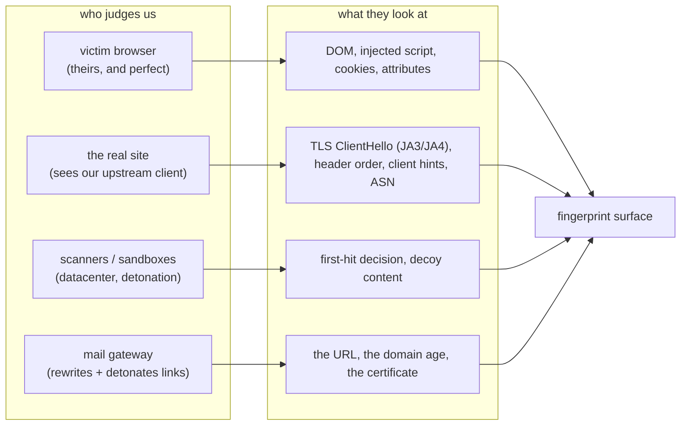
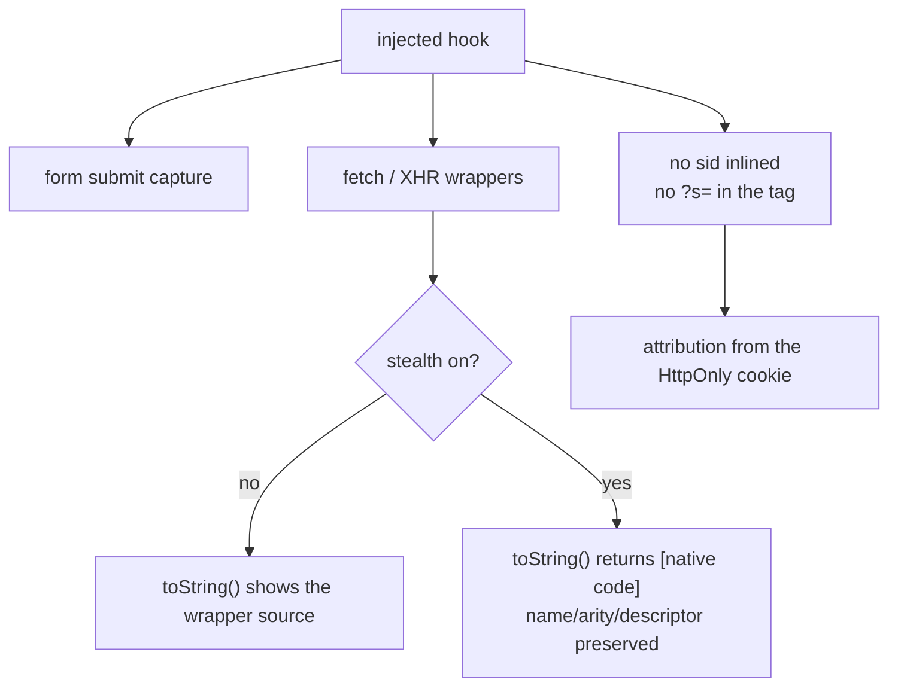
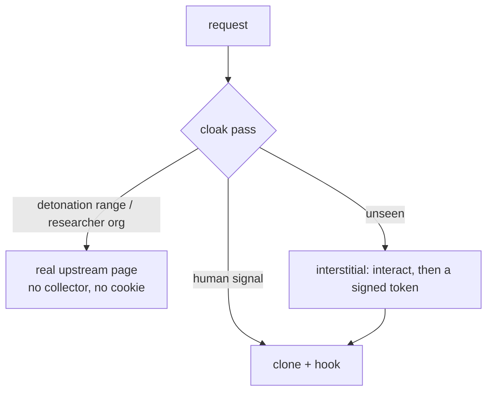

# Evasion and anti-detection posture

How modern anti-bot and threat-detection systems identify a reverse proxy and a phishing
page, and what BytePhisher does about each vector. Every "what we do" below is a shipped
behaviour; the residual-risk column is what no amount of engineering inside a browser
removes.

## Detection vectors and countermeasures

| Vector | What we do | Residual risk |
|---|---|---|
| Upstream TLS/HTTP fingerprint | the upstream leg impersonates Chrome by default (`--no-impersonate` opts out); JA4 and JA4H computed in `core/tls_fp.py`; UA-matched client hints | JA4T/TCP (the operator's Linux kernel) and the host ASN are not fixable from Python |
| Patched `fetch`/XHR | `--hook-stealth` (on by default): wrappers report `[native code]`, keep the native name/arity/descriptor, and hide themselves | a deterministic spoof is itself detectable by a stricter check; a bank that hashes its JS realm still wins |
| Injected DOM/header signatures | relocatable cookie and `data-*` names (`--symbols fixed\|random`), no `?s=` in the page, the sid never inlined (attribution from the HttpOnly cookie) | an extra same-origin script is still an extra script |
| Downstream HTTP/2 / HTTP/3 | the proxy passes h2/h3 upstream where the profile sets it; the runbook requires an h2/h3 edge in front of the listener | the stdlib has no HTTP/2 server; a direct listener is h1-only and anomalous |
| Cloaking | `--cloak` is one switch: researcher networks refused, detonation ranges never served, `--detonation-asn`/`--detonation-cidr` supplied by the operator | a scanner that solves a challenge or uses a real browser defeats it; click-time detonation always sees whichever page you serve then |
| Redirector / reputation / CT | `core/redirectors.py` builds a chain and a verifier follows it with redirects disabled; `core/pool.py` holds rotation with a one-command burn; `core/heartbeat.py` checks RDAP age | CT-log monitoring of a brand-named certificate is public the moment it is issued |
| Infrastructure signals (ASN, tunnels) | the gate refuses datacenter/VPN/security orgs; runbook: egress the upstream leg from a clean ASN | the host's own ASN is what the target sees on the upstream leg |
| Client-side API consistency / headless tells | the collector only reads (it patches no native); the victim's browser is real | the takeover runner drives headless Chrome, which trips provider risk engines |

## The upstream leg's fingerprint

A reverse proxy is judged by two clients: the browser the victim uses (theirs, and
perfect) and the client that talks to the real site (ours). The upstream leg is where a
reverse proxy can look wrong.

| What | Without the profile | With `--impersonate` |
|---|---|---|
| ClientHello (JA3) | Python/OpenSSL ciphers, no GREASE, fixed extension order | the profile's ciphers, curves and GREASE, with a per-request extension permutation |
| HTTP version | 1.1 only | whatever the profile negotiates (2/3) |
| Client hints | none sent | `sec-ch-ua*` set from the parsed UA |
| Header order | `requests`' order | pinned to a browser template |

JA4 sorts ciphers and extensions, so extension randomisation alone does not hide a client;
JA4H hashes request-header order and the first four characters of `Accept-Language` (a
missing one is a classic bot tell). Both are computed by `core/tls_fp.py` and recorded per
session as `ja4`/`ja4h`.

Residual risk: JA4T reads the SYN - a browser-perfect JA4 over a Linux TCP stack is a
textbook proxy tell, and only a residential/Windows egress (or a real browser upstream)
removes it.

## The injected hook

A challenge from PerimeterX/HUMAN runs `typeof` and an implicit `toString()` on built-ins
to prove they were not monkey-patched, and reads driver globals. `--hook-stealth` makes
the wrappers report `[native code]`, keeps the native `name`, arity and property
descriptor (enumerability included), and hides the shim. Verified by executing the served
hook under Node and reading what an integrity script reads.

Residual risk: a deterministic `toString` spoof is detectable by a stricter check that
compares the property descriptor or calls the original native. This class cannot be fully
beaten from inside a browser.

## Downstream HTTP/2 and HTTP/3

A bank origin is h2/h3; a victim whose "bank" answers over HTTP/1.1-only is anomalous, and
a direct listener (`-p 8080` with no tunnel) is the common case that shows it. The
standard library has no HTTP/2 server, so the answer is operational: front the listener
with an h2/h3 edge (the tunnel adapters already exist), and the upstream leg negotiates
h2/h3 when `--impersonate` is on. `tools/doctor.py` warns when the listener is exposed
without a tunnel.

## Cloaking

SafeLinks and Proofpoint detonate every URL from a datacenter before a human clicks, and
re-sandbox at click time - so the page must look legitimate at detonation time. Cloaking
serves the real site to the scanner and the clone to the recognised target.

The ranges are operator-supplied on purpose: the vendor networks move, and a hardcoded
list would either block real visitors or let a sandbox through. One-time and fragment
lures (`core/lures.py`) are the right tool against a gateway that pre-fetches the link.

## Domain and infrastructure strategy

| Move | Where | Why |
|---|---|---|
| Aged / history domain per campaign | runbook | NRD scoring is external; age is bought, not coded |
| Redirector hop (reputable first URL) | in tool (`--hop`, `core/redirectors.py`) | keeps the clone host out of the mail |
| Multi-domain rotation | in tool (`core/pool.py`) | burns a host without killing the campaign |
| Serve real site to scanners | in tool (`core/gate.py` cloak pass) | SafeLinks/Proofpoint detonation |
| One-time / fragment lures | in tool (`core/lures.py`) | a gateway pre-fetch cannot reuse the link |
| Cert from a shared edge (no brand in CT) | runbook | avoids certstream/NRD correlation |
| Residential egress for the upstream leg | in tool flag + ops | ASN reputation |
| h2/h3 edge in front of the listener | runbook + doctor warning | an h1-only origin is anomalous |

## What cannot be beaten from inside a browser

1. **JA4T / TCP fingerprint** of the operator's box (Linux kernel) - a Python process
   cannot change it.
2. **The upstream host's ASN / IP reputation** - visible to the target regardless of page.
3. **Click-time sandbox detonation** (SafeLinks/Proofpoint) - the sandbox always fetches
   the page; you can only choose what to serve it.
4. **CT-log monitoring of a brand-named certificate** - public the moment it is issued.
5. **A bank's deterministic environment hash** - if it hashes its own JS realm, any
   injected script (even one that never patches a native) changes the hash.
