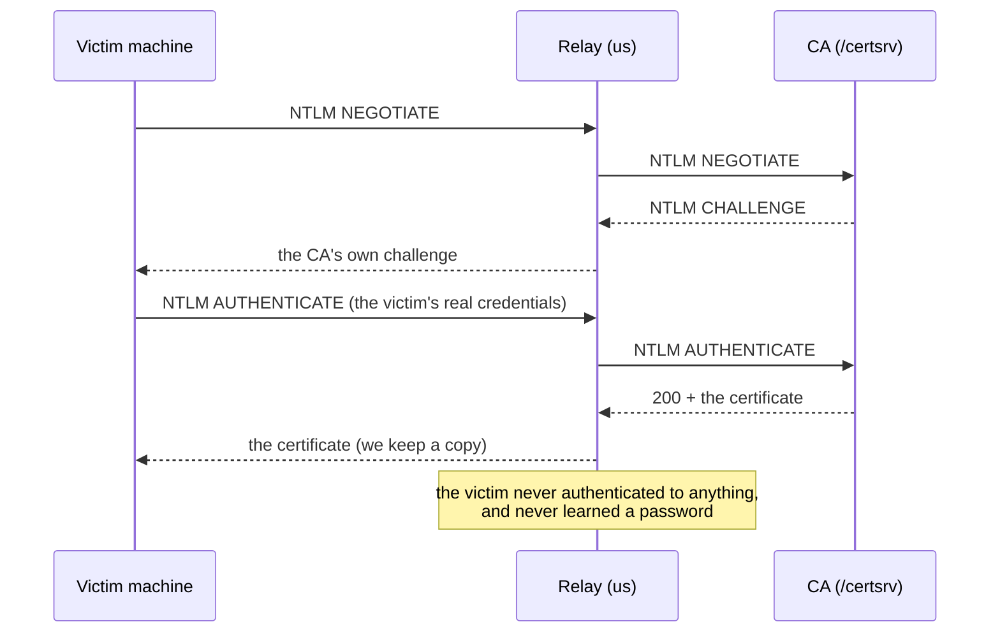

# Pressure operations: the four that end engagements

Four capabilities that are not about stealing a session. One turns an authentication into a
certificate for a domain administrator, one makes a stolen session permanent, one wears a person
down until they approve, and one guesses passwords without tripping the lockout.

## 1. NTLM relay over HTTP (ESC8) — `core/relay.py`

A certificate is accepted as possession. The CA's HTTP enrolment endpoint accepts NTLM, and NTLM
over HTTP has no channel binding - so if a machine authenticates to US, we forward that
authentication to the CA and the CA issues the certificate to whoever asked.

The relay holds one authentication open per exchange and hands the target's answer straight back
to the client. That is the whole mechanism, and it is why the certificate lands in our hands: the
CA believes it is talking to the machine it challenged.

**The trigger** (`--coerce-plan`): the victim's machine has to authenticate to us. Three ways,
and the third needs nothing but the campaign:

| Trigger | How | Needs |
|---|---|---|
| Document | a file that resolves a UNC path (`\\host@80\x`): WebClient sends the authentication over HTTP | the WebClient service (default on workstations) |
| RPC coercion | EFSRPC / MS-RPRN / DFS: tell the machine to authenticate to a path | an RPC transport, interface unpatched |
| The lure itself | the collector already runs in the victim's browser | nothing beyond the campaign |

**What stops it** (this is the list to check before spending time):

1. **Extended Protection for Authentication (EPA)** on the enrolment endpoint
2. **HTTPS with channel binding** - the IIS "Require SSL + Extended Protection" pair
3. **WebClient disabled** on endpoints (kills the UNC trigger)
4. **NTLM disabled on the CA**, or enrolment moved to HTTPS-only
5. **Tier separation**: a CA that does not trust a workstation's authentication for enrolment

SMB signing, which stops SMB relay, is not in play here at all - that is the point.

## 2. Token keep-alive — `core/keepalive.py`

A refresh token dies from inactivity, from CAE, or from a revocation - not from the clock.
Rotating it on a schedule keeps the session warm indefinitely, and **each rotation consumes the
old token**, so revoking the previous one does nothing.

State is written atomically on every rotation, so a restart resumes with the token that is
actually current - losing a rotated token means losing the session.

**What kills it**: a device-bound token (the exchange is refused - `core.dbsc` says so before the
daemon starts), CAE revocation (minutes, regardless), an admin revoking the refresh tokens *and*
the app consent, or the tenant's absolute refresh lifetime (~90 days).

**What it looks like**: a refresh from a new address on a regular cadence. The cadence itself is
the signature.

## 3. MFA fatigue — `core/mfafatigue.py`

The password is captured, the second factor is on the user's phone. The prompt arrives, they
deny it, and then it arrives again, and again - at 02:00, in a meeting, four times in a row.
Fatigue is not a vulnerability in the MFA implementation; it is a vulnerability in the person.

`core/mfafatigue.py` is the pacing engine: even spacing with jitter (a fixed cadence is a
signature, a burst gets the prompts blocked), and a rotating user agent so each prompt looks
like a different client.

**Number matching defeats this outright** - the user must type a digit shown only in the app,
and there is no prompt to approve. It is the Entra default, and the module says so before the
operator spends the attempts.

**Also kills it**: an MFA prompt limit, a "report suspicious activity" policy, or a user who
reports the first prompt instead of approving the fifth.

## 4. Lockout-aware spraying — `core/spray.py`

The classic failure is not the password list - it is the lockout. Ten attempts against one
account locks it, and a locked account is a locked door plus an alert. Spraying inverts the
problem: **one password across many accounts**, slowly enough that no single counter gets close.

The pacer is the accountant:

- the per-account budget is **threshold - 1** (one attempt less is the difference between a
  spray and a lockout), and it is per account per window
- an optional global rate caps the whole window
- **the run stops on the first lockout**, because a locked account is already an alert and the
  next attempt makes it a response

**It is loud.** Many failed sign-ins across many accounts in one window is the detection every
tenant has, and a distributed source does not hide it: the tenant sees the failures, not the
address. Entra's smart lockout also escalates the lockout duration on repeats.

## The honest limits, once

| Capability | Needs | Cannot |
|---|---|---|
| ESC8 relay | a CA that offers NTLM without EPA, and a trigger | work if channel binding is enforced |
| Keep-alive | a replayable refresh token | keep a device-bound token alive |
| MFA fatigue | the correct password, and no number matching | work against number matching |
| Spray | the tenant's real lockout threshold | be quiet |

None of these is a bypass of a control that is configured. Each one is the reason the control is
configured, and the module that implements it reports the control that stops it - before the
attempt, not after.
