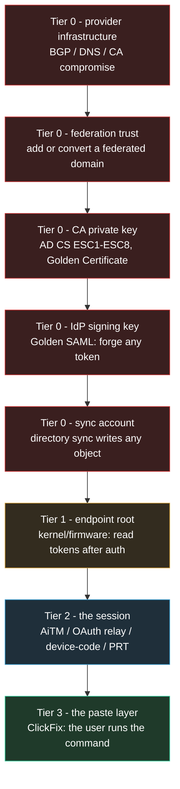
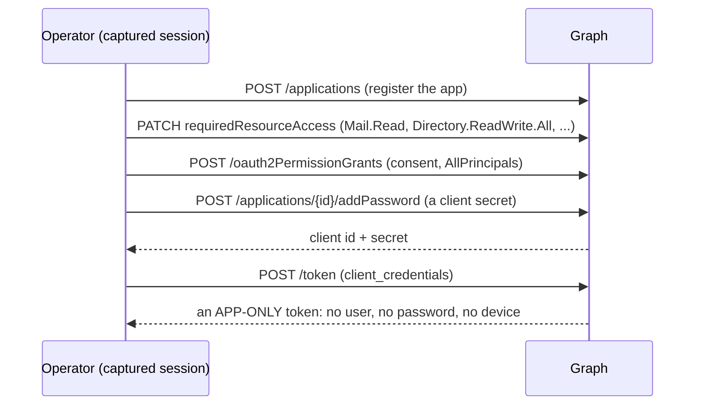
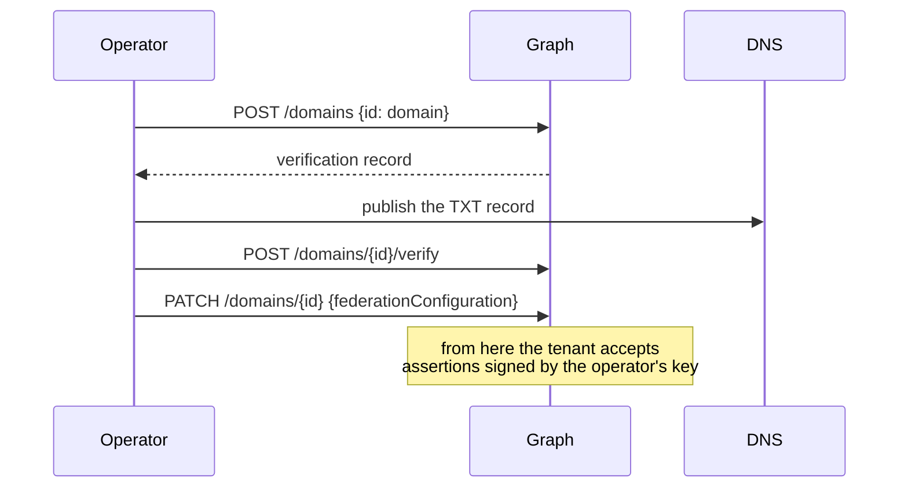
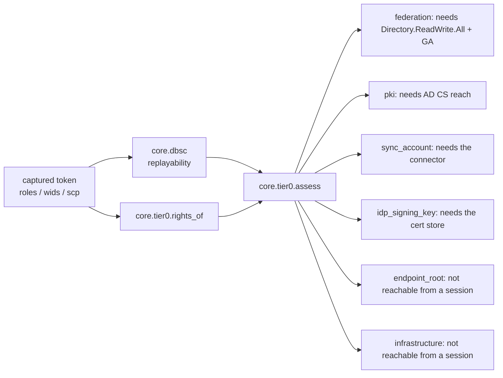

# The root of trust: what sits above AiTM

AiTM is tier 2. Everything above it is about the things an identity *trusts*, not the session
it holds: the federation trust, the signing key, the certificate authority, the sync account.
A stolen session gets you a mailbox. A stolen root of trust gets you every identity that
depends on it, and it survives a password reset, a session revocation and a device wipe.

This document is the map, and it is deliberately honest about which of these a session-based
framework can reach.

## The ladder

Read the ladder by what each rung needs *beyond a credential*:

| Tier | Path | Needs beyond a token | Survives a password reset | Survives device-bound / CAE |
|---|---|---|---|---|
| 0 | Provider infrastructure | a network or registrar position | yes | yes |
| 0 | Federation trust | a domain with a published federation record | yes | yes |
| 0 | CA private key | AD CS reachability, or a template that issues for anyone | yes | yes |
| 0 | IdP signing key | read access to the IdP's certificate store | yes | yes |
| 0 | Sync account | the connector host, or the sync service principal | yes | yes |
| 1 | Endpoint root | code execution on the device | yes | **yes** |
| 2 | The session | nothing - a click | no | **no** |
| 2 | App-only persistence | admin consent (or the user's) | **yes** | **yes** |
| 3 | The paste layer | a user who pastes | yes | **yes** |

The two rows worth staring at are tier 2 and tier 3. Tier 2 is what this framework does, and it
is the only tier that a device-bound, CAE-aware, passkey-protected session defeats. Tier 3 is
the answer to that: the user runs the command themselves, with their own rights, inside their
own session, and no session control ever fires.

## The rung that has no user in it at all: app-only persistence

The session tiers end when the user's credentials, session or device stop working. This one does
not touch the user.

Why it outranks everything above:

| Control | AiTM | PRT | **App-only** |
|---|---|---|---|
| Password reset | stops it | no effect | **no effect** (the app has no password) |
| MFA / passkey change | stops it | no effect | **no effect** (no interactive sign-in) |
| Session revocation | stops it | no effect | **no effect** (the app is not the user) |
| Device-bound / DBSC / CAE | stops it | partly | **no effect** (no browser session exists) |
| Deleting the user | stops it | stops it | **no effect** (until the app is removed) |
| Removing the consent grant + the app | - | - | **stops it** |

That last row is the only remediation, and it is four audit entries away from being noticed:
the registration, the permission change, the consent grant and the credential add.

`core/appconsent.py` implements the whole chain, and it refuses to guess: permission ids are
read from the tenant (`role_ids()`) because a guessed GUID either grants nothing or grants the
wrong permission. `core/tier0.py` reports it as the `app_only` path, and the tool's
`revoke()` is the clean-up path (grant first, then the app).

## The rungs that are implemented as ACTIONS

`core/tier0.py` maps the doors. Two of those doors are also wired: the calls themselves are in
the tool, because "the rights are there" is only useful if the next step exists.

### Federation (`core/federation.py`)

Three ordinary, audited calls. Step 3 is the rung: the tenant now trusts an issuer you named,
so a token for any user can be minted legitimately - no password, no MFA, no session. The tool
refuses step 3 without a signing certificate (a federation without one is refused by the
tenant anyway), and `remove_federation()` is the clean-up path.

### AD CS (`core/adcs.py`)

The probe reports only what an HTTP request can observe: is the enrolment endpoint reachable,
does it offer NTLM (the ESC8 precondition), does it answer without authentication, and does it
disclose the template list. The ESC findings are then stated honestly - ESC8 as `possible` on
an NTLM offer, ESC1 as `check` on a suggestive template name, and ESC1-ESC7 as
`not_visible_from_here` because template ACLs, subject flags and CA permissions live in the
directory, not in an HTTP response.

It cannot take the CA's private key, and it does not claim to: that needs the CA host.

## What BytePhisher implements

`core/tier0.py` reads the captured identity's rights out of the token and reports which rung
its identity opens. It does not perform the escalation - it maps the door.

Each row comes back as one of:

- `open` - a live probe confirmed it
- `needs_a_call` - the rights are in the token; the call itself decides
- `blocked` - a live probe refused it
- `no_rights_visible` - the token carries none of the rights this path needs
- `not_reachable_from_a_session` - the path needs something a token cannot give

A live probe outranks the claims in **both** directions: rights in a token do not prove a call
works, and their absence does not prove it fails.

### Federation (the rung above Golden SAML)

Converting a domain to federated, or adding one, makes the tenant trust an IdP you control.
From then on every token the tenant accepts is signed by you, for any user, with no password
and no MFA - and the tenant's own logs show a legitimate sign-in.

What it needs: `Domain.ReadWrite.All` (or Global Administrator / Hybrid Identity
Administrator), plus a domain with a published federation record. `--tier0 SID` reports whether
the captured identity carries those rights.

### PKI and AD CS

A certificate is accepted as possession. ESC1 (a template that lets the enrollee supply the
subject) and ESC8 (relaying to the HTTP enrolment endpoint) both end at "a certificate for a
domain admin". What a session can do is *reach* the enrolment endpoint, which is why the
posture report names it instead of claiming the certificate.

### The sync account

The directory-sync account can write any object in the tenant - including setting a password or
assigning a role. It is the cloud equivalent of DCSync and it is a service principal, so it has
no MFA to defeat. Reachable only from the connector host or with a token for that principal.

### Golden SAML

Forging a token with the IdP's own signing key. The key lives in the IdP's certificate store,
so this needs read access to that server - not a session. The posture report lists it, because
knowing whether the captured identity is a Hybrid Identity Administrator is the difference
between "we have a mailbox" and "we could have every mailbox".

## The honest limits

| Path | Why a session-based tool cannot do it |
|---|---|
| Provider infrastructure | needs a network/registrar position, not a credential |
| Endpoint root | needs code execution on the device; a browser session is not that |
| CA private key | needs the CA's key store; the tool can only reach the enrolment endpoint |
| IdP signing key | needs the IdP server's certificate store |
| Sync account | needs the connector host or the sync principal's own token |

Those five are reported as `not_reachable_from_a_session`. Dressing them up as achievable would
be the kind of claim that gets an operator burned on a real engagement, and a posture report
that lies is worse than no posture report.

## What the blue team should do, in order

1. **Federation**: alert on any change to a domain's federation settings, and require
   privileged approval for `Domain.ReadWrite.All`.
2. **PKI**: remove enrollee-supplied subjects from templates; require HTTPS with
   channel binding on the enrolment endpoint (this is what kills ESC8).
3. **Sync account**: treat it as a tier-0 account - no interactive sign-in, monitored writes,
   its own conditional access.
4. **IdP signing key**: the key must not be exportable; monitor certificate rollover.
5. **Sessions**: device-bound (DBSC) and CAE-aware sessions, so tier 2 stops working, which is
   what pushes an attacker down to tier 3 - and tier 3 is a user-training problem.
