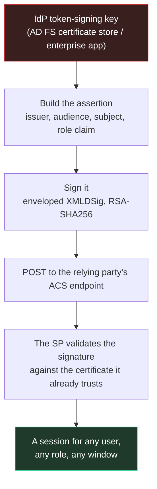
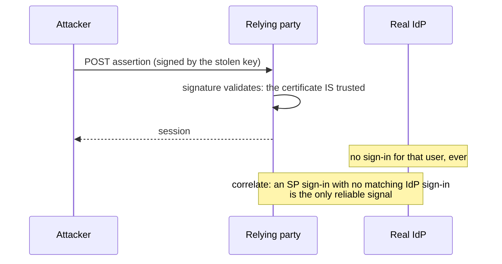

# Golden SAML: the assertion that needs no session

Everything else in this framework steals or borrows an identity. This forges one - and the
resource that accepts it does so legitimately, because the signature is real.



## Why it is above the session tier

| Control | AiTM (tier 2) | ClickFix (tier 3) | Golden SAML |
|---|---|---|---|
| Password change | stops it | stops it | **no effect** |
| MFA / passkeys | stops it | stops it | **not consulted** |
| Device-bound session (DBSC) | stops it | no effect | **not consulted** |
| CAE-aware session | stops it | no effect | **not consulted** |
| Session revocation | stops it | no effect | **no effect** |
| Revoke the user's tokens | stops it | no effect | **no effect** |
| Roll the signing certificate | no effect | no effect | **stops it** |

The last row is the only remediation, and it invalidates every forged assertion at once - which
is why it is also the loudest.

## What the tool does, and what it refuses to fake

`core/samlforge.py` builds the assertion and signs it:

- the assertion carries the issuer, the audience, the subject, the validity window, the
  conditions, and an `AttributeStatement` - which is where the **role claim** goes. That claim
  is the difference between "authenticated as the user" and "authenticated as an administrator",
  and it is the first thing to get right.
- the signature is enveloped XMLDSig (RSA-SHA256 by default, SHA-1 available for older relying
  parties), over a canonical form, with the digest computed over the canonicalised assertion.
- the signer is **pluggable**: `cryptography` (an optional dependency) does the real RSA work,
  and a test injects its own signer to verify the digest, the reference and the enveloped
  placement without a key.

**What it refuses:** signing without the IdP's token-signing key. An unsigned assertion is not a
forged one - every relying party rejects it - so the module raises with the reason instead of
emitting something that will silently fail at the ACS endpoint. A key that cannot sign (a
key-agreement key rather than a signing key) is refused too.

The key itself lives on the IdP host: that is a different rung (endpoint root), and the tool
says so rather than implying it can read it.

## The detection that works



- **Correlate the SP's sign-ins with the IdP's.** A sign-in at the relying party with no
  corresponding sign-in at the IdP is the signal. Nothing on the wire looks wrong, because
  nothing on the wire *is* wrong.
- **Certificate rollover** is the remediation: it invalidates every assertion signed with the
  old key, forged or not.
- **IssueInstant outliers**: a forged assertion's instant does not sit in the IdP's own
  sequence, which is visible when the SP's logs are compared against the IdP's.
- **Key hygiene**: the token-signing key must not be exportable, and the IdP host must not be
  reachable from the identity plane (this is the rung that has to fail for the forge to work).

## Running it

```bash
# the plan: what it needs, and what the defender sees
./bytephisher.py --saml-plan --saml-issuer https://adfs.contoso.test/adfs/services/trust \
                 --saml-audience https://sp.contoso.test/saml

# an assertion (UNSIGNED unless --saml-key is given: the tool says so on the line it prints)
./bytephisher.py --saml-assert admin@contoso.test \
                 --saml-issuer https://adfs.contoso.test/adfs/services/trust \
                 --saml-audience https://sp.contoso.test/saml \
                 --saml-role "Domain Admins" --saml-out ./saml/assertion.xml
```

The unsigned output is deliberate: it is the shape, and it is labelled as unsigned in the same
line that reports the file. Passing `--saml-key` with the IdP's signing key produces a signed
response; without the key, no pretending.
