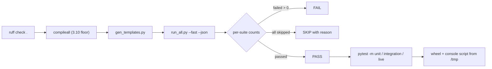

# Testing and verification

What is verified, how to run it, and what each suite proves.



## Test tiers and suites

87 suites, one runner (40 unit, 43 integration, 4 live). Nothing is mocked where it can be real: the HTTP tier drives
sockets, the proxy tier drives a real upstream login flow, the live tier drives the public
internet.

```bash
make test                                    # everything (needs the internet)
make test-fast                               # skip the live tier
./.venv/bin/python tests/run_all.py --json data/test_results.json
./.venv/bin/python tests/run_all.py --only units,http
```

Three selection tiers exist and each selects something real: every test file carries a
module-level `pytestmark`, so `-m unit` (pure logic, no sockets), `-m integration` (local
servers over real sockets) and `-m live` (a real browser or the real internet) all work,
and `make test-unit` runs the first. `tests/run_all.py --fast` is a different axis: it runs
every suite except `tests/test_live.py`.

| Suite | Command | What it proves |
|---|---|---|
| `test_e2e.py` | `python tests/test_e2e.py` | standalone end-to-end: real server, real POST, real SQLite row, redirect mode, OTP page, CSV export, plain dashboard |
| `test_units.py` | `pytest tests/test_units.py` | pure logic: body parsing (urlencoded / multipart / JSON / unicode / empty), credential detection, device classification, capture DB (+concurrency, dedupe, migrations, CSV), all generated templates, mailer rendering, alert formatters, tunneler URL patterns, CLI helpers, custom-site import |
| `test_http.py` | `pytest tests/test_http.py` | live HTTP: GET/POST variants, honeypot + timing fields, forwarded-IP precedence, device detection over the wire, redirect mode, OTP flow, TLS, webhook firing, 40 parallel submissions |
| `test_features.py` | `pytest tests/test_features.py` | risk engine + risk over HTTP, template rotation, alert payloads, CLI flags, JSON/CSV export, stress-tool integrity, doctor, campaign launcher, tunnel watchdog |
| `test_gate.py` | `pytest tests/test_gate.py` | gating parsers and logic (country allow/deny, datacenter, active hours/days, per-IP hit cap), gating over real HTTP, decoy redirect, refused visitors not counted |
| `test_packaging_stream_reuse.py` | `pytest tests/test_packaging_stream_reuse.py` | packaging/pip console script + library import + `BYTEPHISHER_HOME`, SSE `/stream` push of a live capture + polling fallback, credential-reuse detection in DB/CLI/dashboard |
| `test_proxy.py` | `pytest tests/test_proxy.py` | reverse-proxy engine against a fake upstream that reproduces a real multi-step login: header/HTML rewriting, SRI + CSP stripping, hook injection, per-victim cookie isolation, credential/cookie/fingerprint capture, risk model, session resolution, malformed + empty bodies rejected, upstream 500/down, inject/block rules, unicode and 50 KB fields, 12-way concurrency, HEAD, query strings, phishlet YAML, plus three CLI-level `--proxy` runs with an isolated `BYTEPHISHER_HOME` |
| `test_security.py` | `pytest tests/test_security.py` | the adversarial pack: SSRF/absolute-form URI, dashboard XSS escaping, session-id + cookie hardening, body/session/recording caps, CSV formula injection, credential false-positives, blank urlencoded values, POST hit-cap, `--no-trust-headers`, TLS guard, campaign-scoped stats |
| `test_live.py` | `pytest tests/test_live.py` | real internet: geo lookups, cloudflared / localhost.run / bore public round-trips with captures landing in SQLite, Flask dashboard API, SMTP delivery into a local aiosmtpd sink, public webhook echo, CLI subprocess runs (incl. SIGINT session summary), TUI live loop |

Live tests skip with a reason when a service is unavailable; they never fake a pass, and
the runner prints skips explicitly instead of hiding them.

### Every suite

The tier is the module-level `pytestmark` in each file, so `-m unit`, `-m integration`
and `-m live` select exactly these sets. `test_e2e.py` is the one script: `run_all.py`
executes it directly and it defines no pytest test functions.

| suite | tier | what it pins |
|---|---|---|
| `test_access_cli.py` | unit | The click-to-access CLI surface: facts in, files out, exit codes. |
| `test_ad_chain.py` | unit | The last three rungs: PKINIT, shadow credentials, and the Golden Ticket. |
| `test_ad_hardening.py` | unit | Protocol-level hardening for the AD/network tier: byte vectors, not round-trips. |
| `test_ad_hunt.py` | unit | The directory hunt: what AD gives away, and the two attributes worth writing. |
| `test_adcs_esc.py` | unit | ESC conditions decided from directory attributes. |
| `test_aes.py` | unit | The pure-Python AES: verified against the published vectors, and states what is not covered. |
| `test_appconsent.py` | unit | App-only persistence: the credential that has no user behind it. |
| `test_audit_fixes.py` | integration | Live-server tests for the hardening pass: the challenge's Accept gate, the relocated |
| `test_blocklist.py` | integration | Researcher filtering: the identity-based refuse, and that it really refuses. |
| `test_botgate.py` | integration | Bot gate tests: a scanner must never be served the phishlet. |
| `test_brutal_ops.py` | integration | The brutal four: NTLM relay (ESC8), keep-alive, MFA fatigue, lockout-aware spray. |
| `test_chains.py` | unit | Post-exploitation chains: the runner, the keyword hunt and the reporting. |
| `test_challenge.py` | integration | Pre-serve human challenge: the clone is not handed over on the first hit. |
| `test_control_channel_hardening.py` | unit | Control-channel hardening: token handling, the request path, injection, the |
| `test_cross_platform.py` | integration | Cross-platform portability regression tests (Termux/Android, Windows, macOS, Linux). |
| `test_crossplatform.py` | unit | Cross-platform invariants, enforced statically. |
| `test_ctso.py` | unit | Click-to-access orchestration: the manifest is the deliverable. |
| `test_decision.py` | unit | The click-to-access decision matrix. |
| `test_deep_harvest.py` | integration | The deeper-harvest modules, verified by executing the collector. |
| `test_delivery_engine.py` | integration | Delivery-engine hardening tests: the lure surface a victim actually receives. |
| `test_delivery_hardening.py` | integration | Delivery-layer hardening tests - real sockets, real upstream, real store. |
| `test_devicecode.py` | integration | Device-authorization relay: a fake identity provider drives the real flow. |
| `test_dnsx.py` | unit | DNS exfil/beacon encoding: base32hex, label chunking, reassembly, records. |
| `test_e2e.py` | integration | see the module docstring |
| `test_evasion.py` | integration | Evasion hygiene: relocatable hook path + per-session collector symbols. |
| `test_exploitpack.py` | unit | The exploit-pack matcher and loader, proven without any network or payload. |
| `test_exploits.py` | integration | Link click -> system access: the exploit library, and the proof that the |
| `test_features.py` | integration | BytePhisher advanced-feature tests: risk scoring, |
| `test_federation_adcs.py` | unit | The two tier-0 rungs that can be reached from a session: federation and AD CS. |
| `test_fingerprint_headers.py` | integration | Header hygiene: our responses must not advertise that they are a script. |
| `test_forge.py` | integration | Phishlet forge tests - including the real-world bugs it hit. |
| `test_gate.py` | integration | BytePhisher campaign-gating tests (country / datacenter / hours / rate). |
| `test_http.py` | integration | BytePhisher HTTP-level tests - real server, real sockets, real SQLite. |
| `test_identity_hardening.py` | unit | Identity-tier hardening: each fix from the hostile-input / protocol audit, pinned. |
| `test_import_mirror.py` | integration | Asset mirroring: a clone must be self-contained. |
| `test_inbox_clickfix.py` | unit | The second act (replies), the paste layer (ClickFix), and the two "too late" checks. |
| `test_intel.py` | live | Deep device-intelligence tests - analysis, transport, storage, CLI. |
| `test_intel_harvest.py` | live | Real-browser verification of the harvest modules. |
| `test_ja4.py` | unit | JA4 and JA4H, checked against the published FoxIO vectors. |
| `test_kerberos.py` | unit | Kerberos roasting: the request builders, the reply parser, and the crackable formats. |
| `test_kill_chain.py` | integration | The kill chain must actually finish: chained steps, deadlines, and a retry. |
| `test_lab_check.py` | unit | The real-world preflight: what it must say, and what it must not claim. |
| `test_ldap.py` | unit | The LDAP client: BER, RFC 4515 filters, and the frame walker. |
| `test_live.py` | live | BytePhisher live/integration tests - real internet, real tunnels, real SMTP. |
| `test_live_e2e.py` | integration | End-to-end proof that the reverse proxy works on REAL sockets. |
| `test_mailer_delivery.py` | integration | Delivery tests: the message that actually goes on the wire. |
| `test_modern_login.py` | integration | Modern login shapes that used to break through the proxy. |
| `test_mshtml.py` | unit | Click-to-NTLM artifacts: the decoy page, the shortcuts, and the decision matrix. |
| `test_no_fetch_attack.py` | integration | No-fetch attack paths, verified by execution. |
| `test_oauth_relay.py` | integration | OAuth authorization-code relay: PKCE, the state binding, and the exchange. |
| `test_oauth_vault.py` | unit | P1.4: a captured token must survive the process that captured it. |
| `test_operations_safety.py` | integration | Safety paths: the panic stop, the data wipe and the dashboard token. |
| `test_operator_surface.py` | integration | The operator-facing fixes: what the tool reports must match what it does. |
| `test_ops.py` | integration | Live-session operations tests: credential validation and keep-alive. |
| `test_packaging.py` | unit | Packaging: the wheel must carry what the code reads at runtime. |
| `test_packaging_stream_reuse.py` | integration | Packaging, the live dashboard stream, and credential reuse. |
| `test_phishlet.py` | integration | Phishlet v2 + proxy integration tests - multi-host chains, rewriting, |
| `test_portability.py` | integration | Portability / console-encoding regression tests. |
| `test_pretexts_targets.py` | integration | Pretexts and targets: the message layer and the per-target personalisation. |
| `test_production_surface.py` | integration | The production surface: the edge cases an operator actually hits. |
| `test_proxy.py` | integration | Reverse-proxy engine tests - functional, edge cases and adversarial angles. |
| `test_proxy_fixes.py` | integration | The proxy correctness fixes from the modern-login audit, each with a regression. |
| `test_pwa_campaign.py` | unit | Installable lures and the cohort table. |
| `test_qr.py` | unit | QR encoder tests. |
| `test_realtime.py` | integration | Real-time relay: the live input stream and server-side OTP completion. |
| `test_rebind.py` | integration | DNS rebinding: the wire format, the policy, and a real UDP round trip. |
| `test_redirectors_pool.py` | unit | Redirector chains, the domain pool, and detonation-range cloaking. |
| `test_resume_and_evidence.py` | unit | P1.5/P1.6: evidence an action produced, and sessions that survive a restart. |
| `test_samlforge.py` | unit | Golden SAML: the assertion and the signature. |
| `test_security.py` | integration | Security regression suite - every finding from the adversarial audit. |
| `test_sender.py` | unit | The sender identity kit: lookalike candidates and the DNS facts behind a domain. |
| `test_session.py` | live | Session vault + browser takeover tests. |
| `test_stager.py` | unit | Stager builders: the text, the encoding, and the limits. |
| `test_static_challenge.py` | integration | The pre-serve human challenge on the STATIC server. |
| `test_stealth_hook.py` | integration | The hook must survive the check that actually catches wrapped built-ins. |
| `test_symbols.py` | integration | Per-campaign symbol names: the fixed strings a scanner can grep. |
| `test_telegram.py` | unit | Telegram control channel: parsing, dispatch, rendering, and the poll loop. |
| `test_template_brands.py` | unit | BytePhisher - tests for the extra brand library (tools/template_brands.py). |
| `test_tier0.py` | unit | The token-theft tier: replayability, scope swap and the PRT/phantom-device chain. |
| `test_tier0_posture.py` | unit | ConsentFix, passkeys and the tier-0 posture map. |
| `test_tokenintel.py` | unit | The token tier, wired into the capture flow. |
| `test_totp.py` | unit | TOTP / soft-2FA: the RFC vectors, the otpauth parser, and the weak-secret scan. |
| `test_transport.py` | integration | The upstream leg's TLS fingerprint, verified by capturing our own ClientHello. |
| `test_units.py` | unit | BytePhisher unit tests - every module, no network, no external services. |
| `test_vba.py` | unit | Tests for the macro-enabled Word document builder. |
| `test_websocket.py` | integration | WebSocket relay and meta-tag CSP handling. |
| `test_wire_crosscheck.py` | unit | Cross-checks of the Kerberos and AD wire formats against impacket (test-only). |

## What "verified" means here

- A test asserting a capture exists reads it back out of SQLite, not out of the response
  body.
- Tunnel tests POST through the public URL and then assert the row, the real client IP (not
  `127.0.0.1`) and the geo fields.
- SMTP tests run a real SMTP server on localhost (`aiosmtpd`) and assert the received
  message headers/body, including the tracking pixel in the HTML part.
- CLI tests spawn the actual CLI as a subprocess and parse its stdout.
- Anything that runs the real CLI points `BYTEPHISHER_HOME` at a temp directory, so the
  developer database (`data/bytephisher.db`) is never touched.
- The store keeps one SQLite connection per thread; a regression test runs parallel
  readers against parallel writers and closes the store mid-flight, because sharing one
  connection segfaulted the process (see `core/capture.py`).

## Tunneler reality check

```bash
./.venv/bin/python tools/probe_tunnels.py            # all six
./.venv/bin/python tools/probe_tunnels.py --only cloudflared,bore
```

Output states, per tunneler, whether a public URL came up and whether the page actually
loaded through it. cloudflared / localhost.run / bore / pinggy work in a normal network;
ngrok needs an authtoken; serveo and hoplink were removed as dead services and fail soft.

## Debugging a failing live test

- 530 from `*.trycloudflare.com`: the edge connection had not registered yet. The adapter
  waits for `Registered tunnel connection`, and the tests retry.
- `RemoteDisconnected` under load: listen backlog. The server sets
  `request_queue_size = 128`; if you raise concurrency in a test, raise it here too.
- Stale public URL: tunnel logs are truncated on every start. If you see an old hostname, a
  leftover process from a previous run is still writing to it - `tunnels.stop_all()` is
  called in every test teardown for this reason.

## What is not verified in this repository

| Area | Why |
|---|---|
| `docker build` / `docker compose up` | the compose YAML parses and the Dockerfile targets `python:3.11-slim`, but no image is built in the suite |
| systemd unit | `systemd-analyze verify` passes syntax; the `/opt/bytephisher/...` paths only exist on the target host |
| Termux installer | `bash -n` syntax check only; no Android device in the suite |
| Windows/macOS execution | the code paths are cross-platform; the suite runs on Linux |
| ngrok tunnelling | the binary is absent and free ngrok now needs an authtoken |
| live provider SMTP/Telegram delivery | the transport is proven against a local SMTP sink and a stub bot API; a real provider login needs the operator's credentials |
| browser tasks on a host with no browser network | the browser suite skips with the real reason rather than reporting a false pass |

## IPv6 handling

On a host with no IPv6 route, Python's urllib does no happy-eyeballs, so a name that
publishes an AAAA record (Cloudflare quick tunnels, many CDNs) fails outright even though
IPv4 works. Every outbound call in BytePhisher goes through `core/net.py`, which forces
IPv4 resolution behind a re-entrant lock; the doctor reports the IPv6 route status
directly.
