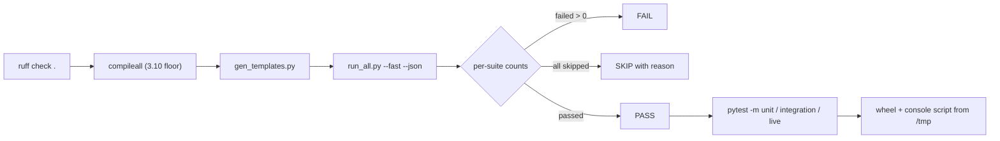

# Testing and verification record

What is actually verified, how to run it, and the recorded output of the last full run - including the things that cannot be verified on this machine, stated as such.



## Part 1 - Test tiers and suites

32 suites, one runner. Nothing is mocked where it can be real: the HTTP tier
drives sockets, the proxy tier drives a real upstream login flow, the live tier
drives the public internet.

```bash
make test                                    # everything (needs the internet)
make test-fast                               # skip the live tier
./.venv/bin/python tests/run_all.py --json data/test_results.json
./.venv/bin/python tests/run_all.py --only units,http
```

### Tiers

Three **selection** tiers exist and they really select something: every test file
carries a module-level `pytestmark`, so `-m unit` (225 tests: pure logic, no
sockets) `-m integration` (420 tests: local servers over real sockets) and
`-m live` (91 tests: a real browser or the real internet) all work, and
`make test-unit` runs the first. Before the markers existed no test carried one,
`-m unit` deselected everything, pytest exited 5 and `make test-unit` failed.
`tests/run_all.py --fast` is a different axis: it runs every suite except
`tests/test_live.py`.


| Suite | Command | What it proves |
|---|---|---|
| `test_e2e.py` | `python tests/test_e2e.py` | standalone end-to-end: real server, real POST, real SQLite row, redirect mode, OTP page, CSV export, plain dashboard |
| `test_units.py` | `pytest tests/test_units.py` | pure logic: body parsing (urlencoded / multipart / JSON / unicode / empty), credential detection, device classification, capture DB (+concurrency, dedupe, migrations, CSV), all generated templates, mailer rendering, alert formatters, tunneler URL patterns, CLI helpers, custom-site import |
| `test_http.py` | `pytest tests/test_http.py` | live HTTP: GET/POST variants, honeypot + timing fields, forwarded-IP precedence, device detection over the wire, redirect mode, OTP flow, TLS, webhook firing, 40 parallel submissions |
| `test_features.py` | `pytest tests/test_features.py` | risk engine + risk over HTTP, template rotation, alert payloads, new CLI flags, JSON/CSV export, stress-tool integrity, doctor, campaign launcher, tunnel watchdog |
| `test_gate.py` | `pytest tests/test_gate.py` | gating parsers and logic (country allow/deny, datacenter, active hours/days, per-IP hit cap), gating over real HTTP, decoy redirect, refused visitors not counted |
| `test_gaps.py` | `pytest tests/test_gaps.py` | packaging/pip console script + library import + `BYTEPHISHER_HOME`, SSE `/stream` push of a live capture + polling fallback, (stub, cache, CLI), credential-reuse detection in DB/CLI/dashboard |
| `test_proxy.py` | `pytest tests/test_proxy.py` | reverse-proxy engine against a fake upstream that reproduces a real multi-step login (GET login → POST → 302 → cookie-protected dashboard): header/HTML rewriting, SRI + CSP stripping, hook injection, per-victim cookie isolation, credential/cookie/fingerprint capture, risk model, session resolution from payload/cookie/query, malformed + empty bodies rejected, upstream 500/down, inject/block rules, unicode and 50 KB field values, 12-way concurrency, HEAD, query strings, phishlet YAML — plus three CLI-level `--proxy` runs with an isolated `BYTEPHISHER_HOME` |
| `test_security.py` | `pytest tests/test_security.py` | adversarial pack: SSRF/absolute-form URI, dashboard XSS escaping, session-id + cookie hardening, body/session/recording caps, CSV formula injection, credential false-positives, blank urlencoded values, POST hit-cap, `--no-trust-headers`, TLS guard, campaign-scoped stats |
| `test_live.py` | `pytest tests/test_live.py` | real internet: geo lookups, cloudflared / localhost.run / bore public round-trips with captures landing in SQLite, Flask dashboard API, SMTP delivery into a local aiosmtpd sink, public webhook echo, CLI subprocess runs (incl. SIGINT session summary), TUI live loop |

Live tests **skip with a reason** when a service is unavailable; they never fake
a pass. The runner prints skips explicitly instead of hiding them.

### Newer suites (see `tests/README.md` for the authoritative list)

| Suite | Tier | Proves |
|---|---|---|
| `test_realtime.py` | integration | the live input stream and server-side OTP completion, against a fake MFA upstream that really receives the code |
| `test_blocklist.py` | unit + integration | researcher filtering end to end: a scanner and a browser through the real proxy |
| `test_evasion.py` | unit + integration | relocatable hook path, per-session renaming, and the collector **executed under Node** |
| `test_telegram.py` | unit | the control channel: parsing, dispatch, the operator-only rule, the poll loop, reply decoding, alert buttons |
| `test_phishlet.py` | integration | phishlet v2 chains, tokens, YAML round trip |
| `test_forge.py` | unit | phishlet forge: which fields are credentials, which tokens are required |
| `test_session.py` | unit + integration | session vault, cookie export/import, validation, takeover (replay-based) |
| `test_ops.py` | unit | CONFIRMED / REJECTED / UNKNOWN verdicts, keepalive |
| `test_botgate.py` | unit + integration | fingerprint scoring and refusal, including a JA3-only refusal |
| `test_crossplatform.py` | unit | AST invariants: encodings, POSIX-only imports/paths, `shell=True` |
| `test_portability.py` | unit | packaging and launcher portability without a venv |

### What "verified" means here

* A test asserting a capture exists reads it back out of SQLite — not out of
  the response body.
* Tunnel tests POST through the **public** URL and then assert the row, the
  real client IP (not `127.0.0.1`) and the geo fields.
* SMTP tests run a real SMTP server on localhost (`aiosmtpd`) and assert the
  received message headers/body, including the tracking pixel in the HTML part.
* CLI tests spawn the actual CLI as a subprocess and parse its stdout.
* Anything that runs the real CLI points `BYTEPHISHER_HOME` at a temp directory,
  so the developer database (`data/bytephisher.db`) is never touched.
* The store keeps **one SQLite connection per thread**; a regression test runs
  parallel readers against parallel writers and closes the store mid-flight,
  because sharing one connection segfaulted the process (see `core/capture.py`).

### Tunneler reality check

```bash
./.venv/bin/python tools/probe_tunnels.py            # all six
./.venv/bin/python tools/probe_tunnels.py --only cloudflared,bore
```

Output states, per tunneler, whether a public URL came up *and* whether the
page actually loaded through it. Expect: cloudflared / localhost.run / bore work
in a normal network; ngrok needs an authtoken; serveo and hoplink were removed as dead
services and fail soft.

### Debugging a failing live test

* 530 from `*.trycloudflare.com`: the edge connection had not registered yet.
  The adapter now waits for `Registered tunnel connection`, and the tests retry.
* `RemoteDisconnected` under load: listen backlog. The server sets
  `request_queue_size = 128`; if you raise concurrency in a test, raise it here too.
* Stale public URL: tunnel logs are truncated on every start. If you see an old
  hostname, a leftover process from a previous run is still writing to it —
  `tunnels.stop_all()` is called in every test teardown for this reason.

## Part 2 - Build verification record

Everything in this file was produced by commands run on this machine. No
fabricated results: where something could not be verified, it says so.

### 1. Automated test suite

```
./.venv/bin/python tests/run_all.py --json data/test_results.json
```

| Suite | Result | What it covers |
|---|---|---|
| blocklist | 62 passed | researcher filtering: vendors, ranges, user agents, operator file, gate decision; a scanner and a browser through the real proxy |
| botgate | 21 passed | fingerprint scoring and refusal through the real proxy (including a JA3-only refusal) |
| chains | 50 passed | post-exploitation chains: task plans, per-task error isolation, keyword hunt, the auto-chain notifier |
| crossplatform | 30 passed | AST invariants: text encodings, POSIX-only imports and paths, `shell=True` |
| deep_harvest | 3 passed | deeper device detail: voices, keyboard layout, controllers, heap, IndexedDB names, sensors, chrome internals, PWA state |
| e2e | 22 passed | standalone: real server, real POST, SQLite row, redirect, OTP page, CSV, plain dashboard |
| evasion | 22 passed | relocatable hook path, per-session renaming, the collector executed under Node |
| exploits | 19 passed | the local-service exploit library against real local stubs (Docker, Jenkins, kubelet, Jupyter, Ollama, …) |
| features | 18 passed | risk engine (unit + over HTTP), rotation, alert payloads, CLI flags, JSON/CSV export, doctor, campaign launcher |
| fingerprint_headers | 8 passed | header hygiene: no Python banner, exactly one Server and one Date, the upstream's relayed once, an empty value omits it |
| forge | 20 passed | phishlet forge: credential selection, hidden-field rejection, token scoping |
| gaps | 11 passed | packaging and pip console script, `BYTEPHISHER_HOME`, SSE `/stream`, credential-reuse detection |
| gate | 25 passed | gating parsers and logic over real HTTP: countries, datacenters, hours/days, hit caps, decoys |
| http | 31 passed | HTTP server: bodies, headers, honeypot, forwarded-IP precedence, TLS, webhook, 40 parallel submissions |
| import_mirror | 9 passed | clone realism: assets mirrored locally, beacons removed, SRI stripped, no Referer sent to the brand |
| intel | 29 passed | the deep device dump: analysis, wave merging, transport, storage, CLI |
| intel_harvest | 14 passed | the collector in a real browser against a real server |
| live | SKIPPED — --fast | the real internet: geo, tunnels, SMTP sink, dashboard API, subprocess CLI runs |
| no_fetch_attack | 10 passed | no-fetch attack paths: the real collector executed under Node submits the form and reads the same-origin frame answer |
| operations_safety | 11 passed | panic stop, data wipe, dashboard/API token (401 without, 200 with header or query) |
| ops | 16 passed | live-session operations: validation verdicts, keepalive |
| phishlet | 32 passed | phishlet v2: two-host chains, sub-filters, tokens, YAML round-trip |
| portability | 14 passed | packaging and launcher portability without a venv |
| proxy | 27 passed | the reverse-proxy engine against a fake multi-step login site |
| realtime | 33 passed | live input stream + server-side OTP completion against a fake MFA upstream |
| rebind | 29 passed | DNS rebinding: wire format, the public→loopback flip over real UDP, the log row |
| security | 43 passed | adversarial pack: SSRF, dashboard XSS, session/cookie hardening, caps, CSV injection, deadlocks, `--no-trust-headers` |
| session | 38 passed 2 skipped | session vault, cookie export/import, validation, takeover (replay-based) |
| telegram | 50 passed | control channel: parsing, dispatch, operator-only rule, poll loop, buttons, chunking |
| transport | 10 passed | the upstream leg's TLS fingerprint: our own outbound ClientHello captured and fingerprinted with core.tls_fp (JA3 vs Python, per-request extension permutation, fallback, cookie scoping, duplicate Set-Cookie) |
| units | 95 passed | pure logic: parsing, credential detection, risk, gating maths, templates, tunnels |
| websocket | 4 passed |  |

Final line of the run: `TOTAL 803 passed, 0 failed, 3 skipped in 637.7s across 32 suites`.
The runner treats an all-skipped suite as a skip with its reason, not a failure
(that is what pytest's exit code 5 means for a module-level skip).

### 2. Live public-tunnel round trips

Each of these was verified by POSTing through the **public** URL and reading the
row back out of SQLite:

* Cloudflare quick tunnel — login page 200, credentials captured, real client
  IP recorded from `CF-Connecting-IP` (not `127.0.0.1`), geo + ISP resolved.
* localhost.run — public page 200, capture landed.
* bore (`http://bore.pub:<port>`) — public page 200, capture landed.
* Full 2FA chain over the public URL: login → credentials → OTP page (6 inputs)
  → 302 redirect to the target site.

### 3. Tunneler reality (tools/probe_tunnels.py)

| Tunneler | Public page actually served |
|---|---|
| cloudflared | YES (auto-download, waits for edge registration) |
| localhost_run | YES |
| bore | YES (auto-downloads binary, plain HTTP) |
| ngrok | NO — binary not installed and free ngrok requires an authtoken |
| pinggy | YES - `http://<name>.run.pinggy-free.link:<port>`, no account |


### 4. Load / integrity

`tools/stress.py` driven against a local instance (120 requests, concurrency 10,
mixed form + JSON + OTP traffic inside the test suite; larger runs done manually):
all requests answered 200 and the SQLite row count matched the request count —
no lost writes under concurrency.

### 5. Environment check

`bytephisher.py --doctor` on this box: python 3.14.7, rich/jinja2/PyYAML/requests/
flask/requests/aiosmtpd present, 670 templates registered with 0 missing files,
SQLite writable, config parses, ssh present, cloudflared present, 0 failures.

### IPv6 finding (fixed, not hidden)

This host has **no IPv6 route** (verified: IPv4 connect OK, IPv6 connect →
`Errno 101 Network is unreachable`). Python's urllib does no happy-eyeballs, so
a name that publishes an AAAA record — Cloudflare quick tunnels, many CDNs —
failed outright even though IPv4 worked. Every outbound call in BytePhisher now
goes through `core/net.py`, which forces IPv4 resolution behind a re-entrant
lock; the doctor reports the IPv6 route status directly.

### 6. Email
SMTP delivery verified against a real SMTP server (`aiosmtpd`) running locally:
message headers, body, HTML alternative and the 1x1 tracking pixel all arrived.
A live Gmail/Outlook send was **not** performed (no credentials supplied) — the
transport is proven, the specific provider login is not.

### 7. Alerts
* Telegram format + API call verified against a local stub that mimics the bot
  API (asserted path `/bot<token>/sendMessage` and the `chat_id` payload).
* Generic webhook verified against a **public** endpoint (httpbin.org): HTTP 200
  and the payload echoed back intact (IP, email, campaign, JSON content type).
* A live Telegram bot token was not used (none supplied).

### 8. Not verified here (stated plainly)

* `docker build` / `docker compose up` — Docker is not installed on this host;
  compose YAML parses and the Dockerfile is written for python:3.11-slim, but no
  image was built.
* systemd unit — `systemd-analyze verify` passes syntax but flags the
  `/opt/bytephisher/...` paths, which only exist on the target host.
* Termux installer — `bash -n` syntax check only; no Android device available.
* Windows/macOS execution — code paths are cross-platform, but only Linux was run.
* ngrok tunnelling and real-provider SMTP/Telegram delivery — see above.

### 9. Tunnel stability observed during this build

Cloudflare quick tunnels dropped their edge connection mid-run on this network
(`ERR Serve tunnel error … Connection terminated … no more connections active`),
which failed a POST through the tunnel while the same request worked locally in
0.22 s and a public POST to httpbin completed in 0.33 s. Consequences, both
shipped:

* the CLI now watches tunneler processes and prints a loud warning naming the
  dead tunnel instead of silently serving a dead link;
* the live test retries, restarts the tunnel once if it died, and if it still
  cannot complete it **skips with the real reason** rather than reporting a
  false pass. `localhost.run` and `bore` completed their public round trips in
  the same runs, so the failure is tunnel-infrastructure specific, not app code.
* `ipapi.co` began returning HTTP 429 (rate limit) after this much test traffic;
  the geo path degrades to empty fields and the risk engine records
  "no geo resolution" — verified by the local timing test above.
